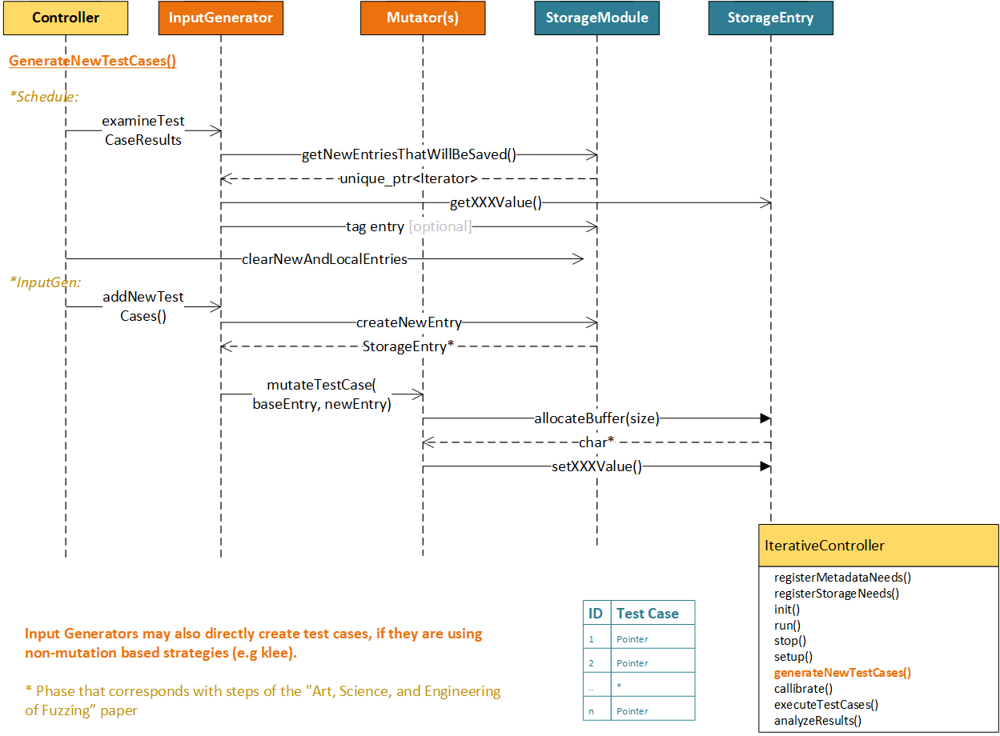
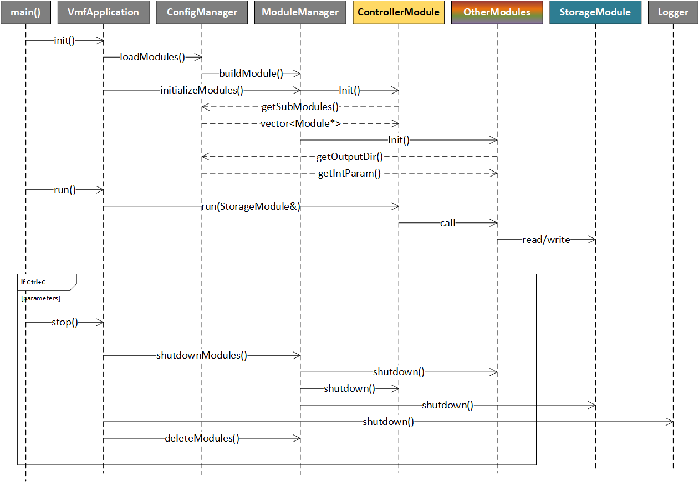

# Top Level Design
At the highest level, VMF is a configuration driven framework that loads a number of VMF "modules".  These modules communicate by reading and writing data to a StorageModule.  The ControllerModule is in charge of the control flow of the fuzzer.

***Note: The only VMF user interface component that is provided today is the Distributed Fuzzing UI***


## VMF Planned Extension Points
The most common planned extension points for VMF are adding formatter modules (to help prepare a test case to be accepted by a SUT), executor and feedback modules (which run a test case on the SUT and evaluate the results, respectively) and mutator modules, which are helper modules for input generation.


| Module Type           | Typical Usage                                     | 
| --------------------- | ------------------------------------------------- |
| Initialization | Seed Generation, or anything that needs to run only once |
| Mutator | Mutation, something that creates new test cases based on old ones |
| InputGenerator | Mutation strategies (something that selects between mutators) |
| Formatter | Something that prepares the mutated test case for use in the SUT (e.g. adding a header or checksum)|
| Executor | A new "runner" (a new means of interfacing to a test harness, such as libFuzz, AFL++)|
| Feedback | Adding a new "fitness function" which evaluates the effectiveness of prior test cases at fuzzing the SUT |
| Output   | Adding an "output" mechanism to provide information to the human |
|          | Adding a means of managing the set of test cases (e.g. trimming) |
|          | Adding tools that perform additional analysis on crashed test cases (e.g. automated exploitation tools)|


## Uncommon Extension Points
More complex modifications to VMF can be made by extending or replacing the controller or storage modules.  

Replacing the controller could support the following use case:
- Automated fuzzer that swaps execution or input generation strategies based on the how the fuzzing campaign is going

The initial implementations of StorageModule and Iterator are SimpleStorage and SimpleIterator, which provide in-memory storage of all the fuzzing data.  These are simplistic implementations based on std C++ object types, and could be replaced with more highly optimized solutions in the future if needed.

The IterativeController is organized into a series of functions that break up the phases of fuzzing, such that someone could sub-class the controller to modify one of these behaviors.  The Controller will instantiate each of the major module types, based on the information in the configuration file.


## Input Generation Modules
The following sequence diagram depicts how the Controller interacts with InputGeneration modules.  The InputGenerator may use Mutator submodules for mutation-based input generation (e.g. the provided GeneticAlgorithmInputGenerator that is used in the default VMF configuration).

The IterativeController will call an internal method GenerateTestCases, which will call upon the input generator to evaluate the results of any prior test case executions and to generate new test cases for this pass.  The interaction with storage to support the functions is shown below.  Our initial management technique for input generation will use a genetic-algorithm based approach.  

For the GeneticAlgorithmInputGenerator, the generate new test case portions of the code are performed by each Mutator submodule.  This code snippet shows the interaction the mutator module has with storage when creating new test cases:
```c++
//-----Initialization time registration of storage keys-----
fakeVariableKey = registry.registerKey("FAKE_VARIABLE", StorageRegistry::INT, StorageRegistry::WRITE_ONLY);
testCaseKey = registry.registerKey("TEST_CASE", StorageRegistry::BUFFER, StorageRegistry::WRITE_ONLY);       
 
 
//-----Generating a new test case-----
StorageEntry* newEntry = storage.createNewEntry(); //constructs a new storage entry
int id = newEntry->getID();                     //each storage entry has an unique ID
newEntry->setValue(fakeVariableKey,val);           //values can be set on each storage entry
 
//The test case itself is stored as a byte buffer, which is also allocated and managed by storage
int size = 128; //size in bytes
char* buff = newEntry->allocateBuffer(testCaseKey, size);  //char* is used to set the data values
```


## Initialization Modules
Initialization modules run exactly once, when the fuzzer is first started up.  A common usage of Initialization modules is for creating an initial set of test cases (i.e. seed generation).  Initialization  modules that create new test cases would have the same kind of interaction with storage as a Mutator module.

## Executor, Formatter and Feedback Modules
The following sequence diagram depicts how the Controller interacts with Executor modules.

The IterativeController will call an internal method executeTestCases, which will call upon the executor run any new test cases.  The executor will be provided with the test case buffer to executor.  If there is a Formatter configured, then the IterativeController will first allow the Formatter to modify the test case.

After execution, the Feedback module must:

- Examine the test case results to determine if the test case is interesting enough to keep in long term storage (and call saveEntry if it is)
- Compute and store the sort by key (our initial implementation will use an AFL-style fitness value)
Our initial implementation of AFLFitness will contain an overrideable methods computeFitness, as we anticipate that subclasses may wish to use AFL-style execution, but with different evaluations of these results.

Code snippet showing Feedback Module interaction with storage:
```c++
//-----Initialization time registration of storage keys and tags
fitnessKey = fitnessKey = registry.registerKey("FITNESS", StorageRegistry::FLOAT, StorageRegistry::WRITE_ONLY);  
testCaseKey = registry.registerKey("TEST_CASE", StorageRegistry::BUFFER, StorageRegistry::READ_ONLY);  
crashedTag = registry.registerTag("CRASHED", StorageRegistry::WRITE_ONLY); 
 
//-----Evaluating the test case resul-----

    bool saveEntry = false;
 
    //First retrieve any test results directly from the executor module
    //The controller will provide the executor to the Feedback module
    executor->getXXX();

    //Set the sort by key, in this case, "FITNESS"
    nextEntry->setValue(fitnessKey,fitness);
 
    //All entries must be either saved or discarded to avoid memory leaks
    if(saveEntry)
    {
        //Move to long term storage
        storage.saveEntry(nextEntry);

        //Tag the entry (if applicable)
        //Note: All tagged entries will also be saved
        storage.tagEntry(nextEntry, crashedTag);
    }
```


## Output Modules
Output modules are the least constrained in terms of their behavior.  They may interact with storage freely, though it is not expected that they would add additional test cases (as this is an input generation function).  These modules can provide output to the human operator or perform corpus management functions.

Code snippet showing interaction with storage:
```c++
//-----Initialization time registration of keys-----
crashedTag = registry.registerTag("CRASHED", StorageRegistry::READ_ONLY);
 
//-----Retrieving all of the new entries that crashed-----
unique_ptr<Iterator> newCrashedEntries = storage.getNewEntriesByTag(crashedTag);
while(newCrashedEntries->hasNext())
{
    StorageEntry* nextEntry = newCrashedEntries->getNext();
}
```


## Configuration Files
VMF uses a configuration file to determine which modules will execute, but the control-flow aspect of their execution is managed entirely by the controller module.  A brief example is provided below.  See [writing_new_modules.md](/docs/writing_new_modules.md) for more information on the structure of the VMF configuration files.


## Storage Modules
A more detailed explanation of the Storage Module is provided below.  This component can be updated in the future if a different data structure would better support optimized data retrieval for future fuzzing functions.  Conceptually storage is able to maintain a few things:

- A set of storage entries, sorted by a particular field in the storage entry
- A set of tags associated with these entries
- A set of metadata fields (for global data)

Importantly the exact contents of the storage entry is configurable at initialize by the set of modules that VMF has been configured to use.  Each module has a registration step that informs storage of it's data needs.  See [writing_new_modules.md](/docs/writing_new_modules.md) for more information on configuring storage.


## Application Initialization
A number of steps are performed automatically by VMF in order to initialize the system.  Detailed sequence diagrams are provided below.

The VaderApplication class automatically loads any modules plugins, loads and initializes each of the modules in the configuration file, and retrieves the configured StorageModule and ControllerModules.


At initialization  time, the Controller Module retrieves any configured submodules.  At runtime, the Controller Module calls upon these submodules to perform each of the fuzzing steps.

