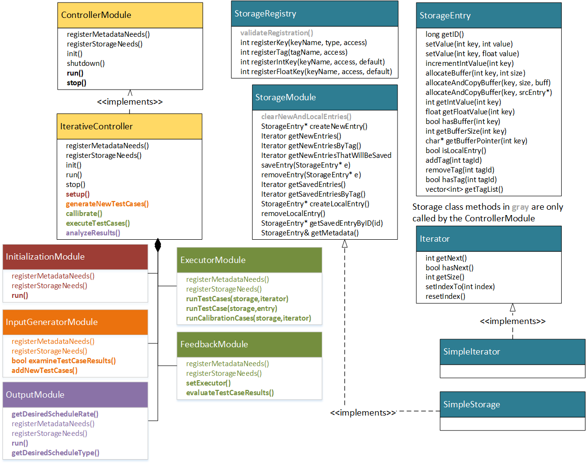
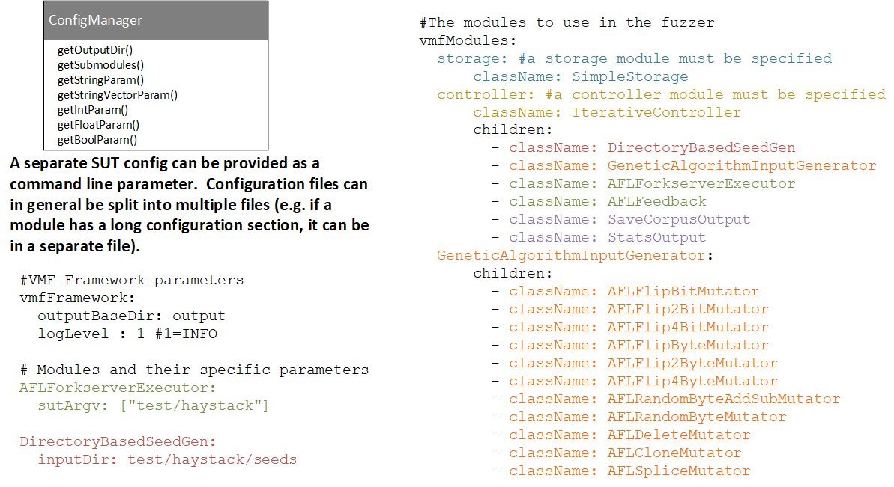
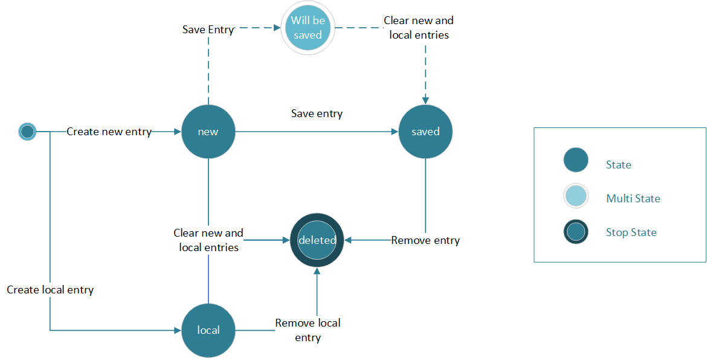

# Top Level Design
This document is intended to describe the software design of the VMF framework.

At the highest level, VMF is a configuration driven framework that loads a number of VMF "modules".  These modules communicate by reading and writing data to a StorageModule.  The ControllerModule is in charge of the control flow of the fuzzer.

***Note: The only VMF user interface component that is provided today is the Distributed Fuzzing UI***


The following section are provided in this document:
* [VMF Planned Extension Points](#vmf-planned-extension-points)
* [Uncommon Extension Points](#uncommon-extension-points)
* [Configuration Files](#configuration-files)
* [Data Flow Diagrams](#data-flow-diagrams)
* [Iterative Controller Control Flow Diagrams](#iterative-controller-control-flow-diagrams)
    + [Input Generation Modules](#input-generation-modules)
    + [Initialization Modules](#initialization-modules)
    + [Executor and Feedback Modules](#executor-and-feedback-modules)
    + [Output Modules](#output-modules)
* [Storage Modules](#storage-modules)
* [Application Initialization](#application-initialization)


## VMF Planned Extension Points
The most common planned extension points for VMF are adding executor and feedback modules (which run a test case on the SUT and evaluate the results, respectively) and mutator modules, which are helper modules for input generation.


| Module Type           | Typical Usage                                     | 
| --------------------- | ------------------------------------------------- |
| Initialization | Seed Generation, or anything that needs to run only once |
| Mutator | Mutation, something that creates new test cases based on old ones |
| InputGenerator | Mutation strategies (something that selects between mutators) |
| Executor | A new "runner" (a new means of interfacing to a test harness, such as libFuzz, AFL++)|
| Feedback | Adding a new "fitness function" which evaluates the effectiveness of prior test cases at fuzzing the SUT |
| Output   | Adding an "output" mechanism to provide information to the human |
|          | Adding a means of managing the set of test cases (e.g. trimming) |
|          | Adding tools that perform additional analysis on crashed test cases (e.g. automated exploitation tools)|


## Uncommon Extension Points
More complex modifications to VMF can be made by extending or replacing the controller or storage modules.  

Replacing the controller could support the following use case:
- Automated fuzzer that swaps execution or input generation strategies based on the how the fuzzing campaign is going

The initial implementations of StorageModule and Iterator are SimpleStorage and SimpleIterator, which provide in-memory storage of all the fuzzing data.  These are simplistic implementations based on std C++ object types, and could be replaced with more highly optimized solutions in the future if needed.

The IterativeController is organized into a series of functions that break up the phases of fuzzing, such that someone could sub-class the controller to modify one of these behaviors.  The Controller will instantiate each of the major module types, based on the information in the configuration file.



## Configuration Files
VMF uses a configuration file to determine which modules will execute, but the control-flow aspect of their execution is managed entirely by the controller module.  A brief example is provided below.  See [writing_new_modules.md](/docs/writing_new_modules.md) for more information on the structure of the VMF configuration files.



## Data Flow Diagrams
This section depicts a data-oriented view of the VMF Basic Modules interacting with the storage module.  This diagram corresponds with the [test/config/basicModules.yaml](../test/config/basicModules.yaml) configuration of VMF.

First, at start-up, the DirectoryBasedSeedGen module creates new storage entries, one per test case that was listed in the input directory.  The TEST_CASE buffer field is filled with the data that was found in each seed file.  Each of the initial storage entries is run through execution and feedback to get initial execution results (though this step is not depicted in the diagram below).

Then, as we start the normal fuzzing loop, the GeneticAlgorithmInputGenerator module retrieves from storage the list of storage entries that were tagged as RAN_SUCCESSFULLY (these are non-crashing, non-hanging test cases).  One of these is selected as the base storage entry which we will used to mutate to create new test cases.  The input generator selects a mutator module, and provides it with the base storage entry, as well as a new storage entry in which to write the mutated data.  The mutator reads the TEST_CASE buffer from the base entry, and write a new, mutated value into the TEST_CASE buffer for the new entry.  This is repeated with each of the configured mutators.

Next, the AFLForkserverExecutor retrieves all of the newly generated storage entries, reads the TEST_CASE buffer, provides that buffer to the SUT, collects the execution results, and writes those results to a number of data fields in the storage entry (this includes tagging the storage entry with CRASHED, HUNG or RAN_SUCCESSFULLY, as well as tagging any entries with new code coverage as HAS_NEW_COVERAGE)


Now the AFLFeedback module retrieves all of the new storage entries.  For each one, it checks if the module has been tagged as HAS_NEW_COVERAGE.  For all entries with this tag, a fitness value is computed, and the entry is saved into long term storage.

Finally, the output modules may execute.  Here the Save Corpus Output module is depicted, which asks storage just for the new entries that will be saved, which it writes to disk in the output directory.


## Iterative Controller Control Flow Diagrams
The following sections provide a module by module description of the more detailed control flow, as captured in sequence diagrams and example code snippets.  This is depiction of the control flow that is used by the IterativeController (slightly different control flow patterns could be used by other controller modules).

### Input Generation Modules
The following sequence diagram depicts how the Controller interacts with InputGeneration modules.  The InputGenerator may use Mutator submodules for mutation-based input generation (e.g. the provided GeneticAlgorithmInputGenerator that is used in the default VMF configuration).

The IterativeController will call an internal method GenerateTestCases, which will call upon the input generator to evaluate the results of any prior test case executions and to generate new test cases for this pass.  The interaction with storage to support the functions is shown below.  Our initial management technique for input generation will use a genetic-algorithm based approach.  

For the GeneticAlgorithmInputGenerator, the generate new test case portions of the code are performed by each Mutator submodule.  This code snippet shows the interaction the mutator module has with storage when creating new test cases:
```c++
//-----Initialization time registration of storage keys-----
fakeVariableKey = registry.registerKey("FAKE_VARIABLE", StorageRegistry::INT, StorageRegistry::WRITE_ONLY);
testCaseKey = registry.registerKey("TEST_CASE", StorageRegistry::BUFFER, StorageRegistry::WRITE_ONLY);       
 
 
//-----Generating a new test case-----
StorageEntry* newEntry = storage.createNewEntry(); //constructs a new storage entry
int id = newEntry->getID();                     //each storage entry has an unique ID
newEntry->setValue(fakeVariableKey,val);           //values can be set on each storage entry
 
//The test case itself is stored as a byte buffer, which is also allocated and managed by storage
int size = 128; //size in bytes
char* buff = newEntry->allocateBuffer(testCaseKey, size);  //char* is used to set the data values
```


### Initialization Modules
Initialization modules run exactly once, when the fuzzer is first started up.  A common usage of Initialization modules is for creating an initial set of test cases (i.e. seed generation).  Initialization  modules that create new test cases would have the same kind of interaction with storage as a Mutator module.

### Executor and Feedback Modules
The following sequence diagram depicts how the Controller interacts with Executor modules.

The IterativeController will call an internal method executeTestCases, which will call upon the executor run any new test cases.  The executor will be provided with an iterator object to use to step through the test cases to be executed.

After execution, the Feedback module must:

- Examine the test case results to determine if the test case is interesting enough to keep in long term storage (and call saveEntry if it is)
- Compute and store the sort by key (our initial implementation will use an AFL-style fitness value).

***Note: Our initial implementation of AFLFitness contains an overrideable methods computeFitness, as we anticipate that subclasses may wish to use AFL-style execution, but with different evaluations of these results.***

Code snippet showing Feedback Module interaction with storage:
```c++
//-----Initialization time registration of storage keys and tags
fitnessKey = fitnessKey = registry.registerKey("FITNESS", StorageRegistry::FLOAT, StorageRegistry::WRITE_ONLY);  
testCaseKey = registry.registerKey("TEST_CASE", StorageRegistry::BUFFER, StorageRegistry::READ_ONLY);  
crashedTag = registry.registerTag("CRASHED", StorageRegistry::WRITE_ONLY); 
 
//-----Evaluating the test case result-----

while(entries->hasNext())
{
    StorageEntry* e = entries->getNext();

    bool saveEntry = false;
 
    //First retrieve any relevant test results that the executor wrote to storage
    e->getXXXValue(XXXkey);

    //Set the sort by key, in this case, "FITNESS"
    nextEntry->setValue(fitnessKey,fitness);
 
    if(saveEntry)
    {
        //Move to long term storage
        storage.saveEntry(nextEntry);

        //Tag the entry (if applicable)
        //Note: All tagged entries will also be saved
        storage.tagEntry(nextEntry, crashedTag);
    }
}
```


### Output Modules
Output modules are the least constrained in terms of their behavior.  They may interact with storage freely, though it is not expected that they would add additional test cases (as this is an input generation function).  These modules can provide output to the human operator or perform corpus management functions.

Code snippet showing interaction with storage:
```c++
//-----Initialization time registration of keys-----
crashedTag = registry.registerTag("CRASHED", StorageRegistry::READ_ONLY);
 
//-----Retrieving all of the new entries that crashed-----
unique_ptr<Iterator> newCrashedEntries = storage.getNewEntriesByTag(crashedTag);
while(newCrashedEntries->hasNext())
{
    StorageEntry* nextEntry = newCrashedEntries->getNext();
}
```


## Storage Modules
A more detailed explanation of the Storage Module is provided below.  This component can be updated in the future if a different data structure would better support optimized data retrieval for future fuzzing functions.  Conceptually storage is able to maintain a few things:

- A set of storage entries, sorted by a particular field in the storage entry
- A set of tags associated with these entries
- A set of metadata fields (for global data)

Importantly the exact contents of the storage entry is configurable at initialize by the set of modules that VMF has been configured to use.  Each module has a registration step that informs storage of it's data needs.  See [writing_new_modules.md](/docs/writing_new_modules.md) for more information on configuring storage.

Each modules reads and writes values on the storage entry, using the following methods:


Modules have a number of other methods that they can call to create new storage entries, or to retrieve specific sets of storage entries, as follows:


Conceptually, Storage Entries have the following state transitions.  Most storage entries begin in the new state when they are created (typically they are created by an input generator module).  They only transition to saved if a module (typically a Feedback module) determines that they are interesting enough to keep around.  For example, the AFLFeedback module only saves storage entries that have new coverage, and the majority of storage entries that are created by the input generator on each pass through the fuzzing loop are discarded as uninteresting.  This discarding point happens when the controller calls the clearNewAndLocalEntries() method.  This call occurs once per iteration through the fuzzing loop, after each module has had a chance to view the data that has been collected on this pass through the fuzzing loop.

The "will be saved" state is primarily of interest to output modules that want to just look at the new interesting storage entries that have been identified.  For example, the SaveCorpusOutput module writes the test buffer from any storage entry that will be saved to disk.

The local state is used only by modules that need local, temporary storage entries for their algorithms.  These storage entries are not uses as part of the main fuzzing loop, and may not be saved.  They are automatically removed when the controller tells storage to clear new and local entries.  They also can be removed manually by the module that created them (useful if the module wants to create a lot of local entries and would like to clean up memory sooner).

Finally, saved modules can also be deleted.  This removes them permanently from storage.  One example of deletion is the CorpusMinimization output module, which removes redudant storage entries.


The Storage implementation is comprised of a number of classes, as depicted in the diagram below.  The default implementation of the StorageModule is captured in the SimpleStorage class.  Storage implementations require a companion Iterator class in order to return accesors to lists of storage entries.  The SimpleIterator class serves this function for SimpleStorage.


## Application Initialization
A number of steps are performed automatically by VMF in order to initialize the system.  Detailed sequence diagrams are provided below.

The VaderApplication class automatically loads any modules plugins, loads and initializes each of the modules in the configuration file, and retrieves the configured StorageModule and ControllerModules.


At initialization time, the Controller Module retrieves any configured submodules.  At runtime, the Controller Module calls upon these submodules to perform each of the fuzzing steps.

