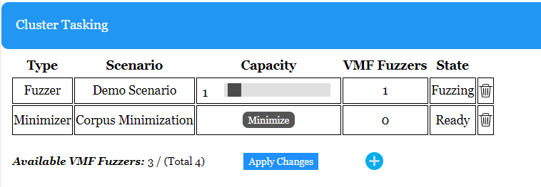

# Getting Started with Distributed Fuzzing

VMF supports a distributed fuzzing mode in which multiple VMF fuzzers work together to fuzz a single SUT.  This is faciliated via a central webserver, the Campaign Data Management Server (CMDS).  CDMS runs within Apache Tomcat.


Distributed fuzzing can be run on a single computer or a collection of networked computers.  

The following things are required for the computer running the distributed fuzzing server:
- Java 17 or later
- An installation of Apache Tomcat 9.0
- A network connection to each of the computers running VMF fuzzing instances (that supports both TCP and UDP Multicast)

The following thing are required for each computer that is running a VMF fuzzer must have: 
- A pre-built copy of the VMF software
- The SUT software (in a known location)
- A small configuration file containing the CDMS information
- A network connection to CDMS (that supports both TCP and UDP Multicast)

VMF fuzzers may also be run on the computer that is running CDMS, and as previously noted, the entire system may be run on a single machine.

See [this document](tomcat_install.md) for instructions on installing Tomcat and Java, and setting up and running CDMS.

The following topics will be addressed in this document:

* [Running Distributed Fuzzing](#running-distributed-fuzzing)
   + [Configuring VMF Fuzzers](#configuring-vmf-fuzzers)
   + [Starting VMF Fuzzers](#starting-vmf-fuzzers)
* [Using the CDMS UI](#using-the-cdms-ui)
   + [Add a Cluster](#add-a-cluster)
   + [Add a Scenario](#add-a-scenario)
      + [Filtering Scenario Files](#filtering-scenario-files)
   + [Assign VMF Fuzzers to Run a Scenario](#assign-vmf-fuzzers-to-run-a-scenario)
      + [Scenario States](#scenario-states)
   + [Viewing Fuzzing Results](#viewing-fuzzing-results)
   + [Viewing Fuzzing Metrics](#viewing-fuzzing-metrics)
   + [Stopping and Shutting Down](#stopping-and-shutting-down)
   + [Settings and Logs](#settings-and-logs)
* [Distributed Fuzzing Configuration Files](#distributed-fuzzing-configuration-files)
   + [CDMS Coordination Modules](#cdms-coordination-modules)
   + [Corpus Minimization](#corpus-minimization)

# Running Distributed Fuzzing
If you installed Tomcat as a service, then CDMS is already up and running.  If you are running it in standalone mode, you will need to manually make sure the Tomcat server is running.

Now you will need to start up your VMF Fuzzers.  You may run as many VMF Fuzzers as you would like, but there will be performance trade offs when running more VMFs than the number of cores on the machine.  Tomcat will also need some CPU resources.

When first configuring the system, we recommend starting with a single VMF in order to first resolve any configuration errors.

## Configuring VMF Fuzzers
Each VMF fuzzer must be configured to connect to CDMS.  A small configuration file contains the connection information needed.  VMF includes a sample configuration in [test/config/serverconfig.yaml](../test/config/serverconfig.yaml).

The only required parameter is the serverURL, which is the URL the VMF fuzzer should use in connecting to CDMS.  This configuration file should contain any `vmfDistributed` or `vmfFramework` parameters.  All other vmf parameters, such as the module to use, will be uploaded to CDMS using its user interface.  

For example, the file below provides a CDMS location of http://127.0.0.1:8080 and sets the logLevel to INFO.  The default logLevel is ERROR, which will provide minimal output to the log file and console.
```yaml
vmfDistributed:
  serverURL: http://127.0.0.1:8080

vmfFramework:
  logLevel : 1 #0=DEBUG, 1=INFO, 2=WARNING, 3=ERROR  (Default)
```

See [docs/configuration.md](configuration.md) for more information on each of the optional configuration values.

## Starting VMF Fuzzers
To start each VMF fuzzer, use the following command, providing a server configuration file that contains the correct `serverURL`.
```bash
cd vmf_install
./bin/vader -d test/config/serverconfig.yaml
```

Each VMF fuzzer will need access to the System Under Test (SUT).  For the directions below, we assume that each VMF was started from within the vmf_install directory.

Two convenience scripts are provided for starting large number of VMF fuzzers on a particular machine in distributed fuzzing mode:
- `tmux_vmfs.sh`: Runs many VMFs using the tmux application (VMFs will not shut down when the terminal shuts down)
- `run_many_vmfs.sh`: Runs many VMF without any third party applications (VMFs will shut down when the terminal shuts down)

Both scripts take two parameters:
- **-n:** the number of VMF fuzzers to run
- **-f:** the configuration file the VMF should be run with

To run the tmux version, first install [tmux](https://github.com/tmux/tmux/wiki/Installing), then run the following command:
```bash
cd vmf_install
./bin/tmux_vmfs.sh -n 10 -f test/config/serverconfig.yaml
```

Use the following command for the non-tmux version, noting that shutting down your terminal will kill the each VMF fuzzer:
```bash
cd vmf_install
./bin/run_many_vmfs.sh -n 10 -f test/config/serverconfig.yaml
```

# Using the CDMS UI
Distributed Fuzzing in CDMS is organized around a `cluster`, where a `cluster` is a collection of VMF fuzzers that are fuzzing the same thing.  "The same thing", more specifically, means fuzzing the same entry point in a SUT, such that it would make sense to share interesting test cases amongst VMF fuzzers.

This documentation will take you through a simple example, fuzzing the haystack SUT that is used in our standalone documentation.

## Add a Cluster
Begin your fuzzing campaign by clicking the green `Add Cluster` button in the upper left hand corner of the UI.


This will display the `Create a Cluster` form.  Provide a name for your cluster and an optional description, then click `create`.


Your newly created cluster will appear in the upper left.


## Add a Scenario
Each VMF fuzzer needs to be told how to configure itself for fuzzing your SUT.  This includes a list of VMF modules to use in constructing the fuzzer, any parameters associated with those modules (such as the path to your SUT), and any initial seed files.  This set of configuration information is called a `scenario`.

Because configuration information often is repeated between scenarios, seeds and configuration files are associated with the whole cluster.  In the `Cluster Files` panel, uploading any seeds and configuration files that you will use in your scenarios.  Click `Choose Files` and then `Upload`.

For this example, upload all of the .yaml files that are located in the vmf install folder under [test/config/distributed](../test/config/distributed/), as well as the .bin files in [test/haystackSUT/test-input](../test/
haystackSUT/test-input/).  After uploading, the files should be marked as "ON SERVER".


*Note: The `SUT_ARGV` parameter specified in `haystack.yaml` is a relative path that has to be understood by the VMF fuzzers that are running.  In this case, you should have started all of your VMF fuzzers in the vmf_install directory, which contains the relative path `test/haystackSUT/haystack`.  You can run VMF from other locations instead, but if the SUT_ARGV parameter contains a relative path, that path will be relative to the path that each VMF was executed in.  For real deployments, you may wish to use an absolute path instead.*

Now go to the `Cluster Tasking` section and click on the `Add Scenario` button:


This will display the `Create a Scenario` form.  Give your scenario a name and leave the scenario type as `fuzzing`.  Use the Ctrl and Shift keys to select `haystack.yaml` and `distributedBasicModules.yaml` in the left panel (labeled `Configuration Files`).  Similarly, select the 3 .bin files in the right panel (labeled `Seed list`).

*Note that Ctrl and Shift work just like they do in other common tools.  Hold down the Ctrl key while clicking on files in order to select multiple files.  Hold down the Shift key while clicking a file to select all of the files between the file you just clicked and the previously selected file.*


Click `Create` to create the scenario.  The scenario will now appear in the `Cluster Tasking` section.  The trash can icon is used to delete a scenario.  Scenarios can only be deleted if they are not currently being run.


If you would like, create a second scenario using `distributedDefaultModules.yaml` instead of `distributedBasicModules.yaml'.

### Filtering Scenario Files
For a large number of files, it is more convenient to select multiple files at once.  The text field above the two panels can be used to filter the list of displayed files.  In the screenshot above, the string ".yaml" was used to display only the .yaml files in the `Configuration Files` list.  Similarly, ".bin" was used to filter the files in the `Seed List`.

The filter boxes can be used with any search string to find a list of files containing that string (e.g. ".bin" or "input").  Use a semicolon to search for more than one thing at once (.e.g ".bin;.yaml").

You can also use Ctrl+A to select all of the files that are currently listed.

## Assign VMF Fuzzers to Run a Scenario
The `Cluster Tasking` panel contains a list of your newly created scenarios.  You should also see `Available VMF Fuzzers` which indicates the number of VMF fuzzers that are available for the server to command.

*Note: If the number of `Available VMF Fuzzers` does not match the number of VMF fuzzers that you started, please check the event logs on the machine that you ran each VMF on, as an error was encountered when starting the VMFs.  The default event log location is in a newly created directory called output.  For example, if you are running VMF from the vmf_install directory, the output directory will be vmf_install/output.  The event log is located in output/{timestampdir}/vmf_{process_id}>/logs/.*

Drag the `Capacity` slider bar next to each scenario name to increase the number of VMF fuzzers.  Click `Apply Changes`.  


After a minute or two, you should see `Unallocated Fuzzer` decrease by the number of fuzzers that you just tasked.  Similarly the `Active Fuzzers` column should increase to the number that you just selected in the slider bar, and the `State` for your scenario should be "Fuzzing".


### Scenario States
State information is displayed for each scenario as follows.
| State | Description |
| --- | ----------- |
| Ready | No VMF fuzzers are fuzzing this scenario |
| Fuzzing | At least one VMF fuzzer is fuzzing this scenario |
| Error | At least one VMF fuzzer encountered an error while fuzzing this scenario.  When this occurs, CDMS will stop the other fuzzers in this scenario. |
| Pending | The number of VMF fuzzers assigned to this scenario has just been decreased.  The scenario will remain in this state until the change has completed.  You cannot change the number of VMF fuzzers assigned to a scenario until it has left the pending state (because it is already in the middle of a prior change).

If a scenario is in an error state, there is likely a configuration problem with the VMF fuzzer.  Check the individual VMF fuzzer's local error log for additional details.

## Viewing Fuzzing Results
Now that you are fuzzing, the current corpus size will be displayed on the corpus.  This is the collection of all interesting test cases that have been found by all the VMFs fuzzing your SUT.  

For haystack, this will be a small number that rapidly stops growing, as this is a trivial system to fuzz, but for a real system this will continue to grow over time.


You can manually examine the test cases in the corpus using the `Corpus Data` panel at the bottom of the page.  


Click in the text box that currently contains "CRASHED" and press the Enter key.  The server will retrieve all of the test cases from the corpus that have a tag containing the string "CRASHED".


The filename listed is a link.  Click on it to download the actual test case.  If you open the file, it will contain the string "needle", which caused haystack to crash.

You can leave this text field blank to search for all test cases, or enter another value.  Typing in "RAN" will return all the test cases with the tag "RAN_SUCCESSFULLY" -- this is all of the interesting non-crashing test cases found by the fuzzer.

Use the Export Button to download the information currently being displayed in the `Corpus Data` table in a .csv format.


## Viewing Fuzzing Metrics

Additional scenario level information is available in the `Scenario Information` panel.  Here average key performance metric data is displayed, where each metric is averaged across each VMF fuzzer that is currently fuzzing this scenario.


Clicking on a scenario name will provide a more detailed view where metrics are displayed for individual VMF fuzzers.  This includes historic information from any prior runs of the scenario.  The `state` field here corresponds to the VMF fuzzer state.  A state of `unregistered` means that the VMF fuzzer is no longer fuzzing the scenario.

| State | Description |
| --- | ----------- |
| Running | The VMF fuzzer is actively running a scenario |
| Error | The VMF fuzzer encountered an error while fuzzing this scenario |
| Paused | The VMF fuzzer has been paused (this is performed during corpus minimization) |
| Unregisted | The VMF fuzzer is no longer fuzzing this scenario, either because it failed or was stopped (this is here to hold historical performance metrics)

After viewing the individual VMF data, use the `Go Back` link to return to the  cluster information page.


## Stopping and Shutting Down
The `Capacity` slider bar may also be used to decrease the number of VMF fuzzers assigned to a scenario.  To remove all the VMF fuzzers currently assigned to a scenario, drag the slider bar to zero and click `Apply Changes`.


To stop all the scenarios in a cluster, use the stop cluster button.  This will signal every VMF fuzzer associated with the cluster to stop what it is doing.  Note: these VMF fuzzers will remain available for further tasking -- you will see them reflected in the `Available VMF Fuzzer` count.  The scenario should return to the `Ready` state.


To shutdown the sytem, use the shutdown button.  This tells every VMF fuzzer to shutdown.  This is distict from the stop cluster command in that the VMF fuzzers are no longer available for tasking after a shutdown.  This command should hence only be used when the intent is to shutdown everything.  To start fuzzing again after a shutdown, the VMF fuzzers will have to be started again -- see [Starting VMF Fuzzers](#starting-vmf-fuzzers).


After a shutdown, the `Available VMF Fuzzers` count will return to 0.

*Note: If your VMF fuzzers crash in a way that prevents them from notifying the server that they are shutting down(e.g. they lose their network connection to the server and timeout), it is possible for the server to report available VMF fuzzers that are not longer running.  The shutdown button will reset all counts, and hence can be used to clear this condition.*

## Settings and Logs
The `Settings` button displays the high level Tomcat configuration settings and provides access to the Tomcat logs.


Clicking on this button will display the following Tomcat configuration settings, followed by event log information.  Click on `Show Log` to view the detailed server logs.


Click on the `Home` button to return to viewing cluster information.


# Distributed Fuzzing Configuration Files
Note that configuration files for distributed fuzzing are slightly different then the configuration files used for standalone fuzzing.  First, if you are using any `vmfFramework` parameters, those were already loaded in the small configuration file that you used to start each VMF fuzzer.  Secondly, there are a few special VMF modules that are needed to coordinate with CMDS.

VMF includes sample configuration files that are preconfigured to include these special modules.  Look at the files in [../test/config/distributed](../test/config/distributed).  `distributedBasicModules.yaml` and `distributedDefaultModules.yaml` are variants of the `basicModules.yaml` and `distributedModules.yaml` that are used when running standalone VMF.  

One notable difference in the distributed form of default modules is that it does not include Corpus Minimization.  Because the corpus is shared amongts VMF fuzzers, a more coordinated network based minimization is needed instead.

## CDMS Coordination Modules
- **ServerSeedInitialization:** ServerSeedInitialization: This module retrieves initial fuzzing seeds from the server (or the minimized corpus if there is one).  It is used instead of DirectoryBasedSeedGen for our basic and default configurations.
- **ServerCorpusOutput:** This module sends interesting test cases to the server.  It is used instead of SaveCorpusOutput, which saves interesting test cases to disk (although you may certainly configure VMF to run both modules, if you also want to save test cases to the local disk).

See [core_modules_readme.md](coremodules/core_modules_readme.md) for additional configuration parameters for these modules.

Additionally, there is a configuration option for StatsOutput that configures it to send performance metric to the server, rather than printing performance data to the console:
```yaml
StatsOutput:
  sendToServer: true
```

## Corpus Minimization

Corpus Minimization is a process that removes redundant test cases from the corpus.  For distributed fuzzing, this needs to be run across the entire common corpus.

VMF includes a sample configuration file `clusterCorpusMin.yaml` that can be used to minimize the common corpus.  This configuration file uses three new distributed fuzzing modules:

   - **RunOnceController:** This module runs each of its submodules exactly once before shutting down.
   - **ServerCorpusInitialization:** This module retrieves the entire corpus from the server.  It is used instead of ServerSeedInitialization for our corpus minimization configuration.
   - **ServerCorpusMinOutput:** This module performs corpus minimization and then notifies the server of what the minimized corpus is.

See [core_modules_readme.md](coremodules/core_modules_readme.md) for additional configuration parameters for these modules.

To minimize the haystack corpus, create a new scenario using `clusterCorpusMin.yaml` and `haystack.yaml` as the `Configuration Files`.  **Select a type of `Minimizer` in the drop down `Type` menu.**  No seeds are needed for this scenario, because it will always retrieve the entire corpus.


Make sure you have at least one available VMF fuzzer (if you have used all of your VMF fuzzers, you can temporarily unassign a VMF from fuzzing by decreasing the capacity of one of your scenarios by 1).  Click the `Minimize` button to run the minimization scenario.

*Note: If you don't see a minimize button, you forgot to select type `Minimizer` when creating the scenario.  Delete the scenario and re-create it with the correct type.*



You should see the corpus size decrease on the haystack cluster (and if you search `Corpus Data`, fewer test cases will be returned). Because the haystack corpus is so small, minimization will happen very quickly.  What happened in the background was:
+ The `minimizer` scenario started up, and any `fuzzer` scenarios in the corpus were paused
+ The `minimizer` scenario ran its minimization algorithm and provided a new minimized corpus to the server
+ The server restarted each of the `fuzzer` scenarios
+ Each `fuzzer` scenario retrieved the new minimized corpus from the server, and started fuzzing again using that corpus

For a real fuzzing campaign with a large corpus, this could take quite some time, as each test case in the corpus has to be re-run.  You can use the `clusterCorpusMin.yaml` configuration file with your own SUT specific configuration file to minimize the corpus for your own SUT.

Any fuzzer scenarios that are currently running will be paused, the minimization scenario will run, the server will update the common corpus to reflect the new corpus contents, and any fuzzer scenarios will resume fuzzing.


