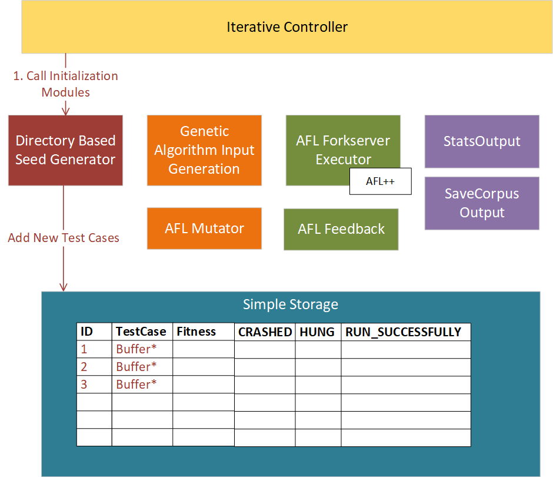
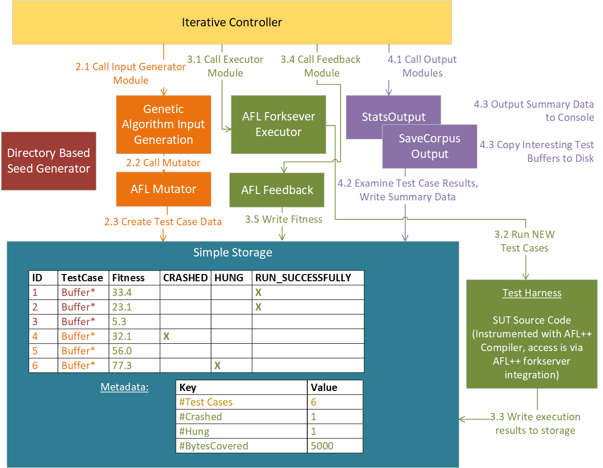

# Getting Started

This "Getting Started" document is a more in-depth version of VMF's basic usage instructions (see [/README.md#Usage](/README.md#Usage)). For more detail about VMF's design, see [docs/design.md](/docs/design.md).

  * [Running VMF Configurations](#running-vmf-configurations)
    + [Run example Haystack SUT with VMF](#run-example-haystack-sut-with-vmf)
    + [Splitting configuration into multiple files](#splitting-configuration-into-multiple-files)
    + [Run your own SUT with VMF](#run-your-own-sut-with-vmf)
  * [Example VMF Configuration](#example-vmf-configuration)
    + [Initialization](#initialization)
    + [Main Fuzzing Loop](#main-fuzzing-loop)
  * [Default VMF Configuration](#default-vmf-configuration)
  * [Reconfiguring VMF](#reconfiguring-vmf)
    + [Strings Initialization](#strings-initialization)
    + [Radamsa](#radamsa)
    + [CRC32Formatter](#crc32formatter)
    + [Configuration Parameters](#configuration-parameters)

## Running VMF Configurations

The configuration files [basicModules.yaml](/test/config/basicModules.yaml) and [defaultModules.yaml](/test/config/defaultModules.yaml) are intended to be reusable across different SUTs, and can be run with either [haystack_file.yaml](../test/haystackSUT/haystack_file.yaml) or [haystack_stdin.yaml](../test/haystackSUT/haystack_stdin.yaml). 

[defaultModules.yaml](/test/config/defaultModules.yaml) or [basicModules.yaml](/test/config/basicModules.yaml) can be used to fuzz a SUT of your choosing as well by combining it with a new configuration file that contains the SUT specific parameters contained in the haystack specific .yaml files.

See the sections below for more details:

### Run example Haystack SUT with VMF

The following command will run VMF with a simple System Under Test (SUT) called haystack, providing the fuzzed input to stdin.

```bash
cd vmf_install
./bin/vader -c test/config/basicModules.yaml -c test/haystackSUT/haystack_stdin.yaml
```

In the `output` directory, a timestamp based subdirectory will be created.  Within that directory, you will find a copy of the configuration used to run VMF, a logs directory that contains an event log, and a testcases directory where the SaveCorpusOutput module will save a copy of each of the unique tests cases that VMF encounters.  This module will save an additional copy of any crashed, hung, or formatted test cases as well.

This configuration uses two config files. The first contains a set of basicModules with which to configure VMF.  The second contains parameters that are specific to the haystack SUT.

By changing only the second config file, we can configure VMF to run haystack with a file based input, rather than stdin.
```bash
cd vmf_install
./bin/vader -c test/config/basicModules.yaml -c test/haystackSUT/haystack_file.yaml
```

If you are using a full source copy of VMF that you have build, you can also run the same ./vader command directly from the top level build directory (it is not neccesary to use the "make install" command to create the vmf_install directory prior to running the application).

Similarly, you may copy and modify haystack_file.yaml or haystack_stdin.yaml to configure VMF to fuzz a different SUT of your chosing (as long as that SUT will take stdin or file based inputs).

Note that the VMF configuration files can also be arbitrarily configured to move individual sections to different areas, and to be split into as many configuration files as are desired.  VMF will concatenate the provided configuration files into a single yaml configuration, however the resulting concatenated configuration must be valid yaml.  Practically this will impose some limitations on how the configuration can be split.  The simplest approach is to not attempt to split top level sections of the configuration (e.g. "vmfModules:") into more than one file.

### Run your own SUT with VMF 

For our simple test application, we include a pre-compiled version of our haystack SUT. But to run VMF with your own SUT, you must first compile the SUT with special instrumentation that allows the executor to observe the code coverage that it is obtaining with each test case.

VMF ships with `Vader::AFLForkserverExecutor` as its default executor. To use this executor, the SUT/harness must be compatible with AFL's forkserver execution model. If you are unfamiliar with this execution model, see [the `#Fuzz-Harness` section in `Intro to Fuzzing`](/docs/intro_to_fuzzing.md#Fuzz-Harness). 

***Note: VMF currently only supports SUTs that execute as native linux applications (bare-metal and virtualized environments are not supported in this release)***

The AFL++ compiler must be also installed in order to build the SUT/harness. You can install the `afl++` or `afl++-clang` Ubuntu packages or build AFL++ from source. Use `afl-gcc` to compile the SUT/harness as follows:

```bash
# Compiling a simple C application to work with Vader::AFLForkserverExecutor
afl-gcc test/haystackSUT/haystack.c -o test/haystackSUT/haystack

# Compiling a simple C application to work with Vader::AFLForkserverExecutor
afl-gcc yourCode.cpp -o yourCode
```

For maximum performance out of the AFL Executor, the following commands will need to be run ***as root*** prior to executing VMF.  This will need to be run each time the computer reboots.  You can run VMF without setting these settings, but it will run a lot more slowly:

```bash
echo core >/proc/sys/kernel/core_pattern
cd /sys/devices/system/cpu
echo performance | tee cpu*/cpufreq/scaling_governor
```

## Example VMF Configuration
VMF is a configuration driven fuzzer.  The VMF configuration file specifies which fuzzing modules to combine together for a fuzzing campaign.  The provided example configuration files are used to fuzz a simple System Under Test (SUT), the provided [/test/haystackSUT/haystack.c](../test/haystackSUT/haystack.c) program.

This particular VMF fuzzer is constructed with the following basic set of modules, as defined in [test/config/basicModules.yaml](../test/config/basicModules.yaml):
- A storage module (SimpleStorage)
- A single controller module
    - IterativeController
- A single initialization module
    - DirectoryBasedSeedGen
- A single input generator
    - GeneticAlgorithmInputGenerator
- A single executor with an associated feedback module
    - AFLForkserverExecutor
    - AFLFeedback
- Two output modules
    - SaveCorpusOutput
    - StatsOutput
- Eleven mutator modules, one for each of the supported mutation algorithms

Each of these modules work together, exchanging information via storage, which provides a centralized in-memory storage of the set of test cases that the fuzzer is working with (i.e. the "corpus").

### Initialization
The InterativeController calls the DirectoryBasedSeedGen initialization module just once.  It creates an initial set of test cases, using the input files found in [test/haystackSUT/test-input](../test/haystackSUT/test-input).



### Main Fuzzing Loop
The IteratorController then loops through the input generator, executor, and output modules over and over to execute the SUT with a huge number of inputs.

The input generator uses the provided mutator modules to modify or mutate an existing test case, making small changes to the data buffer that are provided to the SUT.  The executor runs each of these test cases on the SUT and observes the resulting output to determine if the test case covered new lines of code and produced interesting results such as crashes.  It records what it learns in storage.



## Default VMF Configuration
The slightly more complex configuration in [test/config/defaultModules.yaml](../test/config/defaultModules.yaml) is the recommended starting point for fuzzing a real SUT.  It adds a few more modules to the basic configuration.
Specifically, the following modules are added:
- MOPTInputGenerator (instead of GeneticAlgorithmInputGenerator)
- AFLFavoredFeedback (instead of AFLFeedback)
- CorpusMinimization

The first two modules provide better performing versions of the basic capabilities discussed previously.  CorpusMinimimization will remove rendundant test cases (by default it is configured to run every half hour as well as at application shutdown).  As CorpusMinimization needs to re-run all the test cases to get more detailed coverage information, it also needs a second copy of the AFLForkserverExecutor to assist in this task.

Additionally, a number of commented out modules are provided for conviently reconfiguring VMF for your needs.  These are discussed in detail in [Reconfiguring VMF](#reconfiguring-vmf).

## Reconfiguring VMF
The [test/config/defaultModules.yaml](../test/config/defaultModules.yaml) configuration file can be easily modified to enable some additional modules in this VMF configuration.

### Strings Initialization
As a quick example of VMF's configuration, you may comment in the line that reference "StringInitialization" to add an additional Initialization module to the configuration.  This Initialization modules will extract any ascii strings from the SUT and use these to generate a large set of additional initial test cases.

```yaml
vmfModules:
  storage: #a storage module must be specified
    className: SimpleStorage
  controller: #a controller module must be specified
    className: IterativeController
    children:
      #- className: CRC32Formatter
      #- className: StringsInitialization    #***Comment in this line***
 ```

You will also need to provide StringsInitialization with the path to the SUT.  Add the following section to your SUT-specific configuration file:
```yaml
StringsInitialization:
  sutArgv: *SUT_ARGV    #You may also directly list the value here, rather than using a yaml anchor
  #sutArv: ["test/haystackSUT/haystack"]   #This is an example of directly providing the value
```

Rerun VMF with the modified configuration file, and you will observe the generation of additional initial test cases.

### Radamsa
You may also comment in the following line to add the Radamsa mutator module to the list of mutators being used.  The Radama mutator is particularly well suited to ascii based inputs.  It does run more slowly than some of the other mutators, so we recommend only including it for SUTs that are known to process ascii inputs.

 ```yaml
  MOPTInputGenerator:
    children:
      #- className: RadamsaMutator      #****Comment in this line*****
 ```

### CRC32Formatter
Commenting in the following line configures VMF to run the CRC32Formatter.  This module inserts a CRC32 checksum at the end of each test case.  Now the `output/TIMESTAMP/formatted` directory will contain formatted copies of each unique test case. In this directory you can see that the additional checksum bytes were added to each test case.  Note that the haystack application does not actually check for a checksum.


 ```yaml
vmfModules:
  storage: #a storage module must be specified
    className: SimpleStorage
  controller: #a controller module must be specified
    className: IterativeController
    children:
      #- className: CRC32Formatter      #****Comment in this line*****
 ```


### Configuration Parameters
At the bottom of the [test/config/defaultModules.yaml](../test/config/defaultModules.yaml) configuration file, there are a number of module specific configuration options that can be adjusted to change the behavior of the modules.  See also the more detailed module by module documentation in [docs/coremodules/core_modules_readme.md](/docs/coremodules/core_modules_readme.md) for additional parameters that can be adjusted.

#### Fuzzer Runtime
By changing the runTimeInMinutes parameter to a non-zero value, you can configure the fuzzer to shutdown automatically after a specified amount of time has passed.  Note that this parameter is specified as a whole number of minutes, and that the fuzzer may not shutdown precisely after this time has passed, as it will finish it's current fuzzing loop and perform any shutdown processing first.

Add the following section to your SUT-specific configuration file:
```yaml
controller:
  runTimeInMinutes: 0     #***Change this line***
```

#### Output Statistics Logging
The outputRateInSeconds parameter controls how frequently the output statistics are printed to the log file.  For longer running test runs, you will likely want to increase the value of this parameter, as the default value prints every 5 seconds.

Add the following section to your SUT-specific configuration file:
```yaml
StatsOutput:
  outputRateInSeconds: 5     #***Change this line***
```

#### Corpus Minimization Parameters
You can change the frequency of CorpusMinimization by modifying the parameter at the bottom of the config file.  Try changing it to a few minutes to see CorpusMinimization run without having to wait 30 minutes (Note: this is for demonstration purposes only, we do not recommend running a real fuzzing campaign with Corpus Minimization happening more frequently than every half hour).  You may also set this parameter to 0 to have CorpusMinimization only run when the fuzzer shuts down.

Add the following section to your SUT-specific configuration file:
```yaml
CorpusMinimization:
  frequencyInMinutes: 30   #***Change this line***
```

After running, CorpusMinimization will write the minimized subset of test cases to the output directory under "minimized" (e.g. for the haystack configuration, see `/output/TIMESTAMP/minimized`).
