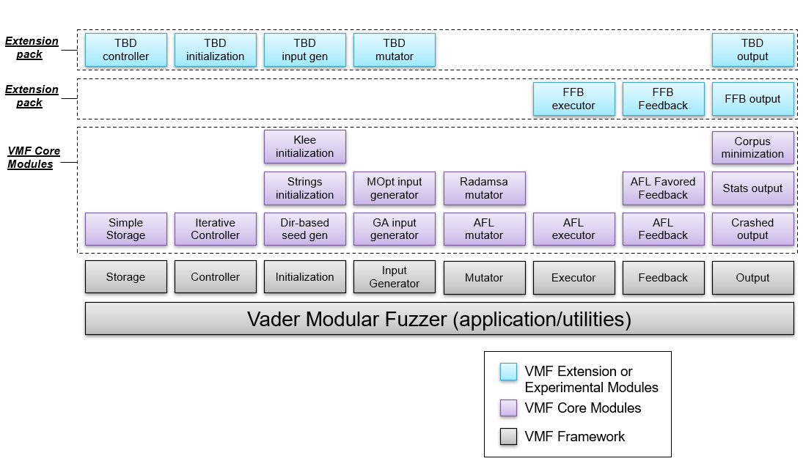

# Fuzzing Glossary

## General fuzzing terms
**System Under Test (SUT)** - the software that is being tested by the fuzzer, this may also be referred to as Software Under Test (SUT), Program Under Test (PUT), or Application Under Test (AUT).

**Fuzzing software (e.g. VMF)** - a tool that exercises the SUT's input space to elicit new behaviors ([Brumley](https://twitter.com/thedavidbrumley/status/1495880726457298944 "\"Fuzzing is the process of automatically exploring the program input space to elicit new behaviors\""))

**Fuzz harness** - tooling that (1) manages the lifecycle of the SUT, (2) maps input provided by the fuzzing software to the SUT's input, and (3) returns data from the SUT's execution of the input as feedback to the fuzzing software.  See [Intro to Fuzzing](./fuzz_harnessing.md) for more information.

**Bug** – a departure from nominal execution, such as a crash, hang, or violation of security policy.

**Bug oracle** – A bug oracle is a program, perhaps as part of a fuzzer, that determines whether a given execution of the PUT violates a specific security policy. ("Definition 5", Manés, et. al, 2019)

**Fitness function** – an algorithm that transforms feedback from the execution stage to data that can be processed by the objective function (e.g. transform code coverage to a weighted value/float that can be sorted; the objective function could be to maximize the sorted fitness values)

**Fitness value** – the output of the fitness function that that can be processed by the objective function (e.g. a weighted value/float that can be sorted; the objective function could be to maximize the sorted fitness values)

**Objective function** – what the fuzzer is instructed to find/solve for. The objective function is often a proxy for the true objective of the fuzz operator (e.g. maximize code coverage instead of maximize bugs, since bugs are unknown but code coverage is measurable)

## VMF-specific terms and diagrams

**VMF framework** - Module base classes intended to be extended to provide specific capabilities, plus the common application, utilities, and unmodifiable/unextendible classes​.

**VMF module** - A specific derived class (of a VMF module base class) that provides a particular capability​

**VMF core modules** - A set of initial VMF modules that can be used to instantiate the fuzzer.

**VMF extension pack​** - A set of modules that work together to provide a higher-level capability​

The VMF framework architecture largely follows the terminology of the generic fuzzing algorithm used in ([Manés, et. al, 2019](https://arxiv.org/pdf/1812.00140.pdf "The Art, Science, and Engineering of Fuzzing")).

**Controller module** - VMF Controller modules are the top level module in Vader.  The controller module is required to manage the sequencing of the “fuzzing loop”, and call StorageModule::clearNewAndLocalEntries() at the end of each fuzzing loop.

Controllers should be written to be fairly generic to the set of modules being used.  Controllers should not be adding/modifying/deleting test cases in storage.

Controllers typically support submodules of type:  InitializationModule, ExecutorModule, FeedbackModule, InputGeneratorModule, and OutputModule.  Controllers with Executor and Feedback submodules are responsible for determining which storage entries are used by these modules.  However, a Controller could be written to manager other controllers, in which case its submodules would also be of type Controller.

**Storage module** - VMF Storage modules provide for storage of test cases and their associated data.  Support for global metadata variables is provided as well.

**Initialization module** - Implements a function that "modif[ies] the initial set of fuzz configurations before the first fuzz iteration. Such preprocessing is commonly used to instrument the PUT, to weed out potentially-redundant configurations (i.e., “seed selection”), to trim seeds, and to generate driver applications." An Initialization module "can also be used to prepare a model for future input generation." (Manés, et. al, 2019)

VMF Initialization modules are run once, prior to the main fuzzing loop.  They are typically used to manage seeds, either loading, generating, or selecting seeds.  Static instrumention of the SUT is performed outside of VMF, prior to starting the fuzzer.  Model preparation for input generation is typically done as part of the input generator itself.

**InputGenerator module** - Implements a function that determines the contents of a test case. "Traditionally, fuzzers are categorized into either generation- or mutation-based fuzzers. Generation-based fuzzers produce test cases based on a given model that describes the inputs expected by the PUT. […] On the other hand, mutation-based fuzzers produce test cases by mutating a given seed input. Mutation-based fuzzers are generally considered to be model-less because seeds are merely example inputs and even in large numbers they do not completely describe the expected input space of the PUT." (Manés, et. al, 2019) 

VMF InputGenerator modules create new inputs that will be run by the Executor Module(s).  InputGenerator modules that use mutation based strategies typically have configurable submodules of type MutatorModule.

**Mutator module** - Implements one or more functions that modify the contents of a test case. "Most model-less fuzzers use a seed, which is an input to the PUT, in order to generate test cases by modifying the seed. A seed is typically a well-structured input of a type supported by the PUT: a file, a network packet, or a sequence of UI events. By mutating only a fraction of a valid file, it is often possible to generate a new test case that is mostly valid, but also contains abnormal values to trigger crashes of the PUT." (Manés, et. al, 2019)

VMF Mutator modules mutate the provided data buffer.  Mutator modules are typically submodules of InputGeneratorModules.

**Executor/Feedback modules** - "After an input is generated, the fuzzer executes the PUT on the input and decides what to do with the resulting execution." (Manés, et. al, 2019) The executor and feedback modulse performs several functions that correspond to the Bug Oracle and InputEval functions in (Manés, et. al, 2019):
* VMF Executor Modules: Run the SUT using each test case as an input and capture the results of that execution in storage. This includes evaluating the bug oracle.
* VMF Feedback Modules: Evaluate the results of running a test case and determine whether the test case is interesting enough to keep in long term storage.  This decision is made based on the information that an executor provides about the test case execution results.  Typically feedback modules will also write the sortByKey value that is used to sort test cases in long term storage.

**Output module** - Implements functions that "can modify the set of configurations based on the configuration and execution information collected during the current fuzzing run," corresponding to the ConfUpdate function in (Manés, et. al, 2019). 

VMF Output modules are used to examine the results of test cases.  They are fairly general purpose and may be used to output information to a human operator, to trim the corpus of test cases, or to perform any other function that should occur periodically as test cases execute.

OutputModules are schedulable, and indicate a preferred scheduling rate to the Controller managing them.

## Distributed Fuzzing terms ##
**Distributed Fuzzing** - The ability to run multiple instances of VMF simultaneously and collaboratively.  The fuzzers work together to fuzz a particular SUT.​

**Fuzzing Scenario** - A set of VMF instances with a common fuzzing setup (SUT, config files, initial test cases, etc.). ​

 * Three available scenario types: fuzzer (fuzz a target), analyzer, minimizer (minimize the common corpus of a cluster)​

**Fuzzing Cluster** - A set of fuzzing scenarios which are all targeting the same SUT but have other differences in their setup.​

 * The input point into the SUT in the test harness must be the same for all scenarios in a cluster, such that it makes sense to view all fuzzers in the cluster as having a common corpus​

 * Within a single cluster the compilation of the SUT may be different (e.g. compiled with a sanitizer or not)​

 * Within a single cluster the configuration of VMF may be different (e.g. parameter changes to focus on faster test cases vs. ones with more coverage)​

 * Local Corpus: The set of test cases associated with an individual VMF instance.​
 
**Common Corpus** - The aggregate set of test cases associated with the fuzzing cluster; an individual test case may appear in more than one local corpus​