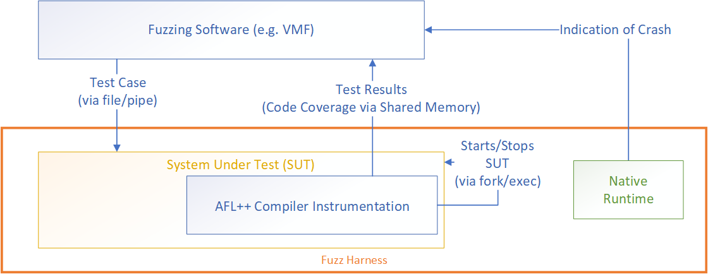
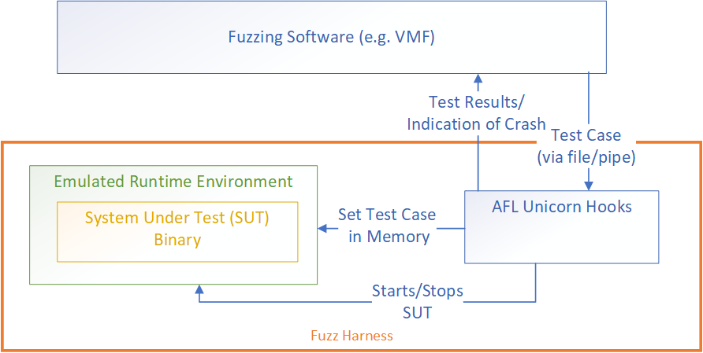
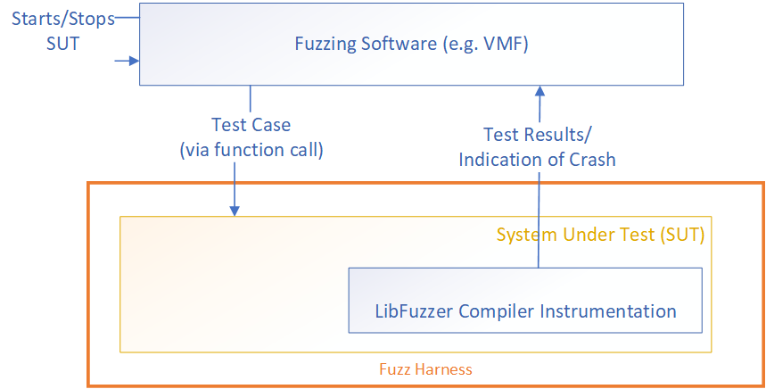

# Intro to Fuzzing

**For the purposes of getting started, the most important component is the "fuzz harness." All other components have sane defaults for the most common fuzzing paradigms.**

## Harnessing a System Under Test (SUT)

Simplistically, the "fuzzing software" (e.g. VMF) provides test cases.  The "fuzz harness" must provide a way to run the SUT, a way to feed it test cases, and a way to retrieve the test results for analysis by the fuzzing software.  

The "fuzz harness" is responsible for:

- managing the lifecycle of the SUT (e.g. starting and resetting for each new testcases)
- inputting test cases from the fuzzing software into the SUT
- returning data from the SUT to the fuzzing software (e.g. code coverage, exit status, ...)

An interesting aspect of common fuzz harness implementations that often confuses the meaning of a "fuzz harness" is that the fuzz harness may be either external to the SUT or compiled into the SUT itself.

### Example A


 _Example A)_ the default AFL fuzz harness is when the SUT is hardcoded to read input from either a file or stdin. Then, the SUT is compiled using the AFL compiler, which adds instrumentation that manages the lifecycle of the SUT (see forkserver), tracks and returns code coverage as a bitmap to the fuzzing software. In this case the fuzz harness' responsibilities are implemented both in the SUT itself and by instrumentation that is compiled into the SUT. The runtime is native (non-emulated) execution.

 ***Note: VMF currently uses only this kind of fuzz harness (via our AFLForkserverExecutor Module)***

### Example B


_Example B)_ AFL unicorn enables fuzzing non-native SUTs without source code. In this case, the SUT's runtime is the unicorn emulation environment. Because the SUT is a binary (or memory snapshot), the instrumentation cannot be compiled in. Instead, unicorn's hooking framework is used to implement the fuzz harness. Hooks must be defined to manage the SUT's lifecycle by setting up and resetting state between fuzz testcases, inject fuzzed input in memory to be evaluated, and capture and return code coverage.

### Example C


_Example C)_ In libFuzzer-style fuzzing, all of the harness' responsibilities are implemented in a single file, colloquially referred to as "the harness." The user overloads the "LLVMFuzzerTestOneInput" function (see below) to pass data to the SUT, and that function is called for each testcase. Code coverage instrumentation and feedback to the fuzzing software is implemented as a compiler pass when this "harness" is compiled into the SUT.

```c
extern "C" int LLVMFuzzerTestOneInput(const uint8_t *Data, size_t Size);
```

