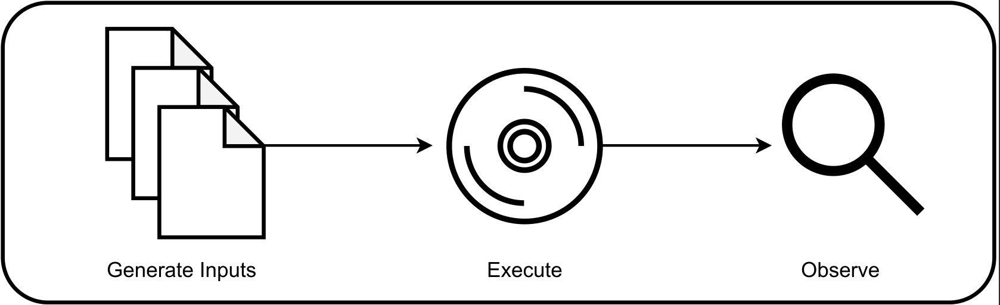

## What is Fuzzing?

Fuzzing is a type of random testing used to identify vulnerabilities in software. The simplest fuzzers generate inputs, and execute inputs against a target software (Software-Under-Test `SUT`), observing the results in hopes of finding a crash. 

## Why Use a Fuzzer?

Traditional forms of software testing involve creating individual unit tests for each case that needs to be tested. Fuzzing is a hands off approach that instead uses randomly generated inputs to test for software vulnerabilities. The randomness of fuzzing allows automatic edge case coverage to be tested without a developer manually having to figure out how to reach the case.

## What Types of Software Work with Fuzzers?

Fuzzers are great for software that accepts input from the command line or a file. While not completely avoidable, stateless programs are more efficient to fuzz as no state clean up happens in-between executions. Thereby, fuzzing is best performed on software targets that are deterministic in nature. Randomness greatly reduces the effectiveness of fuzzers and makes trying to understand crashes difficult and not easily reproducible.

## Categorizing Fuzzers

### Source Level Access

Fuzzers are categorized in a few different forms based on access to the source code of a target. Each type has different trade-offs in speed verses accuracy. Depending on the target, you may only have access to a binary and not the full source, or you may be a developer looking to fuzz test and have complete access to the source.

|   Type    |                                     Description                                      |
| :-------: | :----------------------------------------------------------------------------------: |
| White Box | Full source code and architectural knowledge, typically the slowest type of fuzzing e.g. [Klee](../coremodules/core_modules_readme.md#kleeinitialization)|
| Grey Box  |             Limited source code access, partial knowledge, medium speed e.g. [AFLForkserver](../coremodules/core_modules_readme.md#aflforkserverexecutor)             |
| Black Box |     No knowledge, is limited by speed and lack of intelligent input generation e.g. [Frida](../coremodules/core_modules_readme.md#fridaexecutor)      |

### Input Generation 

Based on how inputs are generated fuzzers gain additional categorization.

|      Type      |                                    Description                                     |
| :------------: | :--------------------------------------------------------------------------------: |
| Mutation Based |         Generates test cases using intial valid test cases called *seeds* e.g. [AFLMutators](../coremodules/core_modules_readme.md#aflmutators)          |
|  Model Based   | Generates test cases based on a given model describing the structure of a testcase e.g. [Gramatron](../coremodules/core_modules_readme.md#gramatron) |

## Fuzzing Harnesses

In-order to supply a `SUT` with a test case, fuzzing operators must implement a harness. Essentially a stub that manages mapping an input from the fuzzer to the `SUT`'s input area. For targets that have state, a harness will manage resetting the state per execution. For more information about harnesses please see [fuzz harnessing](https://github.com/draperlaboratory/VaderModularFuzzer/blob/main/docs/fuzz_harnessing.md).

Please see the [glossary](https://github.com/draperlaboratory/VaderModularFuzzer/blob/main/docs/glossary.md) for more information about each part of a fuzzer.

## Who these tutorials are for?

Maybe you are new to fuzzing or just new to VMF. If you have prior fuzzing experience then these tutorials will provide a good background into the Vader Modular Fuzzer and how to properly utilize it's many features.

If you are new to fuzzing, these tutorials might be somewhat of a challenge to follow but when all is said and done you will have a firm grasp on what fuzzing is.

## Requirements

There are a few requirements to be successful in these tutorials:

* Have a basic understanding of both the C and C++ programming languages.
* Have read through the glossary to familiarize yourself with the different terms associated with fuzzing.
* An open mind, willing to try new methods and troubleshoot when things go wrong.
