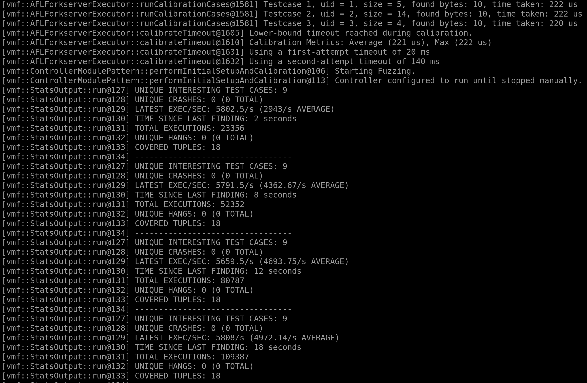

## Goals for this exercise

After finishing this exercise, you should have a basic understanding of how to use the Vader Modular Fuzzer (VMF):
*  Building VMF. 
*  Compiling a target with instrumentation.
*  Using a basic configuration script to fuzz the `haystack.c` SUT.

*Note: it is advised that you read tutorial **0.5 Fuzzing, a Primer** before starting this tutorial, as it will give you a better understanding of fuzzing terms we will use.*

## Background
 
 VMF is a fuzzer that is able to plug-in and plug-out different types of fuzzing modules. These include: initialization, input generation, input mutation, input formatting, execution, feedback, and output. The main focus of VMF is to allow different fuzzing capabilities to be integrated, reused, and adapted, all under one common user tool set.

## Environment

 In this tutorial we will be using **Ubuntu 24.04**.
 
 Note: VMF is usable with many distributions of Linux and, as well as with Windows. 
 
 VMF is built using the CMake build system. Before attemping to build, make sure you have CMake and its dependencies installed.
 
`sudo apt-get install cmake libcurl4-openssl-dev`

VMF comes shipped with different configurations. For this example we will be using the [haystack_file.yaml](../../test/haystackSUT/haystack_file.yaml) and [basicModules.yaml](../../test/config/basicModules.yaml) configuration files. This configuration uses the `AFLForkserverExecutor` as its executor module. Any target using this executor must be built with the afl-clang or afl-gcc compiler, to properly instrument a target. Therefore, it is important that AFL++ be built and in the system path. See [Building and installing AFL++](https://aflplus.plus/docs/install/) for information on how to install AFL++ on your system. 

For more inforamtion see: [AFLForkserverExecutor Readme](../coremodules/core_modules_readme.md#aflforkserverexecutor) and [AFLForkserverExecutor Configuration](../coremodules/core_modules_configuration.md#section-aflforkserverexecutor) documentation.

## Building VMF

First, pull the latest release from Github onto your local machine. 

`git clone https://github.com/draperlaboratory/VaderModularFuzzer.git` 

*Note: If your C++ compiler is not gcc or clang, you will need to explicitly set the compiler using the associated CMake flag.*

`cmake -DCMAKE_CXX_COMPILER=g++` 

Second, to build VMF create a new build directory, initialize the CMake system, and then execute `make install -j<#cores>`.

```
# from /path/to/vmf/ directory:
mkdir build
cd build
cmake ..
#Or optionally use this version instead to specify an install path
#cmake -DCMAKE_INSTALL_PREFIX=<your install path here> ..
make install -j8
```

The Makefile will handle building VMF, as well as all sample target applications and places the build in a directory titled `vmf_install`. 

For more information about the build system as well as addtional build features. Please see [build_system.md](../build_system.md).

## Fuzzing with VMF

We will begin with the simple target application: [haytstack.c](../../test/haystackSUT/haystack.c). This example program checks to see if an input buffer contains the string 'needle', which if it does, raises a segmentation fault. 

The build system has already handled compiling and instrumenting our target with instrumentation suitable for the VMF `AFLForkserverExecutor`. See below for a general example of compiling for the `AFLForkserverExecutor`.

``` 
# Compiling a simple C application to work with VMF `AFLForkserverExecutor`
afl-c++ yourCode.cpp -o yourCode
```

Since our target or SUT has been built with the proper instrumentation we can now initialize a fuzzing campaign using VMF. 

Many fuzzers use command line arguments to indicate configuration settings i.e. options, inputs, or outputs. VMF instead uses YAML files for configuration settings. We will examine the YAML config files in more detail in the following tutorial.  For now, start VMF by executing the command below, which uses basic configuration files.

```
# from /path/to/vmf_build/ directory:
./bin/vader -c test/config/basicModules.yaml -c test/haystackSUT/haystack_file.yaml 
```



After initialization VMF should start outputting the following information on the current fuzzing campaign:

`Unique Interesting Test Cases`: The number of test cases that causes new coverage to be traced.

`Unique Crashes`: The number of test cases that cause a never before seen crash.

`Latest Exec/Sec`: The number of target executions per second i.e. how quickly VMF is providing a new test case to a target and executing the target with that test case.

`Time Since Last Finding`: The amount of time that has passed since a test case has discovered new coverage.

`Unique Hangs`: The number of test cases that cause a never before seen hang.

`Covered Tuples`: The number of unique covered paths in a target. See [AFL Internals](https://afl-1.readthedocs.io/en/latest/about_afl.html#how-afl-works) for more information about coverage tuples.

These outputs are produced by the `StatsOutput` module, see: [StatsOutput Documentation](../coremodules/core_modules_readme.md#statsoutput) for more information about the `StatsOutput` module.

Given enough time VMF will find a test case that causes a crash in our SUT. 

Information about each fuzzing campaign including initial, crashing, and coverage increasing test cases, campaign log and configuration files can be found in the output directory indicated in the `yaml` configuration files. Because we initialized VMF using a default configuration `yaml`, information for the `haystack` campaign will be found under:

`<vmf_dir>/build/vmf_install/output/<date_time>`

## Critical Success!

Congratulations, you have successfully started your first VMF fuzzing instance! In the next tutorial we will look at how to take advantage of VMF's modularity through  `yaml` configuration scripts. As well as exploring RedPawn, VMF's implementation of RedQueen a popular light weight method of solving magic bytes and checksums.
