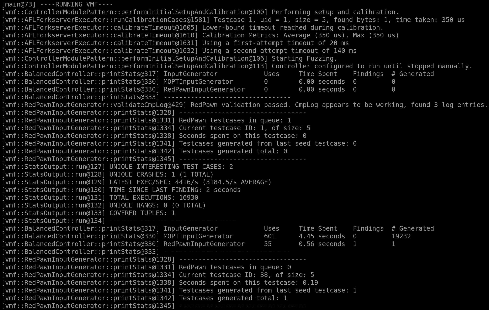

## Goals for this exercise

After this exercise you should have a deeper understanding of how VMF uses `yaml` files for configuration:
* What a `yaml` file is.
* How `yaml` files are used for configuring VMF.
* How to change the basic configuration of VMF to access more advanced features.
* How different SUT's need different fuzzing techniques to be effective.

## What is a `yaml` file? 

`yaml` is a type of data serialization language. This allows `yaml` files to be used as a standard for writing configuration files. 

Items in a `yaml` file are treated as a key-value pair.

`<key> : <value>`  

 Lists contain a collection of items marked with `-` .
 
```
animals:
  - dog 
  - cat
  - deer
```

`yaml` files are also able to contain anchors indicated with  a `&`. They act similarly to environment variables in a Linux environment. Using anchors, configuration files are able to be organized into separate types i.e. one for a SUT, one for the configuration of each module of VMF.

```
$ cat fruits.yaml

fruits:
   - &APPLE_SOURCE ["orchard"]
   - &GRAPE_SOURCE the/vinyard/across/the/street/
     
```


```
$ cat seller.yaml

storefront:
   box : *APPLE_SOURCE
   basket : *GRAPE_SOURCE
   
```

## Configuring VMF using `yaml` files

VMF is a configuration driven fuzzer, that uses `yaml` files to specify configuration details about each fuzzing campaign. A `yaml` file is created for fuzzer configuration and target configuration as seen in `basicModules.yaml` and [haystack_file.yaml](../../test/haystackSUT/haystack_file.yaml) from the previous exercise. 

Let's take a closer look at [basicModules.yaml](../../test/config/basicModules.yaml) to gain a better understanding of fuzzer configurations. The file is constructed with a basic set of modules that will start a fuzzing campaign. Note that while this configuration starts a fuzzing campaign it is not necessarily the most effective configuration for some targets. The following keys indicate different modules available for usage by the fuzzer:

`vmfModules:` High level configuration key for the different modules useable with VMF.

`storage:` A storage module, uses the `SimpleStorage` class, handles all data produced or consumed by modules.

`controller:` A controller module uses the `IterativeController` class, along with it's various subclasses. Controls the overall flow of the fuzzer.

`GeneticAlgorithmInputGenerator:` A input generation module, each of the 11 of AFL's mutators are their own subclass. Generates new inputs for the main fuzzing loop.

`AFLForkServerExecutor:` An executor module based on the AFL forkserver module of execution. Defines and implements the way in which VMF communicates with the harness/SUT.

`DirectoryBasedSeedGen:` An initialization module. Executes anything that needs to be ran once. In this case, test seed generation.

*NOTE: It is helpful to look at the API documentation for VMF to see the various options available for each module*

Additionally, let's now look at the `haystack_stdin.yaml` to gain a better understanding of target configurations.

`vmfVariables:` High level configuration key for fuzzing parameters in VMF.

`&SUT_ARGV:` The command line argument to execute our target.

`&INPUT_DIR:` Location of the directory that contains test cases for this target.

`vmfFramework:` High level configuration key for framework parameters in VMF

`outputBaseDir:` The base directory for the output directory of a fuzzing campaign. 

`logLevel:` The level of logging that is provided to a fuzzing operator durning a campaign.

## A New Target for VMF

Let's now look at a practical example of how the modularity of VMF can be leveraged in order to achieve better fuzzing performance.

We are going to be targeting the [magicbytes.c](../../test/magicBytesSUT/magicbytes.c) program. `magicbytes.c` accepts a path to a file as an input. The input file is then checked for magic bytes present in the first eleven bytes i.e. `0xDEADBEEF`.

See if you can get `magicbytes.c` running in VMF, see below for spoilers if you are struggling. 

<details>
	<summary>Spoilers</summary>

*Hint: this SUT accepts input as a file not a command line argument.*

We are going to compile our target in the same way as we did for `haystack.c`.

```afl-cc test/magicBytesSUT/magicBytesSUT.c -o test/magicBytesSUT/magicbytes```

Now that we have our target compiled with instrumentation we must create configuration files that enable a different target.

Copy over the [haystack_stdin.yaml](../../test/haystackSUT/haystack_stdin.yaml) file to the `/magicBytesSUT` directory. 

In order to get the configuration file to be able to recognize and fuzz the `magicbytes` target we must change some of the variables anchored in this file. 

First, the location of the target binary through `SUT_ARGV`:

```
&SUT_ARGV ["test/haystackSUT/haystack"] -> &SUT_ARGV ["test/magicBytesSUT/magicbytes", "@@"]
```

The `@@` is to indicate how the target receives input, in this case through a file. 

*Note: VMF supports both stdin and files to supply test cases to a target SUT.*

Second, the location of the directory where all input seeds are located through `INPUT_DIR`:

```
&INPUT_DIR test/haystackSUT/seeds/ -> &INPUT_DIR test/magicBytesSUT/seeds/
```

For referance the current directory strucutre is:
```
/test
	/magicBytesSUT
		/magicbytes.c
		/magicbytes.yaml
		/seeds
			/seed
	/haystackSUT
		/haystack.c
		/haystack_stdin.yaml
		/seeds
			/seed
```

In order to start fuzzing an initial test case seed needs to be present in the `test-input` directory. Go ahead and create a new file in this directory. You may call it anything you would like, in this case we call it `seed`. Use your favorite text editor and add `AAAAA`, then save and close the document. We now have a initial seed to be mutated upon for fuzzing.

After these changes are made to the configuration file and an initial test case seed is created, VMF may be started with the following command.

`./bin/vader -c ./test/magicBytesSUT/<name_of_target_config>.yaml -c ./test/config/basicModules.yaml`

</details>

## Utilizing RedPawn to Detect Magic Bytes

After letting the fuzzer run for sometime, you will find that VMF stops finding new tuples and interesting test cases. Remember that we are using a basic configuration for VMF at this point. The current basic configuration fails to figure out the magic bytes check present in the target.

To properly detect magic bytes in our target, we will utilize VMF's implementation of RedQueen appropriately named [RedPawn](../coremodules/core_modules_readme.md#redpawn). Like RedQueen, RedPawn utilizes Input-to-State tracking as a form of feedback to the fuzzer. This introduces a lightweight way to overcome magic byte and checksum tests automatically. See the RedQueen [paper](https://www.ndss-symposium.org/wp-content/uploads/2019/02/ndss2019_04A-2_Aschermann_paper.pdf) for more information on how Input-to-State Correspondence works.

See if you can get `magicbytes.c` running in VMF using the RedPawn executor, see below for spoilers if you are struggling. 

<details>
	<summary>Spoilers</summary>

First we need to compile our SUT with special branch instrumentation for use with the RedPawn executor. This is what is called CmpLog. `afl-clang-fast` will add instrumentation to comparison instructions ex: `CMP, JE, JNE`. Using this special instrumentation, the VMF executor is able to "learn" expected values or magic bytes that exist in a target.

```
#Set the approriatie enviorment variable to enable CmpLog insturmention
export AFL_LLVM_CMPLOG=1

#We will use afl-clang-fast for compilation and instrumentation.

afl-clang-fast ./test/magicBytesSUT/magicbytes.c -o test/magicBytesSUT/magicbytes_cmplog
```

*Note: as a sanity check the output for the compilation should include `Running cmplog-switches-pass`, `Running cmplog-instructions-pass`, and `Running cmplog-routines-pass`. If the proper cmplog instrumentation is not included VMF will throw an error indicating such.*

Next, we need to edit our SUT configuration file, setting anchors for the CmpLog binary.  Add this in your `magicbytes.yaml` file.

```
 #Used for RedPawn
 - &CMPLOG_SUT_ARGV ["test/magicBytesSUT/magicbytes_cmplog", "@@"]
 - &CMPLOG_MEM_LIMIT_MB 400
```

`CMPLOG_SUT_ARGV` sets the path for the specially CmpLog compiled SUT, as well as indicating like before that this SUT takes input in the form of a file.

`CMPLOG_MEM_LIMIT_MB` sets the upper limit for how much memory is taken up by the RedPawn method.

Following this, we also need to edit the `basicModules.yaml` file to instantiate the RedPawn modules. These include the input generator, the controller, and the executor.

### Additions for the RedPawn executor

RedPawn requires an additional input generation module. Containing two executors, one for input colorization `colorizationExecutor` and one for cmplog tracing `cmplogExecutor` after an interesting input is found.

Under the `GeneticAlgorithmInputGenerator` block we must add a separate `RedPawnInputGenerator` block.

```
RedPawnInputGenerator:
	children:
		- id: colorizationExecutor
		className: AFLForkserverExecutor
		- id: cmplogExecutor
		className: AFLForksercerExecutor
```

#### Controller Module 

As a reminder, the controller module is what is in charge of the overall flow of the fuzzer. The current configured [IterativeController](../coremodules/core_modules_readme.md#iterativecontroller) module only supports one executor, and one input generator. RedPawn requires three separate executors as well as two separate input generators. So instead of `IterativeController` we will use the [BalancedController](../coremodules/core_modules_configuration.md#section-balancedcontroller).

`className: IterativeController` -> `className: BalancedController` 

Additionally, we need to add `- className: RedPawnInputGenerator` as a child of the `BalancedController` class so that the controller may have access to the input generator for RedPawn.
 
#### Executor Modules

The addition of the RedPawn input generation module requires us to specify various arguments for both the `colorizationExecutor` and the `cmplogExecutor`. Under the `DirectoryBasedSeedGen` block we need to add two separate executor blocks.

```
colorizationExecutor:
	#YAML anchor, normal SUT used for colorization.
	sutArgv: *SUT_ARGV 
	
	#Saves the coverage bitmap to storage.
	alwaysWriteTraceBits: true 
	
	#Only the main executor reports stats.
	writeStats: false. 
```

```
cmplogExecutor:
	#YAML anchor, cmplog insturmented SUT.
	sutArgv: *CMPLOG_SUT_ARGV 
	
	#YAML anchor, how much memory cmplog is allowed to take up.
	memoryLimitInMB: *CMPLOG_MEM_LIMIT_MB 
	
	#Enables cmplog
	cmpLogEnabled: true 
	
	#Only the main executor reports stats.
	writeStats: false 
```

Now that both `yaml` configurations have been created we can run VMF with the following command making sure to include our newly formatted `yaml` configuration files.

For more information on`yaml` files for different configurations see [configuration.md](https://github.com/draperlaboratory/VaderModularFuzzer/blob/main/docs/configuration.md) as well as [core_modules_configurations.md](../../docs/coremodules/core_modules_configuration.md).

```
./bin/vader -c ./test/magicBytesSUT/magicbytes.yaml -c ./test/config/basicModules_RedPawn.yaml
```
 


</details>


Using this new configuration we see that VMF solves the magic bytes within seconds, finding a crashing test case. This proves the importance of choosing the proper type of fuzzing modules for each SUT. Research should be done into what a target expects as input using source code/api documentation if available or through reverse engineering techniques. 

## Critical Success!

Congratulations! You have finished the second of many tutorials on how to understand and utilize VMF. In the next tutorial we will take a look at a real target with a known CVE found for it. In addition, we will examine how to properly triage a crashing test following a fuzzing campaign.
