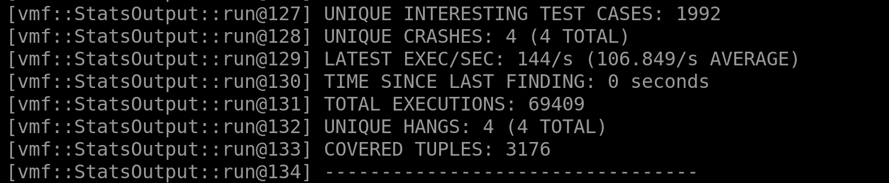
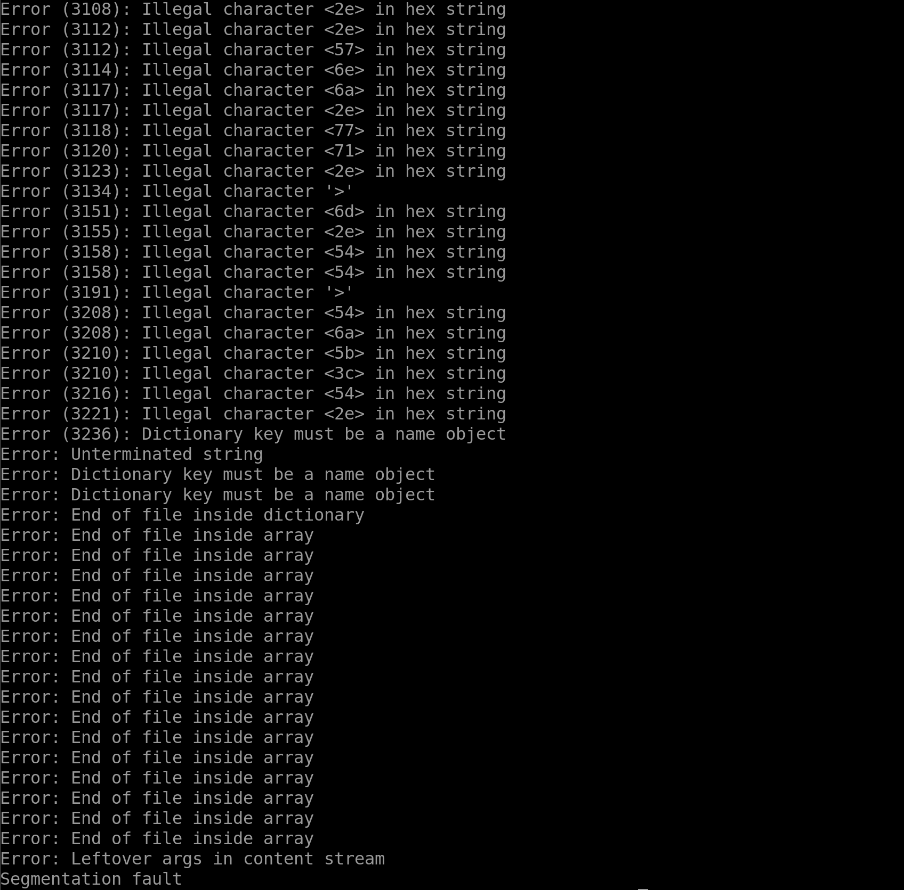
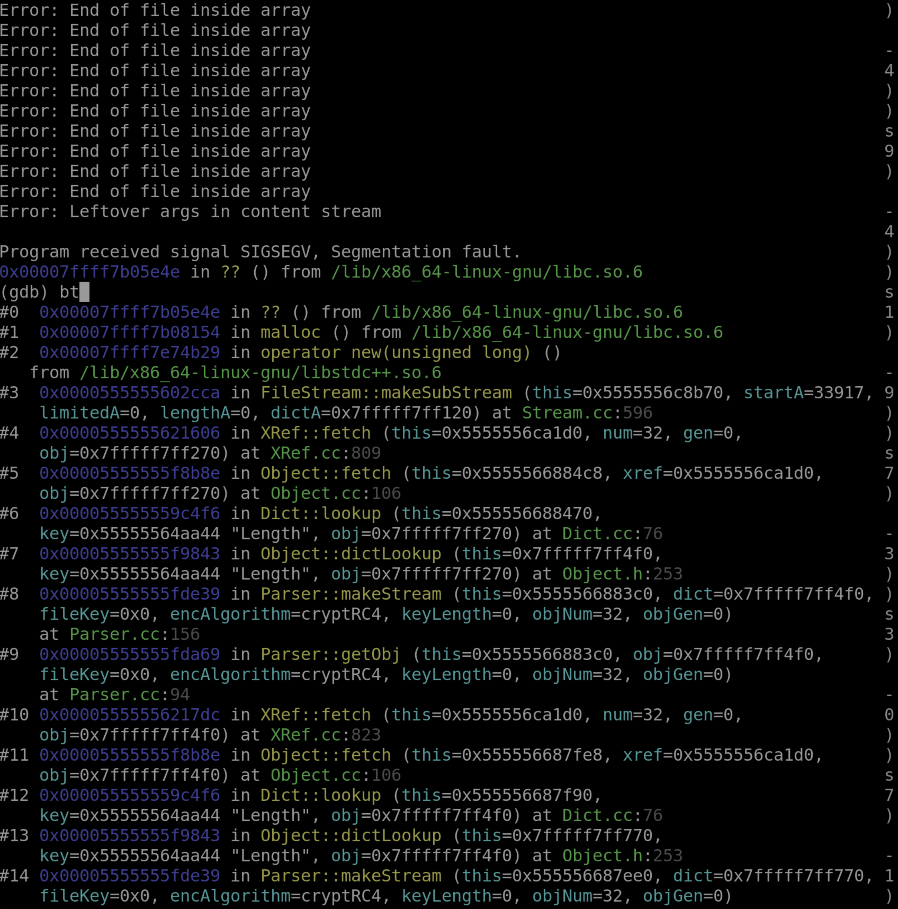

## Goals for this Exercise
In the last few exercises we have explored the basics of VMF. In this exercise we seek to fuzz a real target that contains a real CVE and learn what to do after you find a crash i.e. triage:

* How to build targets that use makefiles.
* How to use VMF to fuzz real SUT's.
* Triaging crashes with a debugger.

For this tutorial we will be using VMF to fuzz `XPDF 3.02`, a PDF viewer. This target has a known CVE, [CVE-2019-13288](https://www.cvedetails.com/cve/CVE-2019-13288/) . This vulnerability causes an infinite recursion when a crafted file is provided as input. Function recursion quickly causes stack memory exhaustion and eventually leads to a program crash.

## Setting up the Target

Before we start fuzzing lets first get `Xpdf` built and instrumented. Go ahead and create a new entry in your `vader` test directory.

```
cd path/to/vader/build/vmf_install/test
mkdir xpdf
cd xpdf
```

Download `Xpdf 3.02` and untar it.

```
wget https://dl.xpdfreader.com/old/xpdf-3.02.tar.gz
tar -xvzf xpdf-3.02.tar.gz
rm xpdf-3.02.tar.gz
cp xpdf-3.02/* -r ./
rm xpdf-3.02/ -r
```

Now that we have the source for `Xpdf`, we can attempt to build it as a sanity check. For the sake of brevity we will leave this to the reader of this tutorial. Let us now build and instrument `Xpdf` with the help of the AFL++ compiler. Once again we are going to use `afl-clang-fast` so go ahead and set the appropriate environment variables for this build, i.e.(`CC` and `CXX`) and point to a newly created directory `xpdf` under `vmf_install/test/`

```
export CC=path/to/afl++/afl-clang-fast
export CXX=path/to/afl++/afl-clang-fast++
./configure --prefix="vmf_install/test/xpdf/"
make
make install
```

This target relies on a make build script in order to be properly built. By specifiying `afl-clang-fast` as the compiler, the make file will use it in the building process, allowing for instrumentation which VMF needs to track to coverage. 

## Setting up the VMF configuration

Following the build we must also configure our VMF configuration files to point to and target this SUT.  In the `xpdf` directory create a new `yaml` file: `xpdf.yaml`. This configuration file follows in a similar vain to the configuration files of previous tutorials.

```
<text_editor_of_choosing> ./xpdf.yaml

#add these blocks into xpdf.yaml

vmfVariables:
  - &SUT_ARGV ["test/xpdf/bin/pdftotext", "@@"]
  - &INPUT_DIR test/xpdf/seeds/
    
vmfFramework:
  outputBaseDir: output
  logLevel : 1 #0=DEBUG, 1=INFO, 2=WARNING, 3=ERROR
```

`&SUT_ARGV` needs to point to our target instrumented binary. As a reminder, `@@` indicates that input to this SUT is provided via a file. `&INPUT_DIR` specifies the directory containing the test case seeds, which at this point is currently empty and does not exist. Let's fix that by first creating a `seeds` directory and then downloading some sample pdfs'. These will be used as valid starting seed test cases for VMF to mutate upon.

```
cd vmf_install/test/xpdf/
mkdir seeds
cd seeds/
wget https://ontheline.trincoll.edu/images/bookdown/sample-local-pdf.pdf
wget https://github.com/mozilla/pdf.js-sample-files/raw/master/helloworld.pdf
cd ..
```

The next step is to create a VMF module configuration file. We will use the [defaultModules.yaml](../../test/config/defaultModules.yaml) file located in `path/to/vader/build/vmf_install/test/config/` The default modules are what is recommended for most common use cases of VMF. Below is an explanation of the differences between the basic modules we have used in the past and the default modules we are using now.

[MOPT](../coremodules/core_modules_readme.md#mopt) is a method of mutator selection optimization. VMF adopts a version of *MOPT* based on the seminal [work](https://www.usenix.org/system/files/sec19-lyu.pdf). The goal of *MOPT* is to find the optimal mutator scheduling for a SUT, increasing interesting test cases found and fuzzer effectiveness. Please see the appendix for more information.

[CorpusMinimization](../coremodules/core_modules_readme.md#corpusminimization) attempts to reduce the size of the current seed corpus while preserving the original amount of code coverage found in the current set of seeds.


## Fuzzing

Now that we are ready to fuzz we can begin our campaign by executing the following command.

```
./bin/vader -c ./test/xpdf/xpdf.yaml -c ./test/config/defaultModules.yaml
```

Let VMF do its work until it finds a crash. Real fuzzing campaigns are ran anywhere from a day to a month at a time, depending on the size of the SUT.



When you are ready to stop the campaign use `CTRL-c`.  Following the ending of the campaign you will find the results in `vmf_install/output/<date_time>/`, navigate to `testcases/crashed/` . Inside this directory you will see one or multiple test cases that have caused a detectable crash in our target software.

So we have found a test case that causes a crash how do we investigate this further? Remember our goal was to discover [CVE-2019-13288](https://www.cvedetails.com/cve/CVE-2019-13288/) in the version of `Xpdf` we are fuzzing. To see if a crash is actually the result of a vulnerability we must perform ***triage***.  

## Reproducing and Triaging a Crash

Take a look at the `testcases/crashed/` directory you will see test cases that have crashed labeled by their test case id. Go ahead and select one and run it using `Xpdf`. You should get a segmentation fault as a result.

*Note: Other errors are possibility found along with the CVE. We will leave this to the reader to see if they can differentiate them.

```
build/vmf_install/test/xpdf/bin/pdftotext vmf_install/output/<date_time>/testcases/crashed/<test_case_number>
```



Now that we know this test case causes a crash, let's seek to understand the crash through the use of the software debugger `gdb`. If you do not have `gdb` installed go ahead and do it now. 

```
sudo apt-get install build-essential gdb
```

`gdb` or the GNU project debugger is an open-source software debugger that allows a user to do four main things. Start a program, make a program stop, examine what has happened, and change things in the program. This tool allows us to look into a target to better understand what is happening when our crashing test case is processed.

In order to use `gdb` you must build `Xpdf` with symbolic trace info for debugging.

```
cd path/to/vmf/build/vmf_install/test/xpdf/
make clean
export CFLAGS="-g -O0"
export CXXFLAGS="-g -O0"
make
make install
```

You can now run `gdb` with the following:

```
gdb --args ./bin/pdftotext ../../output/<date_time>/testcases/crashed/<test_case_number>'
```

Once `gdb` is loaded you can execute the program by typing `run`. Using the `bt` (backtrace) command you can see and scroll the call stack. Looking at the call stack you will see multiple calls to the `Parser::getObj` function. This seems to indicate that the function is being called in a infinite recursion.  This backtrace follows what is indicated in the CVE we are trying to trigger. You should see something similar to what you see below.



For more information on `gdb` and how to utilize all of it's debugging features see the [gdb documentation](https://sourceware.org/gdb/).

## Critical Success

Congratulations you have successfully used VMF to fuzz a real target and have triaged a crashing test case to discover a real CVE! In the next tutorial we will look at how to build a target with sanitizers to detect memory bugs.  

## Appendix

####  MOPT
As mentioned above, *MOPT* is a form of mutator scheduling. There exists multiple mutators that are able to be picked in a mutation cycle. Commonly, mutators are chosen at a flat probability rate leading to inefficient test case generation (certain mutators are inefficient for a given SUT).  Instead of using a uniform distribution, *MOPT* creates bias for mutators that are more efficient at producing interesting test cases. These distributions of mutators are called swarms. Multiple swarms may be evaluated at a time point, with the most interesting swarm being used in the next cycle for mutation.

VMF introduces a few differences that optimizes *MOPT* for better performance. The original version of *MOPT* specifically used the set of mutators that is currently present in AFL++. VMF has it's own set of mutators, as well as the ability to scale to any number of mutator that a user wants to add. Additionally, the parameters for VMF *MOPT* are configurable, allowing for the optimal tuning of a fuzzer on a per-target-basis.  See the [MOPT paper](https://www.usenix.org/system/files/sec19-lyu.pdf) for more information.

## Acknowledgments

This tutorial has been partially adopted from the [AFL++ 101](https://github.com/antonio-morales/Fuzzing101/tree/main/) tutorial by Antonio Morales for use with VMF.  
