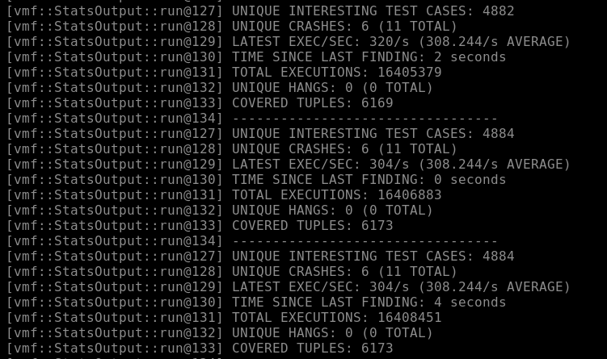
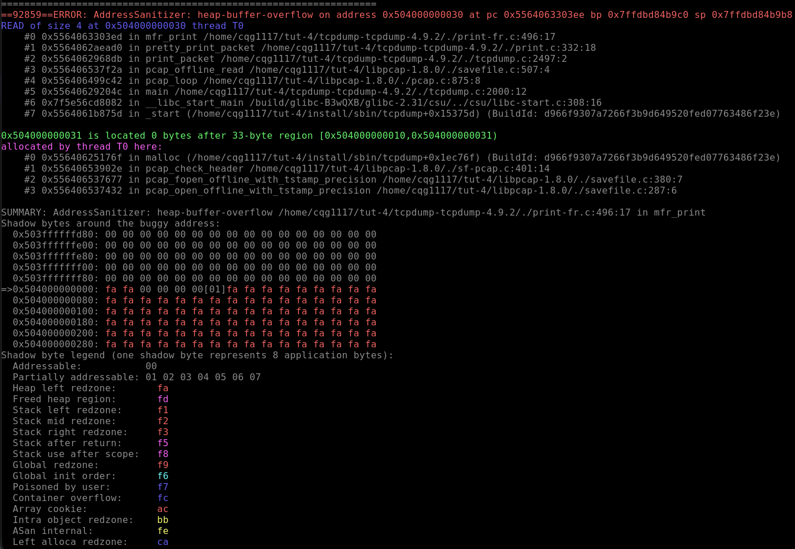
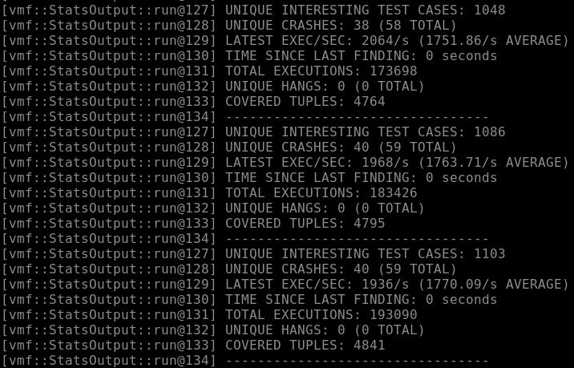
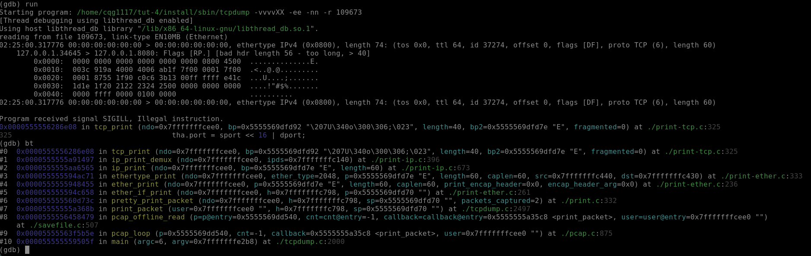
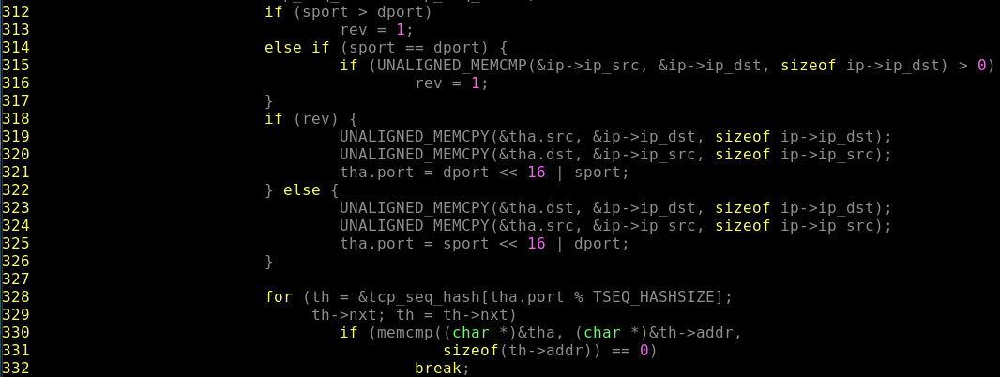
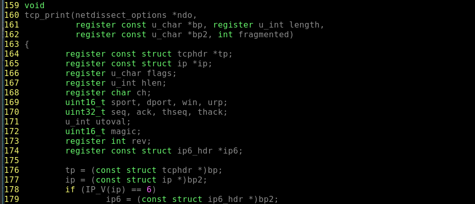
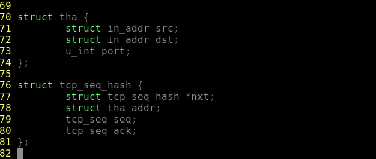

## Goals for this exercise

Plain coverage guided fuzzing has been shown to be very effective at finding vulnerabilities in targets. However, what if there was a way to increase the number of bugs found in a fuzzing campaign?

After finishing this exercise you should:
* Have a understanding of what a sanitizer is and what it's purpose is in fuzzing.
* How to integrate popular sanitizers with VMF.
* How to detect memory errors, or undefined behavior using a fuzzer.

## What is a sanitizer?

Sanitizers are tracing tools that are added to a target at build time. Popular sanitizer instrumentation is added using LLVM backend compiler passes. Sanitizers can be used to find errors including: use-after-free, undefined behavior, buffer overflows, or memory corruption. Sanitizers provide a finer grain detection of software bugs at the cost of both processing time and memory usage.

## The Good, the Bad, and the `TCPdump`

We will be looking at `TCPdump` version 4.9.2 to detect [CVE-2017-13028](https://www.cvedetails.com/cve/CVE-2017-13028/). `TCPdump` is a popular command line tool that is used to capture network traffic on linux systems. CVE-2017-13028 states that one of the packet parsers in this version of `TCPdump` contains a buffer over-read vulnerability. Essentially, a buffer in the `TCPdump` program is able to be read past it's actual size, leading to a potential memory leak.

### Downloading the Fuzzing Target

Let's go ahead and download `TCPdump` version 4.9.2. to a new directory. 

```
mkdir tut-4
cd tut-4
wget https://github.com/the-tcpdump-group/tcpdump/archive/refs/tags/tcpdump-4.9.2.tar.gz
tar -xzvf tcpdump-4.9.2.tar.gz
```

We also need `libcap`, a library that is required by `TCPdump`.

```
wget https://github.com/the-tcpdump-group/libpcap/archive/refs/tags/libpcap-1.8.0.tar.gz
tar -xzvf libpcap-1.8.0.tar.gz
mv libpcap-libpcap-1.8.0/ libpcap-1.8.0
```

In order to build `libcap` you will need `flex` and `yacc`.

```
sudo apt-get install flex yacc
```

### AddressSanitizer explained

AddressSanitizer is a type of sanitizer instrumentation used to detect bugs such as heap/stack overflows, use-after-free, use-after-return, and use-after-scope. These software vulnerabilities are critical to detect early on in development, before software is released to the general public.

*Note: AddressSanitizer introduces an average slowdown of about 2x and does require more runtime memory.*

From this point you are now ready to compile the target with AddressSanitizer instrumentation. AddressSanitizer is an open source tool that is integrated into both the `LLVM` compiler tool chain and the `gcc` tool chain. If you have been following along with this tutorial series you should have AFL++ installed along side VMF.

### Building the Target with the Proper Instrumentation

To start we need to set the `AFL_USE_ASAN=1` flag to tell the AFL compiler to instrument using ASAN. First things first, we need to build the supporting library `libpcapp` with AddressSanitizer enabled. As a reminder, make sure to set the `CC` and `CXX` enviorment variables to `afl-clang-fast` for proper instrumentation.

```
export CC=path/to/afl++/afl-clang-fast
export CXX=path/to/afl++/afl-clang-fast++
export AFL_USE_ASAN=1
cd libpcapp-1.8.0
#--prefix is used to specify where you would want to see the installed libpcap
./configure --prefix="vmf_install/test/libpcapp"
make
```

From this point you are now able to build and install `TCPdump`. AddressSanitizer also increases compilation time for our target i.e. this may take a few minutes for compilation.

```
export CC=path/to/afl++/afl-clang-fast
export CXX=path/to/afl++/afl-clang-fast++
export AFL_USE_ASAN=1
cd ../tcpdump-tcpdump-4.9.2/
./configure --prefix="vmf_install/test/tcpdump"
make
make install
```

### Configuring VMF for use with AddressSanitizier

Like before we need to create a configuration `yaml` script for our target. In your `install` directory create a new yaml file `tcpdump.yaml`. To properly fuzz `TCPdump` we need to provide a few command line arguments. In `tcpdump.yaml` add the following lines:

```
vmfVariables:
  - &SUT_ARGV ["test/tcpdump/sbin/tcpdump", "-vvvvXX", "-ee", "-nn", "-r", "@@"]
  - &INPUT_DIR test/tcpdump/seeds
    
vmfFramework:
  outputBaseDir: output
  logLevel : 1
```

Following the creation of the target configure `yaml` file. We also need to look at the VMF specific configuration script. In this case we will be using [defaultModules_ASAN.yaml](../../test/config/defaultModules_ASAN.yaml) which defines a default set of VMF modules.  The important option to note is `useASAN: true` . This option in the configuration disables the SUT processes memory cap. This is needed as the addition of AddressSanitizer increases the memory overhead that SUTs occur due to the shadow memory of AddressSanitizer.

```
AFLForkserverExecutor:
  sutArgv: *SUT_ARGV
  useASAN: true

CorpusMinExecutor:
  sutArgv *SUT_ARGV
  alwaysWriteTraceBits: true
  useASAN: true
```

Following setting up our configuration files, we also need some valid input files. The [Wireshark wiki](https://wiki.wireshark.org/samplecaptures#sample-captures) has a selection of valid `pcap` files that we have access to.  Let's go ahead and download a few.

```
cd /path/to/install/inputs
wget https://wiki.wireshark.org/uploads/__moin_import__/attachments/SampleCaptures/chargen-udp.pcap
wget https://wiki.wireshark.org/uploads/__moin_import__/attachments/SampleCaptures/bfd-raw-auth-simple.pcap
wget https://wiki.wireshark.org/uploads/__moin_import__/attachments/SampleCaptures/ipv4frags.pcap
```

We can begin the fuzzing campaign by using the following command:

```
#From /path/to/vmf_install/
sudo ./bin/vader -c ./test/config/defaultModules_ASAN.yaml -c vmf_install/test/tcpdump/tcpdump.yaml
```

Let VMF run for sometime to find a crash in our target, in our case it took ~3.5 hours to find our first crash.



Okay we now have a crashing test case how can we triage it in a well defined way? Fortunately AddressSanitizier makes it very easy to triage test cases after crash conditions are met. We just provide our crashing test case to the ASAN instrumented target and get a pretty dump of the crash as well as the runtime trace.

```
vmf_install/test/tcpdump/sbin/tcpdump -vvvvXX -ee -nn -r <path_to_crashing_testcase>
```



AddressSanitizier output is broken into a few pieces. We will give a brief summary, but for more information please see [ASAN Documentation](https://github.com/google/sanitizers/wiki/AddressSanitizer) or [Understanding ASAN](https://blog.trailofbits.com/2024/05/16/understanding-addresssanitizer-better-memory-safety-for-your-code/) . AddressSanitizer keeps a shadow memory of a certain granularity depending on set settings. The shadow memory identifies if a particular area of memory is accessible.  In addition to this, AddressSanitizer sets **redzones**, essentially buffers between objects in memory. In the case of `TCPdump`, a crafted packet causes a buffer to be over read into the **redzone** which triggers AddressSanitizer to deduce that a heap overflow occurred in the `mfr_print` function.

*Note: While AddressSanitizer does provide a very robust trace. It is still beneficial to use a debugging tool such as `gdb` in order to fully understand what leads up to the point of crash.*

## Detecting Undefined Behavior with UBSanitizer

Like AddressSanitizer, UndefinedBehavaiorSanitizer (UBSanitizer) is another form of sanitizer that instead detects behaviors that are not defined by a programming languages specification during execution. For example: bitwise shifts that are out of bounds for their data type, signed integer overflows, passing a null pointer to a function that does not specify a null pointer in its parameters. UBSanitizer introduces lower overheads compared to other sanitizers, which is good for fuzzer throughput.
### Building a target for use with UBSanitizer

We will once again be using `TCPdump` as our target. Go ahead and create a new directory and clone fresh copies of both `ibpcapp` and `TCPdump`.

```

mkdir tut-ubsan-4
cd tut-ubsan-4
wget https://github.com/the-tcpdump-group/tcpdump/archive/refs/tags/tcpdump-4.9.2.tar.gz
tar -xzvf tcpdump-4.9.2.tar.gz

wget https://github.com/the-tcpdump-group/libpcap/archive/refs/tags/libpcap-1.8.0.tar.gz
tar -xzvf libpcap-1.8.0.tar.gz
mv libpcap-libpcap-1.8.0/ libpcap-1.8.0
```

To start we need to set the `AFL_USE_UBSAN=1` flag to tell the AFL compiler to instrument using ASAN. First things first, we need to build the supporting `libpcapp` library with UndefinedBehaviorSanitizer enabled.

```
export CC=path/to/afl++/afl-clang-fast
export CXX=path/to/afl++/afl-clang-fast++
export AFL_USE_UBSAN=1
cd libpcapp-1.8.0
#--prefix is used to specify where you would want to see the installed libpcap
./configure --prefix="vmf_install/test/libpcapp"
make
```

From this point you are now able to build and install `TCPdump`. Like AddressSanitizer, UndefinedBehaviorSanitizer increases compilation time for our target.

```
export CC=path/to/afl++/afl-clang-fast
export CXX=path/to/afl++/afl-clang-fast++
export AFL_USE_UBSAN=1
cd ../tcpdump-tcpdump-4.9.2/
./configure --prefix="vmf_install/test/tcpdump/"
make
make install
```
### Configuring VMF for use with UndefinedBehavaiorSanitizer

We will use the same configuration `yaml` script for `TCPdump` as we did before. Recall that `tcpdump.yaml` is stored in the `install` directory. Make sure to update the paths to reflect the changes in directory names. 

The VMF specific configuration script does need to have a small change be implemented. Copy `defaultModules_ASAN.yaml` into a new file `defaultModules_UBSAN.yaml`.  Instead of setting `useASAN` to true, we will instead be setting a different variable `useUBSAN` to true. 

```
AFLForkserverExecutor:
  sutArgv: *SUT_ARGV
  useUBSAN: true

CorpusMinExecutor:
  sutArgv *SUT_ARGV
  alwaysWriteTraceBits: true
  useUBSAN: true
```


Following setting up our configuration files, we also need some valid input files. The [Wireshark wiki](https://wiki.wireshark.org/samplecaptures#sample-captures) has a selection of valid `pcap` files that we have access to.  Let's go ahead and download a couple.

*Note: Some valid `pcap` files will inedibly cause undefined behavior. Please test the specific `pcap` files you download using the `TCPdump` binary before fuzzing. If a seed input causes a crash VMF will raise an error, as it will not be able to properly detect a timeout at initialization.*

```
cd \path\to\tut-ubsan-4\
mkdir inputs
wget https://wiki.wireshark.org/uploads/__moin_import__/attachments/SampleCaptures/cmp_IR_sequence_-OpenSSL-EJBCA.pcap

wget https://wiki.wireshark.org/uploads/__moin_import__/attachments/SampleCaptures/Apple_IP-over-IEEE_1394_Packet.pcap
```

We are now ready to start our next fuzzing campaign go ahead and start it with the following command.

```
cd /path/to/vader/build/vmf_install/
./bin/vader -c test/tcpdump/tcpdump.yaml -c ./test/config/defaultModules_UBSAN.yaml
```

After running VMF for a short time, you should see that `TCPdump` has *a lot* of undefined behaviors. Let's look now at how to triage.



### Target Triage

Depending on the version of UBSanitizer you are using you may have a detailed report or simply a `SIGILL` generated when executing a test case with a target. In either case it is important to triage using your favorite debugger.

*Note: Make sure you build your target binary with debug symbols enabled.*

```
gdb --args vmf_install/test/tcpdump/sbin/tcpdump -vvvvXX -ee -nn -r <crashed_testcase>

#Once gdb is loaded up.
(gdb) run
(gdb) bt
```




With this information we can go to the source code located in `print-tcp.c` line 325 to see what is going on.



Using the UBSanitizer trace as a guide we can see that `tha.port` is getting assigned a value that is overflowing because `dport` is a `uint16_t` 16-bit unsigned integer. We can see this by searching near the top of `print-tcp.c`. 



Continuing on we have to check if `tha.port` is a 16-bit value or a 32-bit value? Let's find out. Continuing to backtrack in our function we see that the `struct tha` has three members and that the `port` member is a unsigned integer.



`u_int` in this case is defined by Linux system headers which means that the size variables of this type could represent vary. In the worst case `u_int` represents a 16-bit integer, in the best case it represents a 32-bit integer (which is common in modern Linux systems).  When left shifting a 16-bit unsigned integer that is large enough, bits that overflow will be dropped. This leads to improper values being stored in `tha.port`.

We leave it to the reader to create a fix and test it again with UBSanitizer.

## Critical Success

In this tutorial we learned all about sanitizers and how to use them against a real vulnerable piece of software. While fuzzing can benefit greatly by using sanitizers there is a performance hit that has to be acknowledged by the fuzzing operator. In the next tutorial we will utilize methods to speed up a fuzzing campaign.

## Acknowledgements

This tutorial has been partially adopted from the [AFL++ 101](https://github.com/antonio-morales/Fuzzing101/tree/main/) tutorial by Antonio Morales for use with VMF.  
