## Goals for this Tutorial

This tutorial will look at optimizations for targets that will increase the throughput of a fuzzer. 

Specifically we will be looking at:
* How persistent mode can increase a fuzzers throughput and how this leads to more efficient fuzzing campaigns.
* The special considerations you have to make when fuzzing a target in persistent mode.
* How to enable shared memory between a target and VMF.  How this method increases throughput.
* How to skip lengthy initialization steps using deferred mode.
 
## What is Persistent Mode Fuzzing?

VMF typically executes test cases with a fresh copy of the SUT. In the past this was done using the `execve` system call, however this system call is expensive. Currently a fresh copy of the SUT is created through the use of a `fork()` system call. When VMF begins it selects an area to fork itself repeatedly. Typically this is right before `main()`. 

Persistent mode goes one step further and uses a single process and repeatedly provides this single process, test cases. Without the overhead of the `fork()`system call, persistent mode can improve fuzzing throughput by up to 2x-100x. 

However, like all things persistent mode is not without special considerations. In order to fuzz a target using persistent mode, a target must either be stateless, or state must be managed per execution by a fuzzing harness. Persistent state that is left over per fuzzing execution leads to false positives, and negatives. These falsities pollute real results from the fuzzer. See [Tutorial 8: Fuzzing Best Practices](./8_fuzzing_best_practices.md) for more information about correct persistent mode fuzzing.

## Getting Ready for Persistent Mode Fuzzing 

In this tutorial one of the targets we will be looking at is the `libxml2` library. This library contains a set of tools useful for handling XML files. Like before lets download and build `libxml2`.

```
#Make sure you have automake
sudo apt get update && sudo apt install automake

git clone https://gitlab.gnome.org/GNOME/libxml2.git 
cd libxml2
git switch 2.12

./autogen.sh

#It is important that --enabled-shared=no or the --disable-shared flag is set. This flag prevents shared libraries from being built. 
./configure --enable-shared=no

#Set the afl-compiler as the default
export CC=/afl/loc/afl-cc
export CXX=/afl/loc/afl-cc
```

For this tutorial we are going to be using `AddressSanitizer` so go ahead and enable it using AFL flags and then build using make.

```
export AFL_USE_ASAN=1

make all
```

## Harnessing a Target

At this point you may be wondering how are we going to target code built into a library. That is where a fuzzing harness is important. A harness provides a interface between the fuzzer and a target, preparing test cases to be executed. In this case, there is already an example program `xmllint.c` in the `libxml2` directory. This program tests the various features of the `libxml2` library. 

As its already instrumented through the build process lets try this as our fuzzing target first. As this is one of the later tutorials we will leave it to the reader to figure out the configuration for the target. When you are ready to fuzz, start the campaign and see how VMF performs.

*Note: There are many good test case seeds in the `/libxml2/test/` directory*

## How to Speed Up Fuzzing

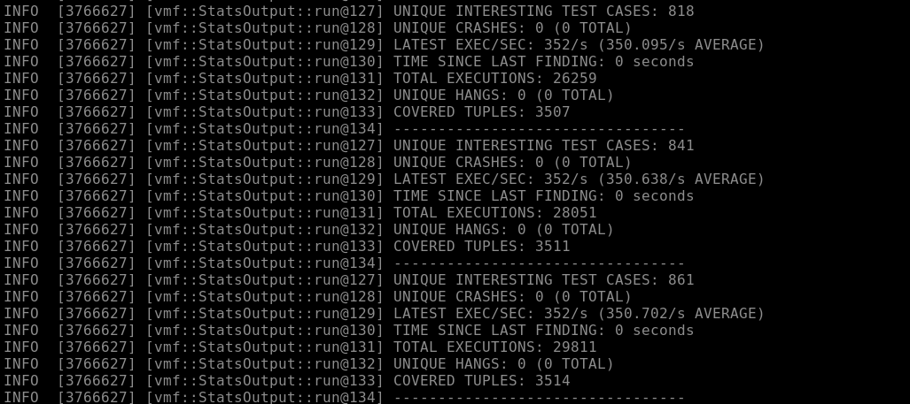

Wow, only 352 execs a second, this seems very slow. Remember that we did add `AddressSanitizer` instrumentation which does increase runtime quite a bit. However, the issue with our current target is that the execution is very long, leading to longer test case execution times.

*Note: A harness can make or break a fuzzing campaign. The harness should specifically target a function or area of code.*

Well what if instead of fuzzing a whole binary we sought out only a specific functionality of a library? With a better crafted harness this can be the case. Looking at `xmllint.c` there seems to be a few interesting places, one such place is the `parseAndPrintFile` function.

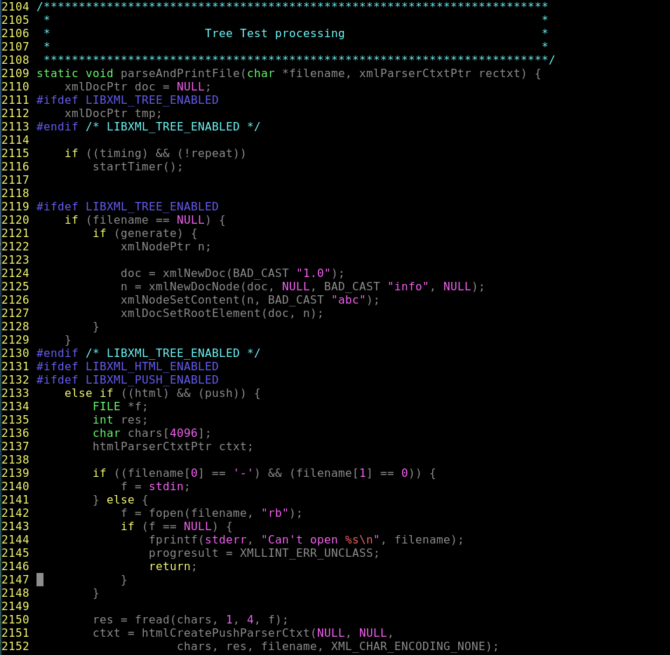

Let's try to target this function by editing the `main` function to specifically call this function with the arguments from the command line. More importantly this function is stateless which means we are able to fuzz `xmllint` in persistent mode. To do this, we wrap our function call/code block in a `__AFL_LOOP(10000)`. This macro signals to VMF that the executor is able to execute 10,000 test cases in a single process. After 10,000 test cases are executed the process is reset just in case of latent state existing in a target that is unknown to the operator. 

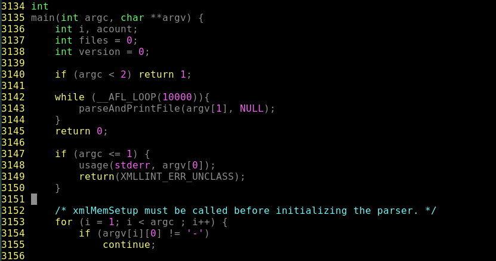

Go ahead and add these lines to the `main`  function and rebuild the target. The configuration for our target is the same as if the target is being executed in a non-persistent manner.  When ready, execute another fuzzing campaign and observe the results.

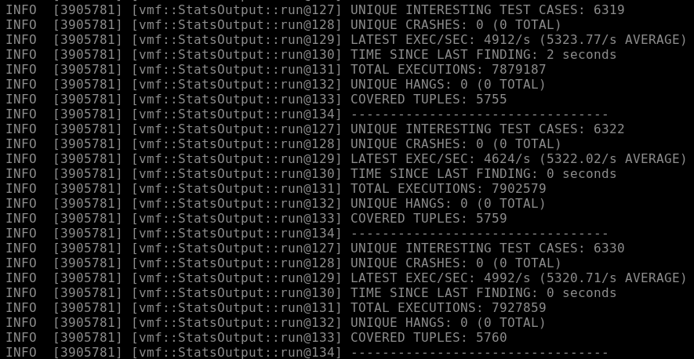

We are now averaging nearly a 16x improvement over the previous non-persistent mode fuzzing campaign. 

Now that we have leaned how to improve the execution time via persistent fuzzing, let's look at two more options to significantly speed up the execution of a fuzzing campaign.

## Delivering Fuzzing Inputs via. Shared Memory

Executing a target in persistent mode still requires that VMF provide input via `stdin` or by a file. This operation does induce overheads on a per test case execution basis. To get around this, VMF has a shared-memory execution mode. Test cases are provided to a target by sharing memory between the target process and the fuzzer. The benefit is that the I/O overhead is removed from the fuzzing loop by removing test case writting as well as coverage communications. VMF automatically detects when a target has the symbols that indicate shared memory.

*Note: Shared-Memory Fuzzing is a type of persistent mode. In order to perform it, a target must be able to be executed in a persistent manner.*

#### Setting up a Target for Shared Memory Fuzzing

First, we must add a call to `__AFL_FUZZ_INIT()` in our harness code but outside of any function, after our `#include`'s.  When this symbol is detected, `__AFL_FUZZ_TESTCASE_BUF` type `char *` and `__AFL_FUZZ_TESTCASE_LEN`  type `int` are defined. The test case pointer is the shared memory region between the fuzzer and target. While the test case length is the size of a given test case provided via the shared memory space.

*Note: There is a 1MB maximum per test case size enforced for shared memory test cases.*

Unfortunately `libxml2` tightly couples its parsing mechanism and it's file I/O handling. This makes it a poor target for shared-memory fuzzing. So we will have to find a different target for execution.

### libwebp and CVE-2023-4863

A popular C library `libwebp` from Google allows developers to create and display images that are in the WebP image format. In version 1.3.1 a heap buffer overflow occurs via the `VP8LBuildHuffmanTable` function [CVE-2023-4863](https://nvd.nist.gov/vuln/detail/cve-2023-4863). This allows an advisory to either crash a target or perform remote code execution. Unfortunately, this library was widely adopted on many platforms and used with many services.

First let's obtain and build the vulnerable `libwebp` version.

```
git clone https://chromium.googlesource.com/webm/libwebp
cd libwebp
git checkout v1.3.1
./autogen.sh
./configure

#Make sure that AFL is set as your compiler.
export CC=/path/to/afl-cc
export CXX=/path/to/afl-cc
export AFL_USE_ASAN=1

make clean all 
sudo make install
```

### Harnessing VP8LBuildHuffmanTable

To create an effective harness for `VP8LBuildHuffmanTable` we must identify the format of inputs provided to `VP8LBuildHuffmanTable`. Once we understand how inputs are provide we can use our harness to take test cases provided from VMF and format them as valid inputs for our target.

Running a grep over the source of `libwebp` we can see that `VP8LBuildHuffmanTable` is used in the file `/src/dec/vp8l_dec.c`. Digging deeper we see that this function is called in the `ReadHuffman` function. 

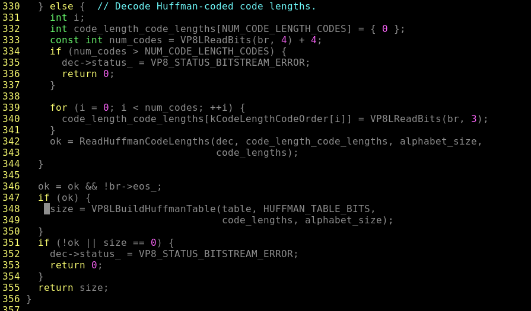

We see that we need a `HuffmanCode *` object, `HUFFMAN_TABLE_BITS` a constant indicating the size of the lookup table, `code_lengths` a buffer full how long each code is for each symbol in the Huffman Tree Structure, and `alphabet_size` which is the size of the table of code lengths which is being passed in.

We want a source of input between VMF and our target which the `code_lengths` buffer appears appropriate. Looking further through the source we identify that we need at least `SYMS` entries in our `code_lengths` buffer. Using the `__AFL_FUZZ_TESTCASE_BUF` we can provide our target a generated `code_lengths` buffer, the only thing we need to do is to make sure that the code lengths are not proceeding over the maximum or `VP8LBuildHuffmanTable` will return.

Combining all of these together along with a declaration of a `HuffmanCode` buffer and pointer. We are now able to provide our target function test cases from VMF.

```
#include <stdio.h>
#include "src/utils/huffman_utils.c"
#include "src/utils/bit_reader_utils.c"


#define NUM_CODE_LENGTH_CODES       19
static const uint8_t kCodeLengthCodeOrder[NUM_CODE_LENGTH_CODES] = {
  17, 18, 0, 1, 2, 3, 4, 5, 16, 6, 7, 8, 9, 10, 11, 12, 13, 14, 15
};

//Defined as 40 for a distance table.
#ifndef SYMS
#define SYMS 40
#endif
#ifndef TABLE_SIZE
#define TABLE_SIZE 410
#endif


__AFL_FUZZ_INIT();

int main(int argc, char **argv) {

	unsigned char *buf = __AFL_FUZZ_TESTCASE_BUF;

	while (__AFL_LOOP(10000)) {

	int length = __AFL_FUZZ_TESTCASE_LEN;

	const int code_lengths_size = SYMS;
	// buf is code_lengths[]. and we need at least SYMS entries
	if(length < code_lengths_size ) continue;

	int code_lengths[SYMS] = {0};

	// build code_lengths from AFL buf
	for (int i = 0; i < code_lengths_size; ++i) {
		code_lengths[i] = buf[i] % NUM_CODE_LENGTH_CODES;
	}

	const HuffmanCode last_table[TABLE_SIZE];
	const HuffmanCode* table = last_table;

	int ok = 1;
	int count[NUM_CODE_LENGTH_CODES + 1] = { 0 };
	for (int symbol = 0; symbol < code_lengths_size; ++symbol) {
		if (code_lengths[symbol] > NUM_CODE_LENGTH_CODES) {
			ok = 0;
			break;
		}
	}
	if(!ok) continue;

	int result = VP8LBuildHuffmanTable(table, 8, code_lengths, code_lengths_size);
	}
}
```

*Note: Don't forget to include the `__AFL_LOOP(10000)` for persistent mode fuzzing and `__AFL_FUZZ_INIT()` for Shared-Memory Fuzzing.*

Now that we have our harness built we can compile our harness with `-lwebp` library enabled.

```
afl-cc -I. webp_harness.c -lwebp -o webp_harness
```

Like before the configuration for this target does not change a whole lot from other configurations. Just make sure to target the harness using `SUT_ARGV`.

```
vmfVariables:
  - &SUT_ARGV ["test/webpSUT/webp_harness"]
  - &INPUT_DIR test/webpSUT/input
```

For input seeds generate some random files using `dd`.

```
dd if/dev/urandom of=<test_case_name> bs=8 count=8,16,32,64,128,etc.
```

At this point you are now able to execute VMF and see if we can find the buffer overflow in the Huffman Table Decoder of `libwebp`.

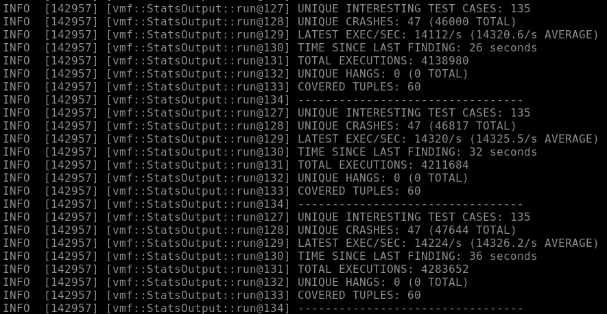

We found that within a couple minutes VMF found crashing test cases which after running against our target binary shows a buffer overflow occurring in `VP8LBuildHumanTable`. This crash was found with the use of persistent and shared-memory fuzzing, allowing us to target a specific area in the code base.

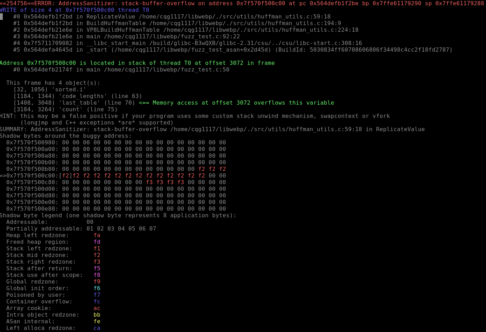

Shared-memory fuzzing only further increases the throughput of a target. Better throughput equals more executed test cases, more executed test cases leads to better fuzzing. But how can we make fuzzing even faster or more efficient?

## Deferred Fuzzing 

Our next type of fuzzing is deferred fuzzing. Many programs have an initial startup procedure that is required for successful execution, while also taking large amounts of execution time. To overcome the initialization hurtle, VMF has access to deferred fuzzing of targets. 

Instead of executing the initialization every test case, the fuzzing operator places a `__AFL_INIT()` at a point after the initialization completes. This symbol indicates to VMF the fork point for every test case execution. You will recall that in regular fuzzer execution, a child is forked via the fuzzers forkserver to execute a new test case. Placing the fork point after initialization happens allows for a fuzzer to skip the overhead of initialization by only executing it once.

Let's look at our next target library `libavutil` found in the FFmpeg collection of libraries. 

```
 git clone https://github.com/FFmpeg/FFmpeg.git
 cd FFmpeg
 
 #Make sure CC and CXX are set to afl-cc
 ./configure cc=/usr/local/bin/afl-cc cxx=/usr/local/bin/afl-cc -disable-x86asm ---enable-cross-compile
 
 export AFL_USE_ASAN=1
 
 make all -j 4
 
 sudo make install
```

Now with FFmpeg built we can look to see if there are any example usage programs that we can utilize as a harness template. One such program exists in `doc./examples/decode_audio.c`. This programs makes calls to the library to test the audio decoding functionality of `libavutil` Let's compile this program and execute it with VMF!

```
#From the FFmepg top level directory.
make examples
```

Writing a configuration for this target is like any other fuzzing target. We will leave this to the reader to perform. Once you are ready to fuzz, go ahead and observe the results.

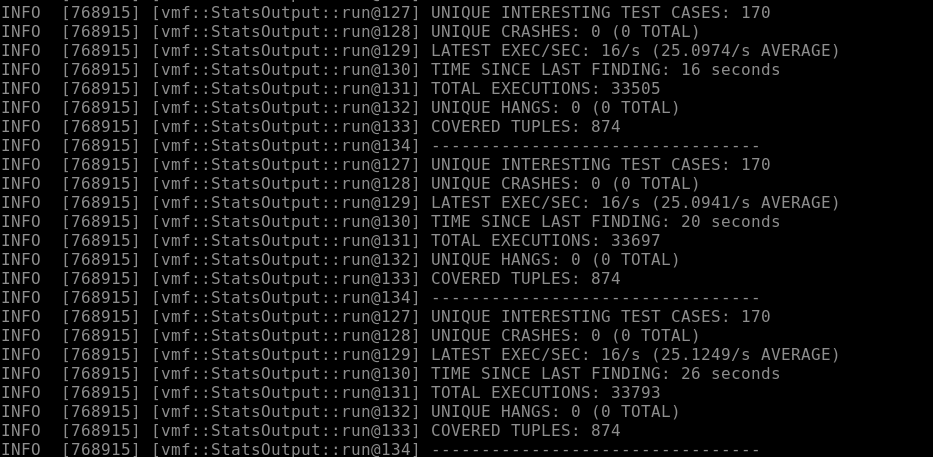

Wow, that execution speed is really low. Maybe we can utilize deferred fuzzing in order to speed up our target. Looking at `decode_audio.c` we can see that there is quite a bit of initialization that is done before the important audio decoding executions happen. By placing the `__AFL_INIT()` after initialization is performed but before the file is open and read we can ideally speed up executions.

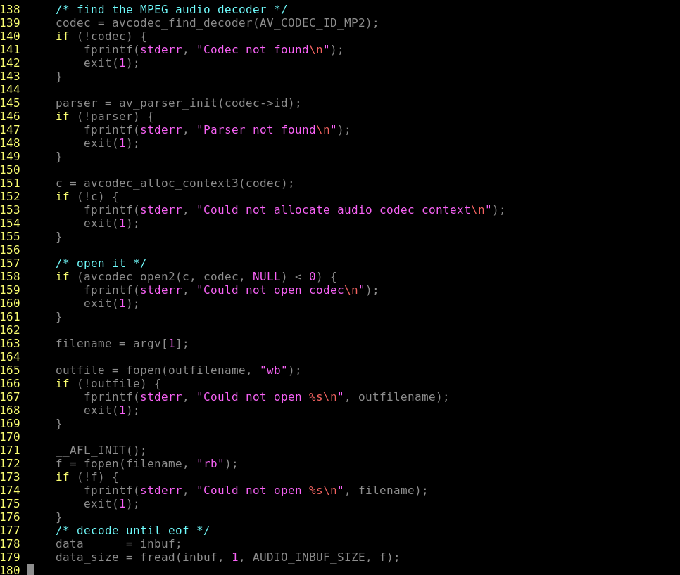

After adding the call to `__AFL_INIT()` we can rebuild `audio_decode.c` and re-run our fuzzer with deferred mode enabled.

*Note: VMF will automatically detect when a target has been insturmented for deferred mode. We do not need to do anything with our configuration file to get it to work.*

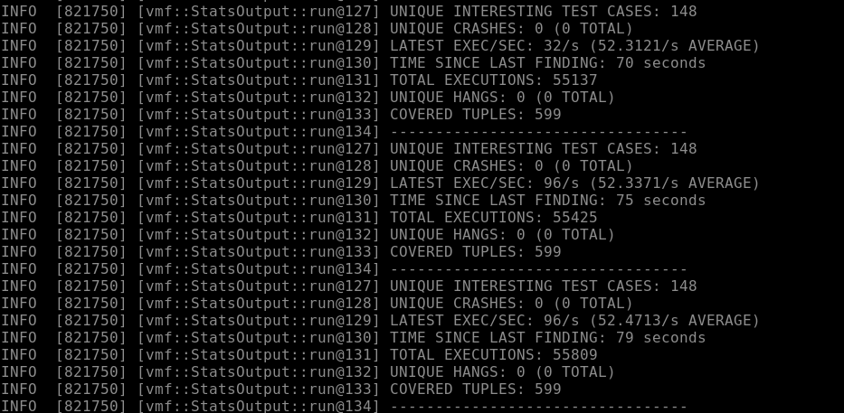

We have achieved a *2x* increase in execution speed this is great! However, there are still ways to increase the test case execution speed of our target.

## Fuzzing as Fast as Possible

It still seems like our test execution speed is still pretty low. Let's now take all three methods of fuzzing i.e. persistent, memory-shared, and differed fuzzing and combine them to see if we can get better throughput.

First, we must look at how `decode_audio.c` handles file operations. It looks like once the file pointer is established it is passed to `fread` to read a portion until the EOF. Each block of data that is read is then processed.

```
data = inbuf;
data_size = fread(inbuf, 1, AUDIO_INBUF_SIZE, f)
```

This `fread` call also occurs later in the file.

```
if (data_size < AUDIO_REFILL_THRESH) {
	memmove(inbuf, data, data_size);
	data = inbuf;
	len = fread(data + data_size, 1, AUDIO_INBUF_SIZE - data_size, f);
	
	if (len > 0)
		data_size += len;
}
```

In order to effectively harness this sample program for persistent mode fuzzing we must create a `dummy_fread` function to handle our `__AFL_FUZZ_TESTCASE_BUF`.

Above `main` we implement `dummy_fread` which accepts a `void *` to a target buffer, a `size_t` variable handling the size of the block we want to read, and a `size_t` variable which handles how many blocks we will read.

```
size_t dummy_fread(void * ptr, size_t size, size_t nmem){
	static ssize_t rem_len = -1;
	size_t number_read = 0;
	
	unsigned char * live_buf = (unsigned char *) ptr;
	unsigned char * testcase_buf = __AFL_FUZZ_TESTCASE_BUF;
	
	if (rem_len < 0)
	{
		rem_len = __AFL_FUZZ_TESTCASE_LEN;
	}
	
	if (rem_len == 0)
	{
		return number_read;
	}
	
	for (size_t i = 0; i < nmem; i++)
	{
		for (size_t j = 0; j < size; j++)
		{
			if((i*size+j) >= rem_len)
			{
				rem_len = 0;
				return number_read;
			}
		}
		number_read++;
	}
	return number_read;
}
```

Once we have these changes all we have to do is replace the areas that ultilize`fread` with our custom `dummy_fread`, which instead of reading from a file, will directly read blocks from the `__AFL_FUZZ_TESTCASE_BUF`. With these changes we are able to implement shared-memory persistent mode fuzzing.

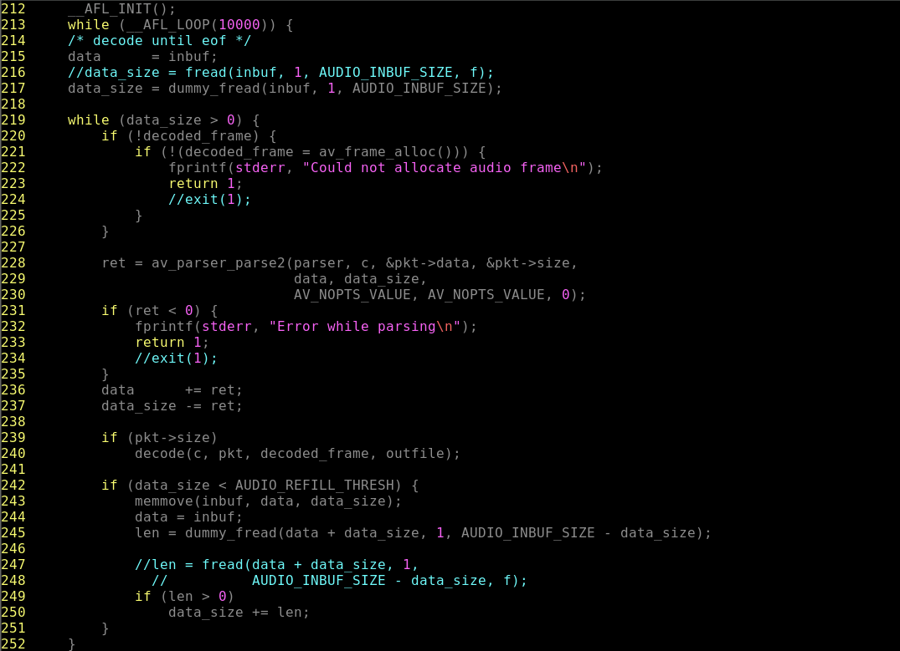

Like before we have still have `__AFL_INIT();` after the file handling routines with the added `while (_AFL_LOOP(10000))` included for persistent mode. At the top of the file we add a call to `__AFL_FUZZ_INIT()` in order to enable shared memory fuzzing. After we finish making the necessary code changes we can now rebuild `decode_audio.c` and once again spin up VMF for another fuzzing campaign.

*Note: The configuration for this target still needs to indicate a file input with `@@` and in this case a `outfile` or else the target will crash repeatedly and never progress forward. *

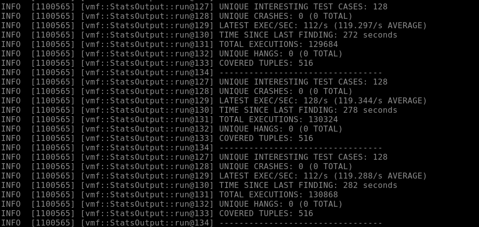

Looking at the execution speed we can see a _2x_ in increase in VMF's throughput. Remember that it is typical for a fuzzers test case throughput to be directly relatable to how much coverage is found.

## Critical Success 

Congratulations, you have now learned how to make fuzzing with VMF more efficient using persistent, shared memory, and deferred mode fuzzing. In the next tutorial we will look at how to containerize VMF so that it can be run in a cloud platform. 

For more information on harnessing do's and don'ts please see [Tutorial 8: Fuzzing Best Practices](./8_fuzzing_best_practices.md).

## Acknowledgements

We would like to give credit to LiveOverflow for creating the harnessing code for libwebp via. https://github.com/LiveOverflow/webp-CVE-2023-4863 . 
