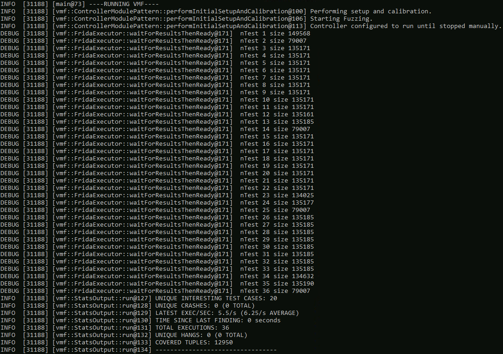
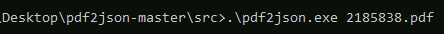
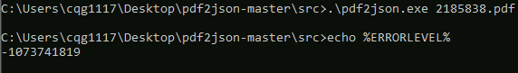
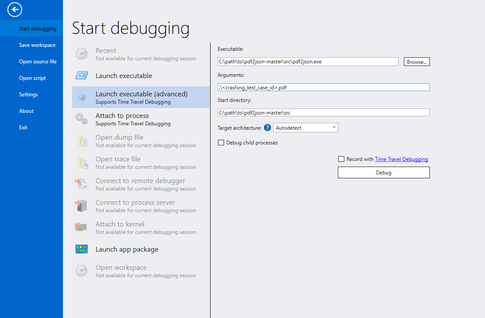
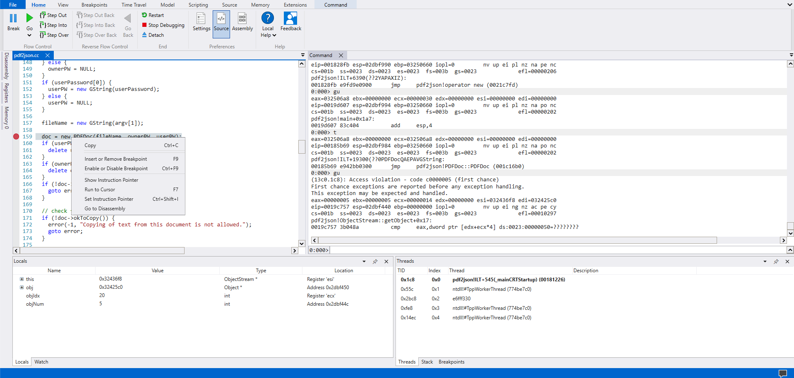
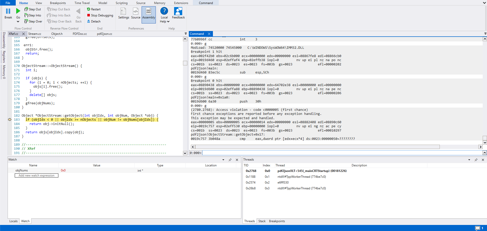
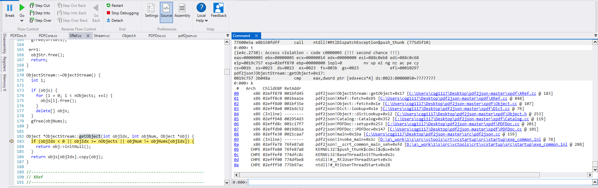

## Goals for this tutorial 

This tutorial will help walk you through how to appropriately set up VMF for fuzzing Windows executables.

Our objectives are as follows:
* Understanding how VMF's Frida execution environment works.
* Setting up a Windows environment for VMF.
* How to correctly harness Windows executables.
* Understanding how to execute a fuzzing campaign in Windows.

## Background

### Frida Executor

Frida is an open source dynamic instrumentation library. Through it's API, one is able to inject snippets of JavaScript or custom libraries into native applications. This is particularly beneficial for fuzzing as coverage tracing instrumentation can be injected in real time as a target executes, enabling closed source fuzzing. For more information on how both Frida and Stalker(code execution tracing) work please see the [Frida Documentation](https://frida.re/docs/home/) and the [Frida Executor Module Documentation](../coremodules/core_modules_readme.md#fridaexecutor) for information about the VMF implementation.


### Harnessing

VMF uses the `libFuzzer` API to implement harnessing. `LLVMFuzzerTestOneInput` provides a fuzzing entry point i.e. a target function for fuzzer generated test cases. The [LLVMFuzzerTestOneInput](../../test/driver/harness_example.c) function is first implemented which will accept test cases. This implementation acts as a fuzzing harness, properly formatting test cases to be used as inputs for a target. Through the dynamic instrumentation provided by `Frida` VMF is able to obtain code coverage information back from a target. This coverage information is then provided back to VMF to inform future test case mutations, with the goal to maximize found coverage.

## Setting up the Windows Environment

Before we jump into fuzzing a Windows target we must first setup our Windows environment for VMF. To build VMF, we will need access to Visual Studio tools. The community edition is available to download and install via the [Visual Studio website](https://visualstudio.microsoft.com/vs/community/).  We recommend `Visual Studio 2022` as this is what will be used in this tutorials examples. 

Additionally, we will need to download VMF from [Github](https://github.com/draperlaboratory/VaderModularFuzzer/tree/main).

Once Visual Studio is installed and the VMF source is downloaded, open up a new command prompt via `x64 Native Tools Command Prompt VS 2022`. Navigate to the folder where VMF is downloaded and execute the following commands to build VMF.

```
#from /path/to/vmf/
mkdir build
cd build
cmake -G "Visual Studio 17 2022" ..
cmake --build . --target INSTALL --config Release
```

## Harnessing Windows Executables

VMF currently supports `Frida` instrumentation against target libraries. To properly harness a target we must create a harness file that defines `LLVMFuzzerTestOneInput(const unsigned char * input, size_t size)`. A target must be built as a library so that our harness can call an entry point or a specific function. Inside of `LLVMFuzzerTestOneInput` we perform any augmentation or setup needed for an test case to be provided to a function.

For this tutorial we will be fuzzing [PDF2JSON](https://github.com/flexpaper/pdf2json) a conversion library used in the Flow Paper © software. This target is a command line tool used to covert PDF's into JSON/XML formatted files. This software can be installed via the GUI, however we want our target to be a library so instead we will be building this target via the included `ms_make` batch file.

 Before we execute the batch file we need to make a few edits.

```
%CXX% %FPFLAGS% /nologo /Fepdf2json.exe XmlFonts.obj XmlLinks.obj ImgOutPutDev.obj pdf2json.obj ..\goo\libGoo.lib ..\xpdf\libxpdf.lib ..\fofi\libfofi.lib ..\splash\libsplash.lib advapi32.lib Gdi32.lib User32.lib ..\freetype.win32\lib\freetype_a.lib
```

This line indicates to the compiler that an executable needs to be generated, we instead want a `.lib` file to be generated.

```
%CXX% %FPFLAGS% /DEBUG /Zi /nologo /Fepdf2json.dll /LD XmlFonts.obj XmlLinks.obj ImgOutPutDev.obj pdf2json.obj ..\goo\libGoo.lib ..\xpdf\libxpdf.lib ..\fofi\libfofi.lib ..\splash\libsplash.lib advapi32.lib Gdi32.lib User32.lib ..\freetype.win32\lib\freetype_a.lib
```

Here we add `/DEBUG` and `/Zi` to enable debug information as a well as generate the appropriate symbolic debugging information. We can now build `PDF2JSON` using the batch file.

```
.\ms_make.bat
```

In addition to changing the batch file we also need to make a small edit to the `pdf2json.cc` file located in `pdf2json/src/pdf2json.cc`. As we turning this target into a library we do not need a `main` function, however `main` is the function that we want to provide inputs to. You can change the function name to any name.

```
int main(int argc, char *argv[]){
}
```

In our case we change the `main` function to `put_pdf`. Due to the fact that `PDF2JSON` is highly coupled with file I/O therefore we are choosing to target the whole executable to avoid having to rewrite portions of the source.

```
#include "pdf2json.h"


int put_pdf(int argc, char *argv[]){
}
```

Our last change comes in the form of creating a `pdf2json.h` file with the following contents.

```
#pragma once

#define PDFLIB_API __declspec(dllexport)

#ifdef __cplusplus
extern "C" {
#endif
	PDFLIB_API int put_pdf(int argc, char* argv[]);
#ifdef __cplusplus
}
#endif

```

This header file exports `put_pdf` as an external function. This allows us to have an entry point into `PDF2JSON`.

### Creating the Harness File

Because `PDF2JSON` relies on a file provided via the command line we must prepare each test case as such.

Create a harness file `pdf2json_harness.c` and create a dummy file called `dummyFile.pdf` which is a placeholder for each test case that is provided to our target. We can then provide `dummyFile.pdf` to `put_pdf` as a fake command line argument. This enables us to dynamically trace through the whole `PDF2JSON` program. See below for our harness implementation.

```
#include <stdio.h>
#include <stdlib.h>
#include <stdint.h>
#include <signal.h>
#include <fcntl.h>
#include <string.h>
#include <io.h>

__declspec(dllimport) int put_pdf(int argc, char* argv[]);


__declspec(dllexport) __declspec(noinline) int LLVMFuzzerTestOneInput( const unsigned char *input, size_t size )
LLVMFuzzerTestOneInput( const unsigned char *input, size_t size ) 
{
	FILE *fp;
	int str_len, err;
	char name[] = "dummyFile.pdf";
	
	fp = fopen(name, "wb");

	fwrite(input, 1, size, fp);
	fclose(fp);

	char * dummy_argv[2] = {".\\", name};
	int result = put_pdf(2, dummy_argv);
	
	return result;
}
```

Now that we have the harness ready, we must build it into a `.dll` file. In your `x64 Native Tools Command Prompt VS 2022` the following commands will build our harness into a `.dll` file.

```
set VMF=<location of vmf_install folder>
cd test/<SUT target folder>
cl /MD /DMAKE_DLL /LD pdf2json_harness.c pdf2json.lib
cd ../..
```

With the `.dll` file built, we must create a configuration file to reflect that we are targeting a library. Copy any of the example template `yaml` files into a new file `pdf2json.yaml`. Two changes need to be made. The first being the variables that VMF references. Instead of `SUT_ARGV` we will use `SUT_DLL` indicating that our SUT is not a command line executable but instead a Dynamic-Link Library. 

```
#Orginal Template
vmfVariables:
 - &SUT_ARGV ["test/example/target.exe", "@@"]
 - &INPUT_DIR test/example/target-input/
```

```
#Changes for DLL
 - &SUT_DLL "test/exmaple/target.dll"
 _ &INPUT_DIR test/example/target-input/
```

The second change is including the Windows specific module configuration. This allows us to adjust common parameters outside of `defaultModules` or `basicModules`. Add the following line into your configuration `yaml` and remove any other executor configurations. 

```
FridaExecutor:
  sutDLL: *SUT_DLL
  debugLog: true
  numTestsPerProcess: 1000000 
```

Now that we have the harness built and configuration file created for our target we can start execution. To choose starting seeds, find valid PDF files that are able to be successfully parsed by `PDF2JSON` .  To begin execution navigate back to the `\vader\build\vmf_install` folder and execute the following command via the command line interface. 

```
.\bin\vader.exe -c test\config\basicModules_windows.yaml -c test\pdf2jsonSUT\pdf2json_con_dll.yaml
```



After initialization we can see that the Frida executor is performing executions and that the covered tuples is progressively increasing. Our harnessing method significantly lowers the amount of executions that can be done per second. It is therefore important to run the fuzzing campaign for longer periods of time aka. multiple days.

After running our fuzzing campaign for more then a week, we found 17 unique crashes and 1,106 unique hanging test cases.

### Triaging Crashes on Windows

After we found some crashes the next step is triaging the crashes to identify what exactly happened in an execution of our target. There are multiple ways to go about this, if possible the simplest way to go about it is to compile the target as a executable instead of a dynamic-link library, in our case simply reverting the batch file back to its original form.

*Note: Make sure to add the /DEBUG /Zi options to CCFLAGS so that debug symbols are generated for our target.*

Now that we have a crashing test case we can provide it to our newly compiled *pdf2json.exe* and observe what happens. 



Seemingly nothing happens so let's see if the test case caused an error code to be generated. After executing the test case we can see rather or not our executable successfully executed by using the `echo %ERRORLEVEL%` command.  



In our case, it seems that execution failed with a `-1073741819 (0xC0000005)` error code. This error code is a Windows Access Violation error caused when an application reads, writes, or executes an invalid memory address i.e. a segmentation fault. To further understand what is happening we must move to the next step, using a debugger.

#### Using WinDBG to trace execution.

There are many debuggers available for Windows executables. Some of the most popular being `X64dbg` and `WinDBG`. For this tutorial we will be using [WinDBG](https://learn.microsoft.com/en-us/windows-hardware/drivers/debugger/). `WinDBG` allows us to set breakpoints at specific points in our program as well as examine memory, registers, and see disassembly of our target much like `GDB`.

Once `WinDBG` is installed open up the `pdf2json.exe` via `file -> launch executable(advanced)`. Here we can indicate our target executable, along with any command line arguments we are providing to our program.   



Once our paths are appropriately set we can start debugging by pressing the debug button in the bottom right. Many windows will open at this point, we are concerned with two, the disassembly/source, and the command window. For more information on `WinDBG` check out the guide written by [Windows](https://learn.microsoft.com/en-us/windows-hardware/drivers/debugger/getting-started-with-windbg).

*NOTE: The source view will not automatically appear, in order to debug with a source view open up `pdf2json.cc` through `Source -> Open Source File`*.

To set break points in our executable we click on the Command window and type `bp <function_label>`, then press enter. Let's first set a break point somewhere familiar.

```
bp main
```

We continue execution by pressing `F5` or clicking the `Go` button in the top left corner. Once `main` is hit by the debugger we can single step through `pdf2json` by using `F11`.

Stepping through the executable we see that. The access violation occurs in the instantiation of the `PDFDoc*` object. Lets go ahead and set a break point at the function call by right clicking on the line and selecting `Insert or Remove Breakpoint`



After stepping through the execution path we find that the access violation occurs in `XRef.cc`, more specifically that `objNums` is `NULL` leading to a invalid address being accessed when the `objNum != objNums[objIdx]` comparison happens.



The other important question to ask is: what led up to this event? Using the `k` command in WinDBG we can see the backtrace at the start of the exception. Following the backtrace through each of the source files. We can see that there is a field that exists in this PDF, that resolves to a `NULL` value. Leading to a invalid reference when using this object in the comparison.



*NOTE: This vulnerability is still an open issue within `PDF2JSON`. Occurring in both Windows and Linux versions of the program.*

Without the source of a Windows executable available, `WinDBG` will not follow a specific source file. Instead, it will be up to the fuzzing operator to step through the disassembly and set breakpoints at critical areas to follow the execution path of a crashing test case.

## Critical Success

Congratulations, you have successfully used VMF to fuzz a Windows executable and have a basic understanding how to triage a Windows executable using `WinDBG`. In the next tutorial we will look at the steps to developing your own module for VMF.

## Additional information about Windows Execution

It is possible to build an executable using the `Frida rtlib`.

```
set VMF=<location of built vmf_install>
cd test/<target_name>
cl /MD <target_name>.c %VMF%\lib\vmf_frida_rtlib.lib %VMF%\lib\vmf_frida_rtembed.lib shell32.lib /link /subsystem:console
cd ../..
```

There are some specifics involved. The `main` function needs to be replaced with `LLVMTestOneInput` as linking with the `vmf_frida_rtlib` runtime will provide its own `main`. Additionally, `Frida` does not instrument statically linked libraries in the target executable.


