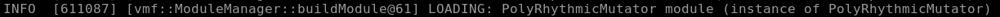

## Goals for this tutorial 

This tutorial will walk through creating a new module for VMF through the following:
* Understanding the different types of VMF modules we can create.
* Understanding the required methods for implementing a new module.
* Implementing a new mutator for use with VMF.

## Understanding VMF Modules 

 VMF is split into multiple pieces to support the creation of a truly modular fuzzer. Each of the fuzzing modules in use durning a fuzzing campaign are controlled by a controller module. The modules are broken into separate types defined below and explained in more depth in [core_module_readme.md](../coremodules/core_modules_readme.md#core-modules): 
 * `Initialization:` Seed Generation, or anything that needs to be executed once before beginning a campaign. 
 * `Mutator:` Test Case Mutation, i.e. creating new test cases based on seed test cases.
 * `InputGenerator:` Selects between different mutators.
 * `Executor:` A means of interacting with a test harness, e.g. libFuzz, AFL++.
 * `Feedback:` "Fitness Function" evaluates the effectiveness of prior test cases when fuzzing a SUT.
 * `Output:` Helps provide information to the operator, manages the set of test cases, tools that perform additional analysis on crashed test cases.
 * `Controller:` Manages all of the different modules that are in use durning a fuzzing campaign.
 * `Storage:` Manages memory all of the modules being used durning a campaign.

Creating a new module of one these types, requires an extension from it's corresponding base [class](../../vmf/src/framework/baseclasses).  It is possible to create an entirely new module instead of a subclass, however it is important to ask if a feature needs to be implemented into a new module or if it can fit into one of the base modules.

## Creating a New Mutator

For this tutorial we will be creating a custom mutator for VMF. There are common methods for each module's base class as well as pure virtual functions that need to be implemented on a per base module basis. To create a new mutator we will first create a `hpp` file named by convention using the first part of the base class name e.g. `TwisterExecutor`,  `PolyRhythmicMutator`. This `hpp` file along with it's partner `cpp` and any other supporting files must be placed in the appropriate subdirectory in `vmf/src/modules/`. Go ahead and create a file named `PolyRhythmicMutator.hpp` under the `vmf/src/modules/common/mutator` directory.
### The `hpp` file

The following example code excerpt should get you started. 

```
#pragma once

#include "MutatorModule.hpp"
#include "StorageEntry.hpp"
#include "VmfRand.hpp"

using namespace vmf;

class PolyRhythmicMutator : public MutatorModule
{
public:
    static Module* build(std::string name);
    virtual void init(ConfigInterface& config);
    
    PolyRhythmicMutator(std::string name);
    virtual ~PolyRhythmicMutator();
    virtual void registerStorageNeeds(StorageRegistry& registry);
    //virtual void registerMetadataNeeds(StorageRegistry& registry);

    virtual void mutateTestCase(StorageModule& storage, StorageEntry* baseEntry, StorageEntry* newEntry, int testCaseKey);

protected:
	int rhythm1;
	int rhythm2;
	
	VmfRand* random;
private:
};
```

```
#include "MutatorModule.hpp"
#include "StorageEntry.hpp"
#include "VmfRand.hpp"
```

Includes the `MutatorModule` base class from `MutatorModule.hpp` and the ability to indicate storage needs from `StorageEntry.hpp`.  Lastly, the `VmfRand` module is VMF's random number generator.

```
using namespace vmf;
```

This prevents name conflicts, which presents any entities declared in the namespace block from being mistake for identically-named entities in other scopes.

```
class PolyRhythmicMutator : public MutatorModule
```

This defines our new `Mutator` subclass that inherits from the `MutatorModule` base class.

```
static Module* build(std::string name);
virtual void init(ConfigInterface& config);
```

Every module is required to implement a `build` method. The purpose is to support name based construction from the VMF config file. 

Additionally, every module must also implement an `init` method. Not every module will have something to do at initialization time but some may need to read configuration parameters from the configuration manager, or load submodules from the configuration manager. For more information see [Using-config](https://github.com/draperlaboratory/VaderModularFuzzer/blob/main/docs/writing_new_modules.md#using-config).

```
PolyRhythmicMutator(std::string name);
virtual ~PolyRhythmicMutator();
```

The  constructor and destructor for our new mutation module.

```
virtual void registerStorageNeeds(StorageRegistry& registry);

virtual void mutateTestCase(StorageModule& storage, StorageEntry* baseEntry, StorageEntry* newEntry, int testCaseKey);
```

These two functions are pure virtual functions in the base class, meaning that they need to be implemented in our new mutator subclass. `registerStorageNeeds` indicates to VMF the memory requirements for our mutator. `mutateTestCase` is the meat and potatoes of our mutator. This method defines in what ways a test case is mutated upon. 

```
protected:
	int rhythm1;
	int rhythm2;
	
	VmfRand *random;
```

Variables internal to the mutator are declared at this point and will be used later for the mutator logic. In addition, we declare a pointer to the VMF random module object.

### The `cpp` file.

Now that we have the `hpp` file created we can move on to its partner `cpp` file. Go ahead and create a new `cpp` file in the same location as your `hpp` file from above. The name should be the same as the `hpp` file except for the trailing file type indicator.

```
#include "PolyRhythmicMutator.hpp"
#include "Logging.hpp"

using namespace vmf;
```

These includes reference our newly created `hpp` file and enable us to output to the runtime log.

```
#include "ModuleFactory.hpp"
REGISTER_MODULE(PolyRhythmicMutator);
```

Our newly created mutator needs to be referenced so that it can be enabled via the `.yaml` configuration file for our fuzzing campaign. We do this by registering our module with the `ModuleFactory's` `REGISTER_MODULE` macro. 

*NOTE: The module name provided to the `ModuleFactory` must match the newly created class name of our module.*

```
Module * PolyRhythmicMutator::build(std::string name)
{
	return new PolyRhythmicMutator(name);
}
```

Every module is required to have a `build` method implemented. The build method only needs to return a newly created instance of the module.

```
PolyRhythmicMutator::PolyRhythmicMutator(std::string name) : 
	MutatorModule(name)
	{
	}
	
PolyRhythmicMutator::~PolyRhythmicMutator()
{

}
```

The constructor for the module is required to take a name string. The module base class constructor uses this name string to uniquely identify the module. It is important that the name string is passed from the child to the parent class. The deconstructor can be left empty for this exercise.

```
void PolyRhythmicMutator::init(ConfigInterface &config)
{
	rhythm1 = config.getIntParam(getModuleName(), "rhythm1");
	rhythm2 = config.getIntParam(getModuleName(), "rhythm2");
	
	if (rhythm1 <= 1)
		throw RuntimeException("The first rhythm is not large enough, it must be larger then 1.",
								RuntimeException::USAGE_ERROR);
	if (rhythm2 <= 1)
		throw RuntimeException("The second rhythm is not large enough, it must be larger then 1.",
								RuntimeException::USAGE_ERROR);
	if (rhythm1 == rhythm2)
		throw RuntimeException("The two rhythms must not be the same.",
								RuntimeException::USAGE_ERROR);
	
	random = VmfRand::getInstance();
	random->randInit();
}
```

Every module also needs to implement an `init` class. This is where user provided variables may be accessed from the configuration file. In this case we are accepting two integer parameters named `rhythm1` and `rhythm2` respectfully. If one of these parameters is not provided via the configuration file a runtime exception will occur. For more information please see the `ConfigInterface` API doxygen. 

In the `init` method we also take the time to do any configuration value checking required for our mutator to run correctly. 

```
void PolyRhythmicMutator::registerStorageNeeds(StoreageRegistry & registry)
{

}
```

Our new mutator does not need to register any storage needs. Mutators specifically are told where to write into storage by the input generator module that calls them.

```
void PolyRhythmicMutator::mutateTestCase(StorageModule & storage, StorageEntry * baseEntry, StorageEntry * newEntry, int testCaseKey)
{
	char * outputBuffer;

	int inputSize = baseEntry->getBufferSize(testCaseKey);
	char * buffer = baseEntry->getBufferPointer(testCaseKey);
	
	if (inputSize < rhythm1 || inputSize < rhythm2){
		//Still need to populate the output buffer with something.
		outputBuffer = newEntry->allocateBuffer(testCaseKey, inputSize);
		memcpy((void *)outputBuffer, (void *)buffer, inputSize);
		return;
	}
	
	outputBuffer = newEntry->allocateBuffer(testCaseKey, inputSize);
	memcpy((void *)outputBuffer, (void *)buffer, inputSize);
	
	for (int i = 0; i < inputSize; i=i+rhythm1)
	{
		outputBuffer[i] = (char)random->randBetween(0,255);
	}
	for (int j = 0; j < inputSize; j=j+rhythm2)
	{
		outputBuffer[j] = (char)random->randBetween(0,255);
	}
}
```

The `mutateTestCase` method is where the main logic of our mutator module exists. In this case, we check to see if the supplied test case is able to be mutated by our algorithm. Following this we allocate a buffer for our new test case and perform our `PolyRythmic` mutation on it. That is selecting a random variable via VmfRand and inserting it at incremented places in our test case.

### Enabling the Module in the Build

In order for our new mutator module to be build by CMake we must add it into the `CMakeLists.txt` located in `VaderModularFuzzer/vmf/src/modules/`.

```
list(APPEND CoreModules_SOURCES
    #Add our newly created mutator here.
    common/mutator/PolyRhythmicMutator.cpp
    common/mutator/Gramatron.cpp
    common/mutator/GramatronHelpers.cpp
    common/mutator/GramatronPDA.cpp
    common/mutator/GramatronRandomMutator.cpp
    common/mutator/GramatronSpliceMutator.cpp
    common/mutator/GramatronRecursiveMutator.cpp
    common/mutator/GramatronGenerateMutator.cpp
    common/mutator/AFLFlipBitMutator.cpp
    common/mutator/AFLFlip2BitMutator.cpp
    )

```

With our mutator module added to the build system we are now able to build VMF as noted before in previous tutorials.

```
# from /path/to/vmf/ directory:
mkdir build
cd build
cmake ..
#Or optionally use this version instead to specify an install path
#cmake -DCMAKE_INSTALL_PREFIX=<your install path here> ..
make install -j8
```

For this example we will use a known working target, haystack. Let's edit the [basicModules.yaml](../../test/config/basicModules.yaml) to include our newly created mutator.

```
GenerticAlgorithmInputGenerator:
	children:
		- className: <other_mutator>
		- className: PolyRhythmicMutator
		- className: <other_mutator>
		- className: <other_mutator>
```

We add the mutator as a child for our input generator to select at a specific interval. 

```
PolyRhythmicMutator:
	rhythm1: 3
	rhythm2: 5
```

We also have to provide our mutator the two required parameters: rhythm 1 and 2. From this point we can run our newly created mutator by using the following command from the `/path/to/vmf/build/vmf_install/` directory.

```
./bin/vader -c ./test/config/basicModules.yaml -c ./test/haystackSUT/haystack_stdin.yaml
```

As we start the instance of VMF we should see a few diagnostic messages appear in the terminal.


A message to indicate that VMF has registered our new created module.



As well as a message to indicate that VMF has loaded our new created mutator for use with the input generator.

## Critical Success 

Congratulations, you have now learned how to make a custom module for VMF. There are many different types of modules you can make and different combinations may produce better or worse fuzzing results depending on your target. However, this is one of the key advantages of VMF, the ability to design and plug and play in modules to quickly test out functionality against a target.
