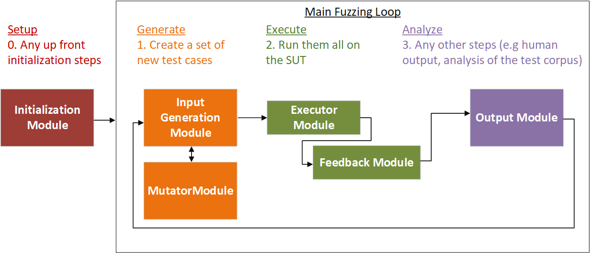

# Writing a New Module
VMF was designed to be a modular, extensible framework that enables the integration of new fuzzing tools and techniques.  Each integrate tool is associated with one or more VMF "modules".  VMF uses a storage-centric design, with a controller module that manages the interaction between other VMF modules.  All data sharing between modules is via a central configurable storage component.

This document describes how to develop new modules within VMF.

* [Common Module Methods](#common-module-methods)
    + [Example Module](#example-module)
    + [Where to Put New Module Code](#where-to-put-new-module-code)
* [Telling VMF About Your Module](#telling-vmf-about-your-module)
    + [Required Methods](#required-methods)
    + [Adding the Module to the ModuleFactory](#adding-the-module-to-the-modulefactory)
    + [Adding the Module to the VMF Configuration File](#adding-the-module-to-the-vmf-configuration-file)
    + [Optional Methods](#optional-methods)
* [Using Storage](#using-storage)
    + [Creating a New Storage Entry](#creating-a-new-storage-entry)
    + [Retrieving Existing Test Cases from Storage](#retrieving-existing-test-cases-from-storage)
    + [Reading and Writing Data Values](#reading-and-writing-data-values)
    + [Tagging Storage Entries](#tagging-storage-entries)
* [Module Type Specific Methods](#module-type-specific-methods)
    + [ControllerModule](#controllermodule)
    + [ExecutorModule](#executormodule)
    + [FeedbackModule](#feedbackmodule)
    + [InitializationModule](#initializationmodule)
    + [InputGeneratorModule](#inputgeneratormodule)
    + [MutatorModule](#mutatormodule)
    + [OutputModule](#outputmodule)
    + [StorageModule](#storagemodule)
* [Using Config](#using-config)
    + [Adding New Configuration Options](#adding-new-configuration-options)


## Module Types
First determine while type of module you are trying to write.  Conceptually, the VMF fuzzer is divided into the following processing steps:




See [docs/design.md](/docs/design.md) for additional explanations of each of the VMF module types.

Each module must extend from it's corresponding parent based class:
- [vmf/src/framework/baseclasses/ExecutorModule.hpp](../vmf/src/framework/baseclasses/ExecutorModule.hpp)
- [vmf/src/framework/baseclasses/FeedbackModule.hpp](../vmf/src/framework/baseclasses/FeedbackModule.hpp)
- [vmf/src/framework/baseclasses/InitializationModule.hpp](../vmf/src/framework/baseclasses/InitializationModule.hpp)
- [vmf/src/framework/baseclasses/InputGeneratorModule.hpp](../vmf/src/framework/baseclasses/InputGeneratorModule.hpp)
- [vmf/src/framework/baseclasses/MutatorModule.hpp](../vmf/src/framework/baseclasses/MutatorModule.hpp)
- [vmf/src/framework/baseclasses/OutputModule.hpp](../vmf/src/framework/baseclasses/OutputModule.hpp)

Both Storage Module and Controller Module may also be extended, but this is much less common:
- [vmf/src/framework/baseclasses/ControllerModule.hpp](../vmf/src/framework/baseclasses/ControllerModule.hpp)
- [vmf/src/framework/baseclasses/storageModule.hpp](../vmf/src/framework/baseclasses/StorageModule.hpp)

Also consider whether the feature you are trying to add necessitates an entirely new module as opposed to a subclass of an existing related module.

By convention, when naming your module, use the first part of the base class name in your module name (e.g. FooMutator, BarExecutor, FancyInitialization).

# Common Module Methods

## Example Module
This section uses a new mutator module (MyMutator) as an example to discuss common module methods.  Full source code for MyMutator is included at [vmf/src/samples/module/MyMutator.hpp](../vmf/src/samples/module/MyMutator.hpp) and [vmf/src/samples/module/MyMutator.cpp](../vmf/src/samples/module/MyMutator.cpp)

The example header file for MyMutator.hpp is provided method.  Within this header file are methods that are common to all module types, as well as the one method that is required specifically for Mutator Modules (mutateTestCase). Each of these common methods will be discussed in detail in this section.

```c++
#pragma once
#include "common/MutatorModule.hpp"

namespace vmf
{

class MyMutator: public MutatorModule
{
public:

    static Module* build(std::string name);
    virtual void init(ConfigInterface& config);

    MyMutator(std::string name);
    virtual ~MyMutatorMutator();
    virtual void registerStorageNeeds(StorageRegistry& registry);
    virtual void mutateTestCase(StorageModule& storage, StorageEntry* baseEntry, StorageEntry* newEntry, int testCaseKey);  //This is MutatorModule specific

};
}

```

## Where to Put New Module Code

All modules are packaged into a library of related modules that are loaded by VMF at runtime.  VMF provides a library of initial modules called "Core Modules", but multiple libraries can be loaded by VMF.  Libraries that are not the "Core Modules" are called "Extension Packs".

### Adding to the Core Module Library
New core modules should be placed in the appropriate subdirectory of [vmf/src/modules/](../vmf/src/modules/).  Modules contains subdirectories for modules that compile under all supported platforms (modules/common) and those that are operating system specific (e.g. modules/linux).  Within those directory, there are further subdirectories that organize modules by type -- the .hpp and .cpp files for each new module should be added in the appropriate subdirectory.  For example, a mutator module that cross compiles for supported platforms should be located under [vmf/src/modules/common/mutator](../vmf/src/modules/common/mutator).

If the module needs any supporting classes, those should be named with a name that is similar to the module and they should be placed alongside the module classes that need them.

Add the .cpp filename(s) to [vmf/src/modules/CMakelists.txt](../vmf/src/modules/CMakelists.txt).  If any new third party libraries are needed to support your module, they will need to be added to the overall build system (see [docs/build_system.md](/docs/build_system.md)).

### Developing a New Extension Pack
To develop a module as part of a new extension pack, look at the example structure in `vmf_install\samples\modules`.  This provides an example makefile for modules that are developed as add ones to VMF.  Such modules will be built as a shared library that can be added onto VMF, simply by installing the build library into 'vmf_install\plugins'.

# Telling VMF About Your Module
A number of steps are needed in order to configure VMF to use a new module.  Several required methods must be implemented, the module must be added to the VMF Module Factory, and the module must be added to a configuration file in order to be used in a fuzzer.  Each of these steps is discussed below.

## Required Methods


### Build()
All modules are required to implement a build method in order to support name based construction of the module from the VMF config file.  The build method simply needs to return a new instance of the module

```c++
Module* MyMutator::build(std::string name)
{
    return new MyMutator(name);
}

```

Note that the module constructor takes a name string.  This is required by the module based class constructor in order to uniquely identify the module (this is the same "name" that is discussed later in the configuration section).  Be sure to pass this name to the parent constructor.

```c+
MyMutator::MyMutator(std::string name) :
    MutatorModule(name)
{

}

```

### Init()
All modules must implement an init method.  This method is called during application initialization.  The following initialization steps should be performed, as relevant to the module.  Not all modules will need to do anything at initialization time:
- Read any configuration parameters from the configuration manager
- If the module uses submodules, these should be loaded from the configuration manager as well

See [Using Config](#using-config) for more information.

### RegisterStorageNeeds()
**Note: This method is only required for module types that are subclasses of StorageUserModule.  This is all VMF modules except for the StorageModule itself.**

Each module that uses storage must specify in advance which fields in storage it will read or write.  This allows the storage module to be configured to include only the fields needed by the modules in the VMF configuration.  Two types of fields are maintained in storage: keys and tags.  Keys contain a data attribute (e.g. int, float, or data buffer) that will be contained within each storage entry, while tags are a boolean property of a storage entry that can be used to retrieve a set of entries (e.g. all of the storage entries that have the tag CRASHED).

When you register a key, provide a name, type, and whether the key will be READ_ONLY, WRITE_ONLY, or READ_WRITE.  Tag registration requires just a name and READ/WRITE information.  The name that is used *must* be used by every module that wants to read or write that field in storage.  Think of storage as a big spreadsheet, each key or tag is a column in the spreadsheet, and each row is an individual storage entry.  The key or tag "name" is like the name in the header row in the spreadsheet.


```c++
void MyModule::registerStorageNeeds(StorageRegistry& registry)
{
    fakeVariableKey = registry.registerKey("FAKE_VARIABLE", StorageRegistry::INT, StorageRegistry::READ_WRITE);
    fitnessKey = registry.registerKey("FITNESS", StorageRegistry::FLOAT, StorageRegistry::WRITE_ONLY);
    testCaseKey = registry.registerKey("TEST_CASE", StorageRegistry::BUFFER, StorageRegistry::READ_ONLY);

    crashedTag = registry.registerTag("CRASHED", StorageRegistry::READ_ONLY);
}
```

If your usage of a key field assumes that there will be a default value for the field, then you may optionally specify one (BUFFER types may not specify a default value).  However, if other modules specify a different default value, you will get an error when the modules are loaded into VMF.  Use the `registerIntKey` or `registerFloatKey` versions of the registration methods to specify a default.  See the example usage below:

```c++
void MyModule::registerStorageNeeds(StorageRegistry& registry)
{
    //Here the default value for this INT field is -1
    fakeVariableKeyWithDefault = registry.registerIntKey("FAKE_VARIABLE", StorageRegistry::READ_WRITE, -1);

    //Here the default value for thie FLOAT field is -1.0
    fakeFloatWithDefault = registry.registerFloatKey("FLOAT_VARIABLE", StorageRegistry::WRITE_ONLY, -1.0);
}
```


Some common keys used in the VMF core modules:
- "TEST_CASE" : A data buffer containing the test case that will be executed on the SUT
- "FITNESS": Produced by AFLFeedback, this is an indication of how useful the code coverage data was (higher values are better)

Some common tags used in VMF core modules:
- "CRASHED" : Produced by AFLFeedback, this indicates that this storage entry caused the SUT to crash
- "HUNG" : Produced by AFLFeedback, this indicates that this storage entry caused the SUT to hang or timeout.
- "RAN_SUCCESSFULLY" : Produced by AFLFeedback, this indicates that this storage entry did not cause the SUT to crash or hang.

You may add your own new keys or tags as well.


## Adding the Module to the ModuleFactory
All  modules will need to register their module with the [ModuleFactory](../vmf/src/framework/app/ModuleFactory.cpp).  To do this simply add a call to the REGISTER_MODULE macro at the top of the new modules .cpp file.  The name provided to the macro *must* match the class name.

```c++
/*
  This will register the mutator module with the VMF module factory, making
  it available for use via VMF configuration files.
 */
#include "common/ModuleFactory.hpp"
REGISTER_MODULE(MyMutator);
```

## Adding the Module to the VMF Configuration File
To get VMF to build your module, you need to add it to a VMF configuration file.  You can use the example configuration file  [test/config/defaultModules.yaml](../test/config/defaultModules.yaml) or [test/config/basicModules.yaml](../test/config/basicModules.yaml) as a starting point.  You will need to add your new module to the "vmfModules" section, under the appropriate parent module.

Most modules will go directly under "controller".  Mutator modules belong instead under the input generator module (in the basic modules configuration the input generator is GeneticAlgorithmInputGenerator).  

In this example, we are adding a mutator module, so we will declare it as a child of the input generator:

```yaml
vmfModules:
  ...
  GeneticAlgorithmInputGenerator:
    children:
     - className: MyMutator

```

Note that you may optionally specify an "id" parameter.  This is only needed if you want more than once instance of your module in the fuzzer configuration (e.g. you want to two instances of the module with different configuration parameters).  

```yaml
vmfModules:
  ...
  GeneticAlgorithmInputGenerator:
    children:
     - id : Mutator1
       className: MyMutator


```

In the less common scenario where you are implementing a StorageModule, you must locate the module under the name "storage".  If you are implementing a controller module that is the top level controller for the fuzzer, it must go under the name "controller".  It is permisable to have more than one controller module (e.g. a top level controller module that manages additional controller submodules), but only one top level module may be listed under "controller".

```yaml
vmfModules:
  storage: 
      className: <Your storage module name here>
  controller: 
      className: <Your controller module name here>
```

These modules may also optionally specify an id.

```yaml
vmfModules:
  storage: 
      className: <Your storage module class name here>
      id: <Your storage module id here>
  controller: 
      className: <Your controller module class name here>
      id: <Your controller module id here>
```

## Optional Methods

### Shutdown()
Modules that allocate memory must obviously provide a destructor method that frees any allocated memory.  Additionally, modules may want to define additional shutdown steps if they have any special processing that needs to run when the fuzzer shuts down.  For example, writing any final data to disk, or running one more time on any outputs that haven't yet been processed.

### RegisterMetadataNeeds()
Modules that use data that is global to all of the storage entries, called Metadata, must implement this method.  Metadata is used for things like execution metrics (e.g. the total number of test cases executed).  Think of this as a list of global key/value variables.  Metadata can only contain keys (not tags).

To access metadata, request the metadata storage entry from storage:
```c++
StorageEntry& metadata = storage->getMetadata();
```

Some common metadata keys used in the VMF core modules:
- "TOTAL_CRASHED_CASES" : Produced by AFLFeedback, this is the total number of test cases that crashed.  This is smaller than the number that are tagged as "CRASHED", because AFLFeedback only saves the test cases that have unique code coverage.
- "TOTAL_HUNG_CASES" : Same as "TOTAL_CRASHED_CASES" but for test cases that hand or timeout.

# Using Storage
The StorageModule stores objects of type [StorageEntry](../vmf/src/framework/baseclasses/StorageEntry.hpp).  Each StorageEntry is associated with a single test case.  What information is stored about each test case is configurable at runtime based on the modules that are loaded into VMF.  Once each module specifies it's storage needs, the exact number of data fields in each StorageEntry is known.  Think of the StorageEntries like a spreadsheet: the registerStorageNeeds method specifies what columns to have in the spreasheet, and each row of the spreadsheet contains data for a single test case.  StorageEntries can contain data fields of type integer, float, or data buffer (where data buffer is commonly used to store the test case itself).

## Creating a New Storage Entry
To add a new test case to storage, you must create a new storage entry.

```c++
StorageEntry* newEntry = storage.createNewEntry();
```

## Retrieving Existing Test Cases from Storage
Storage is used to maintain two kinds of test cases: new test cases, which are what are produced by input generators/mutators on each pass through the fuzzer, and test cases that are in long term storage.  Most of the time new test cases are discarded at the end of each fuzzing loop, because most new test cases don't result in anything interesting.  Long term storage is where the interesting test cases are stored, both test cases that crash or hang, as well as test cases that were interesting in other ways (e.g. test cases that are associated with new coverage paths).

Test cases move into long term storage when a module tells storage that the test case should be saved.  Typically this decision is made in the Feedback module, as that module is responsible for evaluating how the test case performed.  Note that entries that move into long term storage are also still available on the new list until the start of the next fuzzing loop.  This allows modules to look either at just the new test cases that are part of the current fuzzing loop, or all of the test cases in long term storage, depending on their needs.  Note that the strat of the next fuzzing loop is determined by the ControllerModule.  For the IterativeController, which is the default Controller provided in the VMF Core Modules, the next fuzzing loop starts during InputGeneration (specifically this occurs between calling the examineTestCaseResults() and the addNewTestCases() methods, but this detail is only relevant to implementors of InputGeneratorModules).

Individual modules will wish to retrieve different subsets of test cases depending on their roll.  Different accessor methods are provided by the StorageModule to support this retrieval, but all of these methods return the set of test cases in the same way by returning an iterator that steps through a list of StorageEntry objects.  Here is some sample code:

```c++
    //Retrieving all the entries from long term storage
    std::unique_ptr<Iterator> allEntries = storage.getEntries(); //Retrieve all the entries in long term storage
    while(allEntries->hasNext()) //Loop through the entries, checking that there are more
    {
        StorageEntry* theEntry = allEntries->getNext(); //Get the next entry
        //Now access the data in the storage entry
        int val = theEntry->getIntValue(fakeVariableKey);
        float fitness = theEntry->getFloatValue(fitnessKey);
        ...
    }

    //Retrieving only the new entries is extremely similar
    std::unique_ptr<Iterator> newEntries = storage.getNewEntries(); //Note that only the accessor method changes
    while(newEntries->hasNext())
    {
        StorageEntry* theEntry = newEntries->getNext();
        ...
    }

    //Other combinations are supported, such as retrieving only the new entries that were tagged with the CRASHED TAG
    std::unique_ptr<Iterator> newCrashedEntries = storage.getNewEntriesByTag(crashedTag);
    while(newCrashedEntries->hasNext())
    {
        StorageEntry* theEntry = newCrashedEntries->getNext();
```

See [StorageModule.hpp](../vmf/src/framework/baseclasses/StorageModule.hpp) for a complete list of the accessor methods supported by storage.  All entries retrieved from long term storage are sorted by the primary key (for the VMF Core Module the primary key is FITNESS, but the sort by value is configurable).  New entries are not sorted, as they may not yet have a primary key value that has been set.

The Iterator that is returned from storage also supports retrieving storage entries by index.  See [Iterator.hpp](../vmf/src/framework/baseclasses/Iterator.hpp) for more information on this functions.

```c++
std::unique_ptr<Iterator> allEntries = storage.getEntries();
int size = allEntries->getSize(); //This returns the number of storage entries accessible by the iterator
StorageEntry* myTestCase = allEntries->setIndexTo(x); //This returns the entry at index x (which must be smaller than size)
```

## Reading and Writing Data Values
To read or write a data value to a particular StorageEntry, the data must be accessed using the data handle that was returned when registering the data key.  See [RegisterStorageNeeds](docs/writing_new_modules.md/#registerstorageneeds) for more information on registration.

For example, assume the following register storage needs method:
```c++
void MyModule::registerStorageNeeds(StorageRegistry& registry)
{
    myIntVariableKey = registry.registerKey("FAKE_INT", StorageRegistry::INT, StorageRegistry::READ_WRITE);
    myFloatVariableKey = registry.registerKey("FAKE_FLOAT", StorageRegistry::FLOAT, StorageRegistry::READ_WRITE);
    testCaseKey = registry.registerKey("TEST_CASE", StorageRegistry::BUFFER, StorageRegistry::READ_WRITE);
}
```

To write each of these data values, use the following code snippet:
```c++
 myEntry->setValue(myIntVariableKey,7);       //write integer value
 myEntry->setvalue(myFloatVariableKey,3.14);  //write float value

 char* buff = myEntry->allocateBuffer(testCaseKey, 255);   //allocating a data buffer of size 255 bytes, buffer pointer is returned
 buff[0] = 0xFF;   //data can then be written using the buffer pointer
```

To read each of these data values, use the following code snippet:
```c++
int intVal = myEntry->getIntValue(myIntVariableKey);   //read integer value
float floatVal = myEntry->getFloatvalue(myFloatVariableKey);  //read float value

int size = myEntry->getBufferSize(testCaseKey); //get buffer size
char* buffer = myEntry->getBufferPointer(testCaseKey); //get buffer pointer
//data can now be read using the buffer pointer
```

## Tagging Storage Entries
In addition to storing data fields, Storage Entries in long term storage can also have tags.  Tags are boolean attributes that can also be used to rapidly retrieve the set of Storage Entries that have that attribute.  Note that tags are for entries that are kept in long term storage (and all entries that are tagged will be saved in long term storage automatically).  For example, the VMF Core Modules tag all executed entries in long term storage as follows:
- "CRASHED": The test case cased the SUT to crash
- "HUNG": The test case caused the SUT to hang
- "RAN_SUCCESSFULLY": The test case did not crash or hang

Note that the tagging is performed by the AFLFeedbackModule.  New Entries that are not interesting enough to be saved are not tagged by the AFLFeedbackModule.

```c++
//To tag an etry
storage.tagEntry(e, crashedTag);
```

See [StorageModule.hpp](../vmf/src/framework/baseclasses/StorageModule.hpp) for additional methods related to managing tags.

# Module Type Specific Methods
Each module type requires one or more additional methods that are specific to that module type.  High level documentation of these methods is provided here, but the header file for each module class provides more detailed parameter by parameter documentation.  See the links in [Module Types](#module-types).

## ControllerModule
It is unusual to need to write a new ControllerModule.   Implementers of the ControllerModule must implement several methods that provide top level control of the fuzzing loop.   Consider implementing a subclass of IterativeController if possible, and at the very least use IterativeController as an example, as there are a number of functions that the Controller needs to perform within its methods.  The helper class [vmf/src/framework/baseclasses/OutputScheduler.hpp](../vmf/src/framework/baseclasses/OutputScheduler.hpp) should be used to facilitate scheduling output modules at their desired rate.

### Run()
The run method will be called over and over to execute one pass through the fuzzing loop.  Controllers may optionally return false from this method to indicate that fuzzing is complete, or they may continue until interupted by an external factor.

### HandleCommands()
This method is used in distributed fuzzing mode to handle certain commands from the server.  Typically implementers can ignore this method, as the default base class behavior will be appropriate in most cases.

## ExecutorModule
Executor modules are responsible for running test cases, and for collecting any metrics resulting from that test case run  Implementers of the ExecutorModule **must** implement the method runTestCase and **may** implement a runCalibrationCases and runTestCases.  Calibration provides an opportunity for the ExecutorModule to run the initial set of test cases for calibration purposes.  This is useful for behaviors such as computing a SUT-specific timeout value that require a sample of test cases.  These test cases will be provided again to the runTestCase/runTestCases methods.

### RunTestCase()
This method is required and is expected to run the provided test case on the SUT.  

### RunTestCases()
This method has a default implementation in the ExecutorBased class that simply calls RunTestCase for every test case in the provided iterator.  ExecutorModules that implement batch execution of test cases will need to override this method in order to access more than one test case at once.

### RunCalibrationCases()
The RunCalibrationCases method will be called with the list of initial test cases (i.e. any seed test cases that were produced by the initialization modules).  This is an optional method, and should be used for any callibration that requires sample test cases (such as determining a reasonable execution time for a test case)

### Execution Results
The ExecutorModule will need to write any test cases results to storage.  The specific data returned will depend on the executor, but in general includes information like whether the test case crashed or not and how long it took to execute.  The FeedbackModule will use this data to interpret the execution results.

When execution results are highly specific to the executor, they should include the executor name as a prefix to the variable in storage.  For example, "AFL_TRACE_BITS" is used for AFL-style trace bit data.  When execution results are not highly specific, they should use a more generic name.  For example, "EXEC_TIME_US" could be used for any executor that writes it's execution time (in microseconds).

## FeedbackModule
Feedback modules evalute the results of running a test case and determine how good those results are.

### EvaluateTestCaseResults()
The evaluateTestCaseResults method is the meat of the FeedbackModule.  This method is responsible for evaluating the results of the test case that has just been run with the executor.  It will do so by looking at the data that the Executor wrote to storage.

In general, it is expected that this method must:
     * compute and save the fitness value for the test case
     * save any other values of interest for the test case, including tagging the entry if relevant
     * determine if the test case is interesting enough to save in long term storage (and save the entry if it is)

See [Using Storage](#using-storage) for more information on each of these storage interactions.  A commented code snippet from an example implementation of FeedbackModule is provided in [design.md](docs/design.md/#executor-and-feedback-modules)

## InitializationModule
Initialization modules are run once, prior to the main fuzzing loop.  The only Initialization module specific method is run.  This method should perform any designated initialization steps (for example, seed generation).  It is important to note that this module is only called once by the controller, upfront, before other modules are called upon to run.

## InputGeneratorModule
Input generators create new inputs that will be run by the Executor.  Often InputGenerators manage a set of Mutator submodules that are used to help generate these new inputs, but this is not required.  There are two InputGenerator specific methods:
- addNewTestCases, which is required
- examineTestCaseResults, which is optional

### AddNewTestCases()
This method creates one or more new test cases in storage.  Any method may be used to do this.  Mutation based InputGenerators typically call upon Mutator submodules to assist with this task, with each Mutator being capable of creating one or more test case based on a base test case that is selected by the InputGenerator.  But it is also possible to create InputGenerators that create test cases with non-mutation-based strategies.

For more information on how to create new test cases, see [Using Storage](#using-storage).  Additionally, a code snippet from a sample input generator is provided in [design.md](docs/design.md/#input-generation-modules).  Note that this example does not use Mutator submodules, and hence it creates the new test cases directly, rather than having its mutator submodules perform this task.

### ExamineTestCaseResults()     
This is an optional method of InputGeneration.  InputGenerators that need to look at the results of their test case runs prior to generating new test cases should implement this method.  It is distinct from addNewTestCases in that the storage new list has not yet been cleared when this method is called, which makes it very easy to look at only the test cases that just executed.  See [Using Storage](#using-storage) for more information on the new list.

This method also returns a boolean value that indicates whether or not the InputGenerator's input generation strategy is complete.  Only some specialized input generators will have a concept of "completing", but if they do, this is how they will tell the controller that they are done.  Return a value of true to indicate that the input generator is complete, false otherwise.  The default implementation of this method returns false (indicating that the input generator is not complete).

## MutatorModule
Mutator modules create a test case by mutating an existing test case.  There is only one mutator module specific method, mutateTestCase.  This method should write data to the provided new test case by mutating the provided base test case in some way.

## OutputModule
Output modules are used to examine the results of test cases.  They are fairly general purpose and may be used to output information to a human operator, to trim the corpose of test cases, or to perform any other function that should occur periodically as test cases execute.  Output modules can run on each pass of the fuzzing loop, or they can be scheduled to run less frequently.  The only required method is run, but output modules that don't want to run on each pass of the fuzzing loop should also override the scheduling relating methods in order to specify their desired scheduling frequency.

### Run()
The run method is the meat of the OutputModule.  This is the method in which the OutputModule performs whatever function that is doing.   By default, the run method will be called after every new set of test cases is executed, but this will be too frequent for many output module functions.  Override the scheduling related functions to control how often and when the run method is called.

### Scheduling Related Functions
A pair of methods, getDesiredScheduleType and getDesiredScheduleRate, indicate the scheduling method that should be used by the output module.  getDesiredScheduleType must specify the type of scheduling for the module, and getDesiredScheduleRate provides any parameters needed for that scheduling type.  Note that the scheduling is not strict: output modules will only run at the end of a complete fuzzing loop, so the time or number of test cases may be larger than what was requested (particulary if any of the modules being used are slow to execute).

To implement getDesiredScheduleType, simply return one of the valid enumerated schedule type values:
+ **CALL_EVERYTIME**: The module will run on every pass through the main fuzzing loop. This is the value returned by the default implementation of getDesiredScheduleType. 
+ **CALL_ON_NUM_SECONDS**: The module will be called at a period of at least getDesiredScheduleRate() seconds from the prior call.  For eample, if getDesiredScheduleRate() returns 5, then the module will be called approximately every 5s.
+ **CALL_ON_NUM_TEST_CASE_EXECUTIONS**: The module will be called when at least getDesiredScheduleRate() more test cases have been executes since the prior call.  For example, if getDesiredScheduleRate() returns 10000, then this module will be called when approximately another 10,000 test cases have executed.
+ **CALL_ONLY_ON_SHUTDOWN**: The module will not run as part of the main fuzzing loop, and will instead only run on shutdown.  **Make sure to override the shutdown() method** with this scheduling type, as only the shutdown() method is called at shutdown.  The run() method will never be called with this scheduling type.

The getDesiredScheduleRate method must be implemented for CALL_ON_NUM_TEST_CASE_EXECUTIONS and CALL_ON_NUMSECONDS in order to specify the desired schedule rate.  This method simply returns an integer value, and the default implementation returns 0.

## StorageModule
It is extremely unusual to need to write a new StorageModule.  The major reason to do this would be because an alternate data structure is needed in storage for efficiency reasons.  StorageModule requires a large number of methods to support all of the storage functions.  See [StorageModule.hpp](../vmf/src/framework/baseclasses/StorageModule.hpp) for documentation of the methods needed.

# Using Config

## Adding New Configuration Options
To add any new  configuration options for your new module, add a section to the config file.  The name of this section should be the name used in the "vmfModule" section of the config (this will default to the classname if no other name is specified).

For example, if your module is named MyModule (and you do not provide another name in the "vmfModule" section), then your new config section would look like the follows:

```yaml
MyModule:
    MyParam1: value1
    MyParam2: value2
    MyParam3: 4
```

Next, you need to update your module code to read in the configuration option.  This should go in the init method of your module, which will be passed a ConfigInterface object.  Simply call the appropriate getXXXParam method on the ConfigInterface object.  See [ConfigInterface.hpp](../vmf/src/framework/app/ConfigInterface.hpp) for a complete list of supported data types.

You must always include the call to getModuleName() which will identify your module instance for the purposes of
retrieving it's configuration information.

```c++
void MyModule::init(ConfigInterface& config)
{
  //This will retrieve "value1" from the config file
  //If the parameter is not found, an exception will be thrown
  //Use this syntax for required parameters without a default value
  config.getStringParam(getModuleName(),"MyParam1");

  //This will retrieve "value2" from the config file
  //If the parameter is not found, "default" will be returned
  //No exception is thrown in this case.
  //Use this syntax for optional parameters or those with default values.
  config.getStringParam(getModuleName(),"MyParam1","default");

  //Specific methods are provided for other types, such as int
  config.getIntParam(getModuleName(), "MyParam3");

## Retrieving Submodules
The configuration file is also used to retrieve submodules (e.g. mutators that are submodules of an input generator).  Though submodules may be retrieved directly from the ConfigInterface using the getSubModules() method, it is much simpler to use the static convenience methods that are provided in the base class of each module type.  Three versions of each convenience methods are provided: two that returns a single submodule pointer and one that returns a std::vector of submodule pointers.

These convenience methods are named as follows, where XXX is replaced with the actual module type name:
- getXXXSubmodule: use this version when only one submodule of this type is supported
- getXXXSubmodules: use this version when more than one submodule of this type is supported
- getXXXSubmoduleByName: use this version when there is a specific module of this type that you need to retrieve by its module id or className (this is the less common case)

For example, here are code snippet to retrieve a single mutator submodule or a list of mutator submodules.
```C++
MutatorModule* theMutator = MutatorModule::getMutatorSubmodule(config,getModuleName());
std::vector<MutatorModule*> mutators = MutatorModule::getMutatorSubmodules(config,getModuleName());
```
Like other configuration parameters, it is expected that the list of submodules is retrieved in the module's init method.

```c++
void MyModule::init(ConfigInterface& config)
{
  //This will retrieve an output module submodule from a config file
  mySubmodule = OutputModule::getOutputSubmodule(config,getModuleName());
  //Be sure to check if one was found, if this module is required
  if(nullptr == mySubmodule)
```

The getXXXSubmoduleByName version of this method is typically only used by more complex modules that wish to retrieve a specific submodule by name (id or className).  Typically this would occur because the module name was provided somewhere else in your configuration information.

```c++
void MyModule::init(ConfigInterface& config)
{
  std::string initialInputGen = config.getStringParam(getModuleName(),"InitialInputGenerator");
  
  //This will retrieve the specific InputGenerator module from the config file
  mySubmodule = InputGeneratorModule::getInputGeneratorSubmodule(config,getModuleName(),initialInputGen);

  //Be sure to check if one was found, if this module is required
  if(nullptr == mySubmodule)
```
